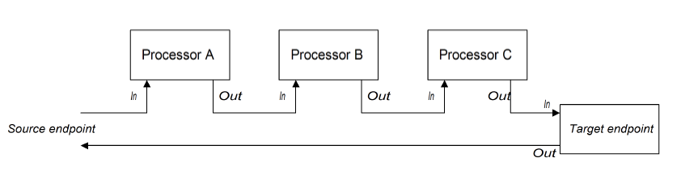

# CHAPTER 44. 实现一个简单处理器
*karezflow 产品组
整理：孙勇
版本：0.1*

Apache Camel允许自定义处理器。然后，可以将自定义处理器插入到路由对路由通过的交换对象执行操作。

## 44.1. 处理模型

### 管道模型
*管道模型*描述处理器编排的路径。管道是端点队列处理最常见的方法（一个生产者端点就像一个特殊类型的处理器）。当处理器用这种方法编排，交换的*输入*和*输出*消息将被处理。



处理器在管道中看上去就像一系列服务，*输入消息*类似于请求，*输出消息*类似于答复。实际上，在现实的管道中，节点经常使用Web服务端点实现，比如CXF组件。

```java
from(SourceURI).pipeline(ProcessorA, ProcessorB, TargetURI);
```

## 44.2. 实现一个简单的处理器
### Processor 接口
继承 **org.apache.camel.Processor** 接口创建简单的处理器，该接口定义单个方法`process()`用于处理交换对象。

```java
package org.apache.camel;

public interface Processor {
  void process(Exchange exchange) throws Exception;
}
```

### 实现处理器接口
创建一个简单的处理器必须继承 **Processor** 接口并为`process()`方法提供业务逻辑。

```java
import org.apache.camel.Processor;

public class MyProcessor implements Processor {
  public MyProcessor() { }
  
  public void process(Exchange exchange) throws Exception
  {
    // Insert code that gets executed *before* delegating
    // to the next processor in the chain.
    ...
  }
}
```

所有代码在`process()`方法中，在交换对象委托给链中下一个处理器前执行。

### 在路由中插入一个简单处理器
使用`process()`DSL命令在路由中插入一个简单处理器。

```java
org.apache.camel.Processor myProc = new MyProcessor();
from("SourceURL").process(myProc).to("TargetURL");
```

## 44.3. 访问消息内容
### 方法消息头
从路由视角来看，消息头包含很多有用的消息内容。这是因为头部通常指定在路由服务中如何进一步处理。访问头部数据，首先要从交换对象中获得消息（例如，使用`Exchange.getIn()`），然后使用 **Message** 接口获得头部（例如，使用`Message.getHeader()`）。

```java
import org.apache.camel.*;
import org.apache.camel.util.ExchangeHelper;

public class MyProcessor implements Processor {
  public void process(Exchange exchange) {
    String auth = ExchangeHelper.getMandatoryHeader(
                    exchange,
                    "Authorization",
                    String.class
                  );

  // process the authorization string...
  // ...
  }
}
```

### 访问消息体

```java
import org.apache.camel.*;
import org.apache.camel.util.ExchangeHelper;

public class MyProcessor implements Processor {
  public void process(Exchange exchange) {
    Message in = exchange.getIn();
    in.setBody(in.getBody(String.class) + " World!");
  }
}
```

### 访问消息附件
使用`Message.getAttachment()`或者`Message.getAttachments()`方法访问消息附件。

## 44.4. ExchangeHelper 类
`org.apache.camel.util.ExchangeHelper`类是Apache Camel工具类，为实现一个处理器提供实用的方法。

### Resolve an endpoint
`resolveEndpoint()`静态方法是`ExchangeHelper`类中方法之一，可以在处理器中创建`Endpoint`实例。

```java
public final class ExchangeHelper {
  ...
  @SuppressWarnings({"unchecked" })
  public static Endpoint
  resolveEndpoint(Exchange exchange, Object value)
    throws NoSuchEndpointException { ... }
  ...
}
```

`resolveEndpoint()`方法第一个参数是交换实例，第二个参数是一个通用的端点URI。

```java
Endpoint file_endp = ExchangeHelper.resolveEndpoint(exchange,
"file://tmp/messages/in.xml");
```

### 包装交换访问器
`ExchangeHelper`类提供数个`getMandatoryBeanProperty()`方法，这些方法相当于是`Exchange`类`getBeanProperty()`方法的包装。两者之间的区别是如果属性不可访问，原始的`getBeanProperty()`方法返回`null`，`getMandatoryBeanProperty()`包装方法则抛出错误。

```java
public final class ExchangeHelper {
  ...
  public static <T> T getMandatoryProperty(Exchange exchange, String    propertyName, Class<T> type)
    throws NoSuchPropertyException { ... }

  public static <T> T getMandatoryHeader(Exchange exchange, String propertyName, Class<T> type)
    throws NoSuchHeaderException { ... }

  public static Object getMandatoryInBody(Exchange exchange)
    throws InvalidPayloadException { ... }

  public static <T> T getMandatoryInBody(Exchange exchange, Class<T> type)
    throws InvalidPayloadException { ... }

  public static Object getMandatoryOutBody(Exchange exchange)
    throws InvalidPayloadException { ... }

  public static <T> T getMandatoryOutBody(Exchange exchange, Class<T> type)
    throws InvalidPayloadException { ... }
  ...
}
```

### 测试交换模式
数个不同的交换器模式与*输入消息*处理匹配，数个不同的交换模式也与*输出消息*处理匹配。`ExchangeHelper`类提供快速的方法检查交换对象能够处理一个*输入消息*或者*输出消息*。

```java
public final class ExchangeHelper {
  ...
  public static boolean isInCapable(Exchange exchange) { ... }
  public static boolean isOutCapable(Exchange exchange) { ... }
  ...
}
```

### 获得输入消息的MIME内容类型
如果想获得交换的*输入消息*的MIME内容类型，可以调用`ExchangeHelper.getContentType(exchange)`方法。具体实现是，`ExchangeHelper`对象查询*输入消息*的头部`Content-Type`的值——这依赖于组件填充这个头部值。