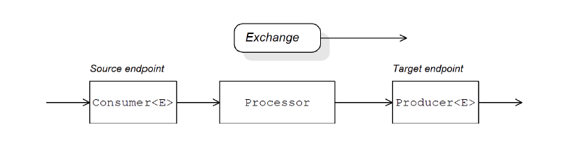

# 第47章. 实现一个组件
*KarezFlow 产品组
编写：孙勇
版本：1.0*

## 47.1. 组件架构
### 47.1.1. 组件工厂模式
一个Apache Camel组件由一组类组成，通过工厂模式彼此关联。一个组件的主入口点是组件对象自身（**org.apache.camel.Component** 类型实例）。可以如同工厂使用 **Component** 对象来创建**Endpoint** 对象。反过来，**Endpoint** 对象担当工厂去创建 **Consumer**, **Producer** 和 **Exchange** 对象。


#### 组件
一个组件是端点工厂的实现。一个组件实现的主要任务是实现 **Component.createEndpoint()** 方法，它负责创建新的端点。

每一种组件必须与一个*组件前缀*联系在一起，在端点URI中出现。

#### 端点
每个端点实例封装了一个特定的端点URI。每当Apache Camel遇到新的端点URI，它将创建一个新的端点实例。端点对象也是用于创建消费者端点和生产者端点的工厂。

端点必须实现 **org.apache.camel.Endpoint** 接口。端点接口定义了一下方法：
- **createConsumer()** 和 **createPollingConsumer()** —— 创建一个消费者端点，它表示路由开始处的源端点。
- **createProducer()** —— 创建一个生产者端点，它表示路由结束处的目标端点。
- **createExchange()** —— 创建一个交换对象，它封装了在路由上下传递的消息。

#### 消费者
消费者端点消费请求。它们总是出现在路由的开头，它们封装了负责接收传入请求的代码，并且发送传出的回复。从面向服务视角来看，一个消费者代表一个服务。

消费者必须实现 **org.apache.camel.Consumer** 接口。实现消费者时可以遵循不同的模式，参考“消费者模式和线程”。

#### 生产者
生产者端点产生请求，它们总是出现在路由的末尾。它们封装了负责调度传出请求和接收传入回复的代码。
从面相服务视角来看，一个生产者代表一个服务消费者。

生产者必须实现 **org.apache.camel.Producer** 接口。可以选择实现生产者支持异步处理风格。有关详细信息，请参见“异步处理”。

#### 交换
交换对象封装了一组相关的消息。例如，一种消息交换时一种同步调用，由一个请求消息及其相关回复组成。

交换必须实现 **org.apache.camel.Exchange** 接口。默认实现 **DefaultExchange** 对于许多组件实现是足够的。但是，如果要将交换附加的额外数据与交换关联或者进行交换则需要进行其他处理。因此可以自定义交换实现。

#### 消息
交换对象中有两个不同的消息槽：
- 输入消息—— 保存当前消息
- 输出消息—— 暂时保存回复消息。

所有的消息类型由 **org.apache.camel.Message** Java对象表示。并不总是需要自定义消息实现——默认实现 **DefaultMessage** 通常是足够的。

### 47.1.2. 在路由中使用组件
Apache Camel 路由本质上是一个 **org.apache.camel.Processor** 类型的处理器流水线。消息封装在交换对象中，通过调用`process()`方法从节点传递到节点。处理器管道架构如下图所示：
 


#### 源端点
源端点位于路由开始处，它是 **org.apache.camel.Consumer** 类型对象。源端点负责接收传入的请求消息和发送回复。在构建路由时，Apache Camel 将根据端点URI的组件前缀创建适当的消费者类型。详见“47.1.1 组件工厂模式”。

#### 处理器
管道中的每个中间节点由处理器对象（实现 **org.apache.camel.Processor** 接口）表示。可以插入标准处理器（例如，过滤器，调节器或者延迟器），或者插入自定处理器。

#### 目标端点
路由的末尾时目标端点，由 **org.apache.camel.Producer** 对象表示。因为在处理器管道的末尾，生产者也是一个处理器对象（实现 **org.apache.camel.Processor** 接口）。

### 47.1.3. 消费者模式和线程
用于实现消费者的模式决定了传入交换的线程模型。消费者可以使用以下模式之一实现：
- 事件驱动模式 —— 消费者由外部线程驱动。
- 调度轮询模式 —— 消费者由专用线程池驱动。
- 轮询模式 —— 线程模式未定义。

#### 事件驱动模式
在事件驱动模式中，当应用程序的另一部分（通常是第三方库）调用消费者实现的方法时启动出入请求的处理。事件驱动的消费者的一个很好的例子是 Apache Camel JMX 组件，其中事件由JMX库启动。JMX库调用`handleNotification()`方法来启动请求处理。


事件驱动的消费者传入请求处理如下：
1. 消费者必须实现接收传入事件的方法（上图中 `notify()`方法）。调用`notify()`的线程通常是应用程序员的单独部分，因此消费者的线程策略是外部驱动的。
2. 在`notify()`方法的主体中，消费者首先将事件转换为交换对象，然后在调用路由中下一个处理器上的`process()`方法，并将交换对象作为参数传递。

#### 调度轮询模式
在调度轮询模式中，消费者通过设定时间间隔检查请求是否达到来检索传入请求。检查请求由内置计时器类自定排定。计划执行器服务以设定时间间隔执行特定任务，并且还管理用于运行任务实例的线程池。


调度轮询消费者传入请求处理如下：
1. 预定的执行器服务有一个可用的线程池用于启动消费者处理。在每个预定时间间隔过去后，计划的执行程序服务尝试从线程池中获取一个空闲线程（默认情况下，线程池有5个线程）。如果有可用线程则使用该线程调用消费者的`poll()`方法。
2. 消费者的`poll()`方法旨在触发传入请求的处理。在`poll()`方法的主体中，消费者尝试检索传入的消息。如果没有请求可用，则`poll()`方法立即返回。
3. 如果请求消息可用则消费者将其插入到交换对象中，然后调用路由中下一个处理器的`process()`方法，并将交换对象作为参数传递。

#### 轮询模式
在轮询模式中，当第三方调用消费者的轮询方法之一时启动传入请求的处理：
- receive()
- receiveNoWait()
- receive(long timeout)

由组件实现来定义启动轮询方法代用的准确机制，轮询模式未指定。


轮询消费者传入请求处理如下：
1. 每当调用消费者的轮询方法之一时启动传入请求的处理。调用这些轮询方法的机制是定义的。
2. 在` receive()`方法的主题中，消费者尝试检索一个传入请求消息。如果当前没有可用消息则该行为取决于调用哪种接收方法。
- **receiveNoWait()** 立即返回
- **receive(long timeout)** 等待指定的超时间隔返回
- **receive()** 等待直到收到消息
3. 如果请求消息可用则消费者将其插入到交换对象中，然后调用路由中下一个处理器的`process()`方法，并将交换对象作为参数传递。

### 47.1.4. 异步处理
处理交换时，生产者端点通常遵循同步模式。当管道中的前一个处理器在生产者上调用`process()`时，`process()`方法阻塞直到收到回复。在这种情况下，处理器的线程将保持阻塞，直到生产者完成发送请求和接收回复的周期。

然而，有时候可能需要将前一个处理器与生产者分离，从而立即释放处理的线程，并且`process()`调用不会阻塞。在这种情况下，应该使用异步模式实现生产者，这使得前一个处理器可以调用`process()`方法的非阻塞版本。

#### 同步生产者
下图显示了同步生产者的示意图，其中前一个处理器将阻塞直到生产者完成交换处理。


同步生产者交换处理如下：
1. 上述处理器在管道中调用处理器的`process()`方法启动同步处理。同步`process()`方法采用单一交换参数。
2. 在`process()`方法的主体中，生产者将请求（In消息）发送到端点。
3. 如果交换模式需要，生产者等待直到回复（Out消息）从端点到达。此步骤可能导致`process()`方法无限期阻塞。
4. 当`process()`方法返回时，交换对象包含来自同步调用的响应（Out消息）。

#### 异步生产者
下图显示了异步生产者的示意图，生产者在子线程中处理交换，并且前一个处理器在任何相当长的时间内不被阻止。


异步生产者交换处理如下：
1. 在处理器可以调用异步`process()`方法之前，它必须创建一个异步回调对象。该对象负责在路由的返回部分处理交换。对于异步回调，处理器必须实现继承 **AsyncCallback** 接口的类。
2. 处理器调用生产者异步`process()`方法启动异步处理。异步`process()`方法有两个参数：
  - 一个交换对象
  - 一个同步回调对象
3. 在`process()`方法的主体中，生成器创建一个 **Runnable** 对象封装处理代码。然后生产者委托执行这个 **Runnable** 对象到一个子线程。
4. 异步`process()`方法返回时，释放处理器的线程。交换处理在单独的子线程中继续。
5. **Runnable** 对象将In消息发送到端点。
6. 如果交换模式需要，**Runnable** 对象等待回复（Out 或者 Fault消息）从端点到达。**Runnable** 对象保持被阻塞，直到回复收到。
7. 回复收到后，**Runnable** 对象插入回复（Out消息）到交换对象，然后在异步回调对象上调用` done()`。然后，异步回调负责处理回复消息（在子线程中执行）。

## 47.2. 如何实现一个组件
### 需要实现哪些接口？
实现组件时，通常需要实现以下Java接口：
- **org.apache.camel.Component**
- **org.apache.camel.Endpoint**
- **org.apache.camel.Consumer**
- **org.apache.camel.Producer**

此外，还可能需要实现以下Java接口：
- **org.apache.camel.Exchange**
- **org.apache.camel.Message**

### 实现步骤
通常按以下方式实现自定义组件：
1. **实现组件接口** —— 组件对象充当端点工厂。扩展 **DefaultComponent** 类实现`createEndpoint()`方法。
2. **实现端点接口** —— 端点表示由特定URI标识的资源。实现端点时采取的方法取决于消费者是否遵循事件驱动模式、调度轮询模式或轮询模式。

对于事件驱动模式，通过扩展 **DefaultEndpoint** 类并实现以下方法来实现端点：
- createProducer()
- createConsumer()

对于调度轮询模式，通过扩展 **ScheduledPollEndpoint** 类并实现以下方法来实现端点：
- createProducer()
- createConsumer()

对于轮询模式，通过扩展 **DefaultPollingEndpoint** 类并实现以下方法来实现端点：
- createProducer()
- createPollConsumer()
3. **实现消费者接口** —— 根据需要执行的模式（事件驱动、调度轮询或轮询）可以采用几种不同的方法来实现消费者。消费者实现对于确定用于处理消息交换的线程模型也至关重要。
4. **实现生产者接口** —— 要实现生产者可以扩展 **DefaultProducer** 类的`process()`方法。
5. **实现交换接口或者消息接口** （可选）—— 交换和消息的默认实现可以直接使用，可根据需要自定义这些类型。

### 安装和配置组件
可以通过以下方式之一安装自定义组件：
- 将组件直接添加到 **CamelContext** —— 使用编程方式调用`CamelContext.addComponent()`方法添加组件。
- 使用Spring配置添加组件 —— 标准的Spring bean元素创建一个组件实例。bean的id属性隐含地定义了组件前缀。
- 配置Apache Camel自定发现组件 —— 自动发现确保Apache Camel根据需要自动加载组件。

## 47.3. 自动发现和配置
### 47.3.1. 设置自动发现
自动发现是一种能够将组件动态添加到Apache Camel应用程序的机制。组件URI前缀用作按需加载组件的键。例如，如果Apache Camel遇到端点`activemq://MyQName`且ActiveMQ端点尚未加载，Apache Camel会搜索`activemq`前缀标识的组件并动态加载组件。

#### 组件类的可用性
配置自动发现之前，必须确保自定义组件类可以从当前类路径访问。通常，将自定义组件类打包到JAR文件并添加到类路径中。

#### 配置自动发现
要启用组件的自动发现，创建一个组件前缀命名的Java属性文件并将文件保存在下列位置：
```
/META-INF/services/org/apache/camel/component/component-prefix
```

组件前缀属性文件必须包含以下属性设置：
```
class=component-class-name
```

其中，*component-class-name* 是自定义组件类的完全限定名称。还可以在此文件中定义其他系统属性设置。

#### 示例
例如，可用过创建FTP组件的Java属性文件：
```
/META-INF/services/org/apache/camel/component/ftp
```

其中包含以下Java属性设置：
```
class=org.apache.camel.component.file.remote.RemoteFileComponent
```

### 47.3.2. 配置组件
可以通过配置Apache Camel Spring配置文件 **METAINF/spring/camel-context.xml** 添加组件。要查找组件，组件的URI前缀与Spring配置中的bean元素的ID属性进行匹配。如果组件前缀与bean元素ID匹配，则Apache Camel会实例化引用的类并注入Spring配置中指定的属性。

>**注意：** 这种机制优先于自动发现。如果CamelContext找到具有必须ID的Spring bean则不会尝试使用自动发现查找组件。

#### 定义组件类的bean属性
如果要将任何属性注入到组件类中，可将其定义为bean属性。例如：
```java
public class CustomComponent extends
  DefaultComponent<CustomExchange> {
  ...
  PropType getProperty() { ... }
  void setProperty(PropType v) { ... }
  }
```

`getProperty()`和`setProperty()`方法访问属性的值。

#### 在Spring中配置组件
要在Spring中配置组件，可以编辑配置文件 **META-INF/spring/camelcontext.xml** 。
```xml
<?xml version="1.0" encoding="UTF-8"?>
<beans xmlns="http://www.springframework.org/schema/beans"
      xmlns:xsi="http://www.w3.org/2001/XMLSchema-instance"
      xsi:schemaLocation="
      http://www.springframework.org/schema/beans
      http://www.springframework.org/schema/beans/spring-beans-2.0.xsd
      http://camel.apache.org/schema/spring
      http://camel.apache.org/schema/spring/camel-spring.xsd">

  <camelContext id="camel" xmlns="http://camel.apache.org/schema/spring">
    <package>RouteBuilderPackage</package>
  </camelContext>

  <bean id="component-prefix" class="component-class-name">
    <property name="property" value="propertyValue"/>
  </bean>
</beans>
```

具有ID组件前缀的bean元素配置*组件类名*组件。您可以使用属性元素将属性注入到组件实例中。例如，上例中的 **property** 元素将通过在组件上调用 **setProperty（）**将值*propertyValue*注入到 **property** 属性中。

#### 示例
本示例显示如何通过配置文件配置JMS组件。设置将添加到 **camel-context.xml** 文件中。

```xml
<?xml version="1.0" encoding="UTF-8"?>
<beans xmlns="http://www.springframework.org/schema/beans"
      xmlns:xsi="http://www.w3.org/2001/XMLSchema-instance"
      xsi:schemaLocation="
      http://www.springframework.org/schema/beans
      http://www.springframework.org/schema/beans/spring-beans-2.0.xsd
      http://camel.apache.org/schema/spring
      http://camel.apache.org/schema/spring/camel-spring.xsd">

  <camelContext id="camel"
        xmlns="http://camel.apache.org/schema/spring">
    <package>org.apache.camel.example.spring</package>
  </camelContext>

  <bean id="jms" class="org.apache.camel.component.jms.JmsComponent">
  
  <property name="connectionFactory">
    <bean class="org.apache.activemq.ActiveMQConnectionFactory">
      <property name="brokerURL"
        value="vm://localhost?
        broker.persistent=false&amp;broker.useJmx=false"/>
    </bean>
  </property>
  </bean>
</beans>
```

1. **CamelContext** 会自动实例化指定的 **org.apache.camel.example.spring** Java包中发现的任何 **RouteBuilder** 类。
2. ID为`jms`的bean元素配置JMS组件。bean ID对应于组件的URI前缀。例如，如果路由指定了具有URI（jms://MyQName）的端点，则Apache Camel将使用jms bean元素中的设置自定加载JMS组件。
3. JMS只是一个消息传递服务的包装，必须在 **JmsComponent** 类上设置 **connectionFactory** 属性指定具体的类实现消息系统。
4. 在这个例子中，JMS消息服务的具体实现是Apache ActiveMQ。**brokerURL** 属性初始化与ActiveMQ代理实例的连接。其中，消息代理嵌入在本地Java虚拟机中。如果一个代理不在JVM中，ActiveMQ将使用根据 **broker.persistent = false**（代理不持续消息）和 **broker.useJmx = false**（代理不打开JMX端口）选项实例化。