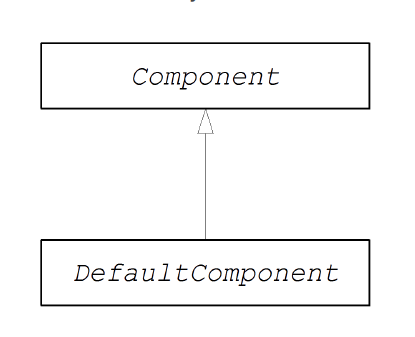

# CHAPTER 48. 组件接口
*KarezFlow 产品组
编写：孙勇
版本：1.0*

## 48.1. 组件接口
实现Apache Camel组件必须继承`org.apache.camel.Component`接口。`Component`类型实例提供自定义组件入口。



### 组件接口
`org.apache.camel.Component`接口定义：
```java
package org.apache.camel;

public interface Component {
  CamelContext getCamelContext();
  void setCamelContext(CamelContext context);

  Endpoint createEndpoint(String uri) throws Exception;
}
```

### 组件方法
`Component`接口定义了下列方法：
- `getCamelContext()`和`setCamelContext()`——在组件内部引用`CamelContext`。
- `createEndpoint()`——创建端点实例的工厂方法。

## 48.2. 实现组件接口
### DefaultComponent 类
可以继承 **org.apache.camel.impl.DefaultComponent** 类实现一个新的组件，它提供了一些标准功能并实现了一些方法。特别是，**DefaultComponent** 类提供URI解析和创建定时执行器（用于调度轮询模式）。

### URI 解析
基于`Component`接口`createEndpoint(String uri)`方法

```java
protected abstract Endpoint createEndpoint(
    String uri,
    String remaining,
    Map parameters
)
throws Exception;
```

*uri*是原始的，未解析的。*remaining*是在开始处截取组件前缀并在结尾处截取查询选项后保留的URI的部分。*parameters*包含解析后的查询选项。当从 **DefaultComponent** 类继承必须重写 这个版本的`createEndpoint() ` 方法。

以下示例显示文件组件的端点URI解析的工作原理：
```
file:///tmp/messages/foo?delete=true&moveNamePostfix=.old
```

此URI以下参数将传递给`createEndpoint()`方法：

参数|示例值
----|------
uri|file:///tmp/messages/foo?delete=true&moveNamePostfix=.old
remaining|/tmp/messages/foo
parameters|delete=true，moveNamePostfix=.old

### 参数注入
默认情况下，参数从URI查询选项中提取并注入到端点Bean属性中。`DefaultComponent`类自动完成注入。

```java
public class FileEndpoint extends ScheduledPollEndpoint {
  ...
  public boolean isDelete() {
    return delete;
  }

  public void setDelete(boolean delete) {
    this.delete = delete;
  }
  ...
  public String getMoveNamePostfix() {
    return moveNamePostfix;
  }

  public void setMoveNamePostfix(String moveNamePostfix) {
    this.moveNamePostfix = moveNamePostfix;
  }
}
```
### 禁用端点参数注入
如果端点类没有定义属性，可以通过禁用端点属性注入优化端点创建过程。重写`useIntrospectionOnEndpoint()`方法并返回`false`可以禁用参数注入。

```java
protected boolean useIntrospectionOnEndpoint() {
  return false;
}
```

### 定时执行器服务
定时执行器使用定时轮询模式，

### URI校验
如果想在创建端点实例前校验URI是否有效，可以通过重写`DefaultComponent`类的`validateURI()`方法。

```java
protected void validateURI(String uri,
                          String path,
                          Map parameters)
  throws ResolveEndpointFailedException;
```

如果URI不符合格式要求则可以在`validateURI()`方法中抛出`org.apache.camel.ResolveEndpointFailedException`异常。

### 创建一个端点
```java
public class CustomComponent extends DefaultComponent {
  ...
  protected Endpoint createEndpoint(String uri, String remaining, Map parameters) throws Exception {
    CustomEndpoint result = new CustomEndpoint(uri, this);
    // ...
    return result;
  }
}
```

**代码说明：**
1. `CustomComponent`是自定义组件类，继承`DefaultComponent`类。
2. 从`DefaultComponent`类继承必须实现有三个参数的`createEndpoint()`方法。
3. 创建自定义端点类型`CustomEndpoint`实例。

### 示例
**FileComponent 实现**：
```java
package org.apache.camel.component.file;

import org.apache.camel.CamelContext;
import org.apache.camel.Endpoint;
import org.apache.camel.impl.DefaultComponent;
import java.io.File;
import java.util.Map;

public class FileComponent extends DefaultComponent {
  public static final String HEADER_FILE_NAME ="org.apache.camel.file.name";

  public FileComponent() {
  }

  public FileComponent(CamelContext context) {
    super(context);
  }

  protected Endpoint createEndpoint(String uri, String remaining, Map parameters) throws Exception {
    File file = new File(remaining);
    FileEndpoint result = new FileEndpoint(file, uri, this);
    return result;
  }
}
```

**代码说明：**
1. 总是定义一个无参构造器，以便自动实例化。
2. 当用编程方式创建组件实例时构造器需要`CamelContext`实例作为参数。
3. 实现`FileComponent.createEndpoint()`方法创建`FileEndpoint`对象。
 
### SynchronizationRouteAware 接口
`SynchronizationRouteAware`接口允许在交换发生路由前后进行回调。
- **onBeforeRoute:** 在交换路由前调用。
- **onAfterRoute:** 在交换器路由后调用。

