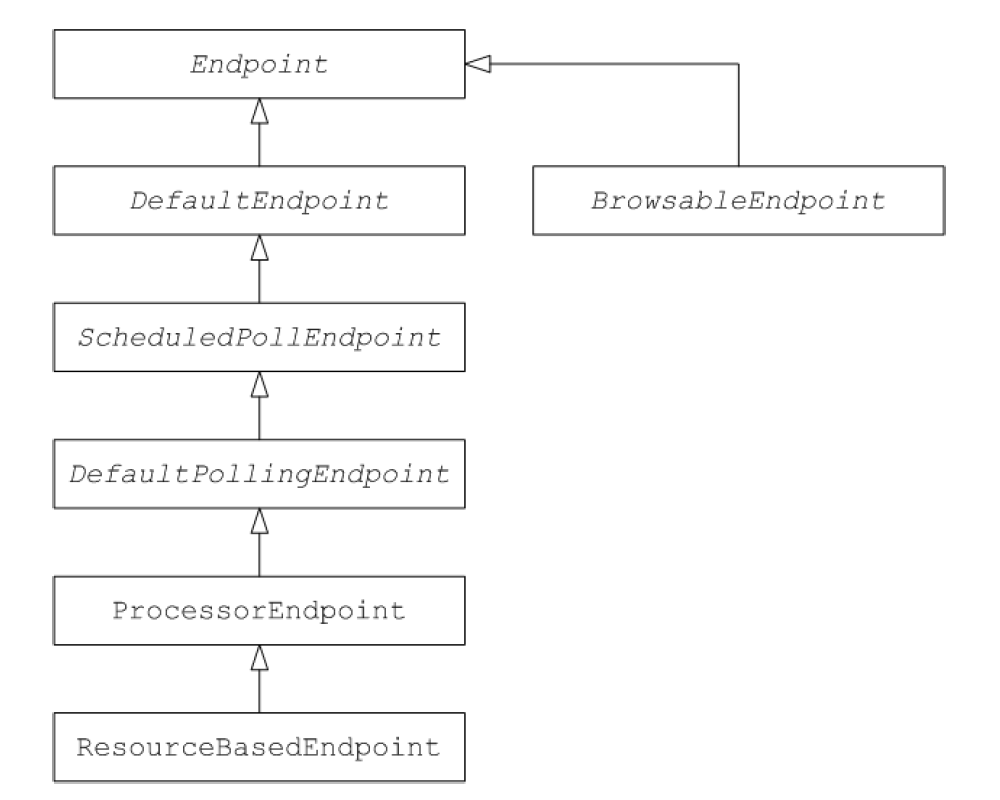

# CHAPTER 49. 端点接口
*karezflow 产品组
整理：孙勇
版本：0.1*

## 49.1. 端点接口
**org.apache.camel.Endpoint** 类型实例封装了一个端点URI，且作为消费者、生产者和交换对象工厂。实现端点有三种不同的方法：
- 事件驱动
- 调度轮询
- 轮询

下图显示构成端点继承层次结构的相关Java接口和类：



### 端点接口
示例：端点接口
```java
package org.apache.camel;

public interface Endpoint {
  boolean isSingleton();
  String getEndpointUri();
  String getEndpointKey();

  CamelContext getCamelContext();
  void setCamelContext(CamelContext context);

  void configureProperties(Map options);

  boolean isLenientProperties();

  Exchange createExchange();
  Exchange createExchange(ExchangePattern pattern);
  Exchange createExchange(Exchange exchange);

  Producer createProducer() throws Exception;
  
  Consumer createConsumer(Processor processor) throws Exception;
  PollingConsumer createPollingConsumer() throws Exception;
}
```

### 端点方法
Endpoint 接口定义了以下方法：
- **isSingleton()** —— 如果在一个上下文中要确保每个URI映射到单个端点，设置为true。当此属性为true时，在路由中多次引用相同的URI始终引用一个端点实例。当这个属性为false时，每次引用URI都会创建一个新的端点实例。
- **getEndpointUri()** —— 返回此端点的端点URI。
- **getEndpointKey()** —— **org.apache.camel.spi.LifecycleStrategy** 用于注册端点。
- **getCamelContext()** —— 返回此端点引用的 **CamelContext** 实例。
- **setCamelContext()** —— 设置此端点的 **CamelContext** 实例。
- **configureProperties()** —— 存储参数映射副本用于创建新的消费者实例时注入参数。
- **isLenientProperties()** —— 返回true表示URI被允许包含未知参数（即不能注入到端点或者消费者的参数）。通常，该方法返回false。
- **createExchange()** —— 具有以下重载方法：
  - **Exchange createExchange()** —— 创建一个默认交换模式的交换实例。
  - **Exchange createExchange(ExchangePattern pattern)** —— 创建一个指定交换模式的交换实例。
  - **Exchange createExchange(Exchange exchange)** —— 将指定交换转换为此端点需要的交换类型。如果指定的交换不是正确类型，此方法将其复制到新的正确类型实例中。**DefaultEndpoint** 类提供了此方法的默认实现。
- **createProducer()** —— 用于创建新的生产者实例的工厂方法。
- **createConsumer()** —— 用于创建新的事件驱动消费者实例的工厂方法。该处理器参数是对路由第一个处理器的引用。
- **createPollingConsumer()** —— 用于创建新的轮询消费者的工厂方法。

### 端点单例
为了避免不必要的开销，最好为在同一个上下文中具有相同URI的所有端点创建一个端点实例。可用通过设置`isSingleton()`为true来实现。

>**注意**
>在这种情况下，相同的URI意味着当使用字符串相等性比较时两个URI是相同的。原则上，可以有两个相同的URI由不同的字符串表示。在这种情况下，URI不会被视为相同。

## 49.2. 实现端点接口
### 实现端点可选的方法
下列是支持的可选端点实现模式：
- 事件驱动端点实现
- 调度轮询端点实现
- 轮询端点实现

### 实现事件驱动端点
如果您的自定义端点符合事件驱动模式,则通过扩展抽象类 **org.apache.camel.impl.DefaultEndpoint** 来实现。如下：

```java
import java.util.Map;
import java.util.concurrent.BlockingQueue;

import org.apache.camel.Component;
import org.apache.camel.Consumer;
import org.apache.camel.Exchange;
import org.apache.camel.Processor;
import org.apache.camel.Producer;
import org.apache.camel.impl.DefaultEndpoint;
import org.apache.camel.impl.DefaultExchange;

public class CustomEndpoint extends DefaultEndpoint {
  public CustomEndpoint(String endpointUri, Component component) {
    super(endpointUri, component);
    // Do any other initialization...
  }

  public Producer createProducer() throws Exception {
    return new CustomProducer(this);
  }

  public Consumer createConsumer(Processor processor) throws Exception {
    return new CustomConsumer(this, processor);
  }

  public boolean isSingleton() {
    return true;
  }

  // Implement the following methods, only if you need to set exchange properties.
  public Exchange createExchange() {
    return this.createExchange(getExchangePattern());
  }

  public Exchange createExchange(ExchangePattern pattern) {
    Exchange result = new DefaultExchange(getCamelContext(),pattern);

    // Set exchange properties
    ...
    return result;
  }
}
```

1. 通过扩展 **DefaultEndpoint** 类来实现事件驱动自动以端点。
2. 必须有一个构造函数接收端点URI、父组件引用作为参数。
3. 实现 **createProducer()** 工厂方法来创建生产者端点。
4. 实现 **createConsumer() ** 工厂方法来创建事件驱动消费者实例。
  >**重要：** 不要重写 **createPollingConsumer()** 方法。
5. 通常不必重写  **createExchange()** 方法。该方法从 **DefaultEndpoint**  继承实现创建一个默认交换对象，可用于任何Apache Camel组件。如果需要在默认交换对象中初始化一些交换属性，可以在此处重写以便添加交换属性设置。

**DefaultEndpoint** 类提供了以下方法的默认实现：
- getEndpointUri() —— 返回端点URI。
- getCamelContext() —— 返回上下文引用。
- getComponent() —— 返回父组件引用。
- createPollingConsumer() —— 创建轮询消费实例。创建的轮询消费者功能基于事件驱动消费者。
- createExchange(Exchange e) —— 将指定交换转换为此端点需要的交换类型。该方法重写 **createExchange()** 创建一个新端点，这样可以确保该方法也适用于自定义交换类型。

### 实现调度轮询端点
如果自定义端点符合调度轮行模式，可以通过继承 **org.apache.camel.impl.ScheduledPollEndpoint** 类来实现。如下：

```java
import org.apache.camel.Consumer;
import org.apache.camel.Processor;
import org.apache.camel.Producer;
import org.apache.camel.ExchangePattern;
import org.apache.camel.Message;
import org.apache.camel.impl.ScheduledPollEndpoint;

public class CustomEndpoint extends ScheduledPollEndpoint {
  
  protected CustomEndpoint(String endpointUri, CustomComponent component) {
    super(endpointUri, component);
    // Do any other initialization...
  }

  public Producer createProducer() throws Exception {
    Producer result = new CustomProducer(this);
    return result;
  }

  public Consumer createConsumer(Processor processor) throws Exception {
    Consumer result = new CustomConsumer(this, processor);
    configureConsumer(result);
    return result;
  }

  public boolean isSingleton() {
    return true;
  }

  // Implement the following methods, only if you need to set exchange properties.
  public Exchange createExchange() {
    return this.createExchange(getExchangePattern());
  }

  public Exchange createExchange(ExchangePattern pattern) {
    Exchange result = new DefaultExchange(getCamelContext(),pattern);
    // Set exchange properties
    ...
    return result;
  }
}
```

1. 通过扩展 **ScheduledPollEndpoint** 类实现一个自定义调度轮询端点。
2. 必须有一个构造函数接收端点URI、父组件参数。
3. 实现 **createProducer()** 工厂方法创建生产者端点。
4. 实现 **createConsumer()** 工厂方法创建调度轮询消费者实例。
  >**重要：** 不要重写 **createPollingConsumer()** 方法。
5. **ScheduledPollEndpoint** 基类中定义的 ** configureConsumer()** 方法负责将消费者查询选项注入到消费者。
6. 通常不必重写 **createExchange()** 方法。该方法从 **DefaultEndpoint** 继承实现创建一个默认交换对象，可用于任何Apache Camel组件。如果需要在默认交换对象中初始化一些交换属性，可以在此处重写以便添加交换属性设置。

### 实现轮询端点
如果自定义端点符合轮询消费者模式，则通过继承抽象类 **org.apache.camel.impl.DefaultPollingEndpoint** 实现。如下：
```java
import org.apache.camel.Consumer;
import org.apache.camel.Processor;
import org.apache.camel.Producer;
import org.apache.camel.ExchangePattern;
import org.apache.camel.Message;
import org.apache.camel.impl.DefaultPollingEndpoint;

public class CustomEndpoint extends DefaultPollingEndpoint {
  ...
  public PollingConsumer createPollingConsumer() throws Exception {
    PollingConsumer result = new CustomConsumer(this);
    configureConsumer(result);
    return result;
  }

  // Do NOT implement createConsumer(). It is already implemented in
  DefaultPollingEndpoint.
  ...
}
```

因为此自定义端点是轮询端点，因此必须实现 **createPollingConsumer()** 方法，而不是 **createConsumer()** 方法。从 **createPollingConsumer()** 方法返回的消费者实例必须从 
**PollingConsumer** 接口继承。

除了执行  **createPollingConsumer()** 方法外，实现 **DefaultPollingEndpoint** 的步骤与实现ScheduledPollEndpoint的步骤类似。 

### 实现 BrowsableEndpoint 接口
如果要公开当前端点中挂起的交换实例的列表，可以实现**org.apache.camel.spi.BrowsableEndpoint** 接口。 如果端点对传入事件执行某种缓冲，则实现此接口是有意义的。例如，Apache Camel SEDA端点实现BrowsableEndpoint接口。

```java
package org.apache.camel.spi;

import java.util.List;
import org.apache.camel.Endpoint;
import org.apache.camel.Exchange;

public interface BrowsableEndpoint extends Endpoint {
  List<Exchange> getExchanges();
}
```

### 示例

```java
package org.apache.camel.component.seda;

import java.util.ArrayList;
import java.util.List;
import java.util.Map;
import java.util.concurrent.BlockingQueue;

import org.apache.camel.Component;
import org.apache.camel.Consumer;
import org.apache.camel.Exchange;
import org.apache.camel.Processor;
import org.apache.camel.Producer;
import org.apache.camel.impl.DefaultEndpoint;
import org.apache.camel.spi.BrowsableEndpoint;

public class SedaEndpoint extends DefaultEndpoint implements BrowsableEndpoint {
  private BlockingQueue<Exchange> queue;
  
  public SedaEndpoint(String endpointUri, Component component,BlockingQueue<Exchange> queue) {
    super(endpointUri, component);
    this.queue = queue;
  }

  public SedaEndpoint(String uri, SedaComponent component, Map parameters) {
    this(uri, component, component.createQueue(uri, parameters));
  }

  public Producer createProducer() throws Exception {
    return new CollectionProducer(this, getQueue());
  }

  public Consumer createConsumer(Processor processor) throws Exception {
    return new SedaConsumer(this, processor);
  }

  public BlockingQueue<Exchange> getQueue() {
    return queue;
  }

  public boolean isSingleton() {
    return true;
  }

  public List<Exchange> getExchanges() {
    return new ArrayList<Exchange>(getQueue());
  }
}
```

1. **SedaEndpoint** 类通过扩展 **DefaultEndpoint** 类实现事件驱动端点。**SedaEndpoint** 类还实现了 **BrowsableEndpoint** 接口，该接口提供对队列中交换对象的访问。
2. 遵循事件驱动消费者模式，**SedaEndpoint** 定义了一个接受端点URI和组件优先级为参数的构造函数。
3. 提供了另一个构造函数，将队列创建委托给父组件实例。
4. 实现 **createProducer()** 工厂方法创建一个 **CollectionProducer** 实例，这是一个将事件添加到队列的生产者实现。
5. 实现 **createConsumer()** 工厂方法创建一个 **SedaConsumer** 实例，该实例负责将事件从队列中拉出并处理。
6. **getQueue()** 方法返回队列的引用。
7. **isSingleton()** 方法返回true，指示为每个相同URI创建单个端点实例。
8. **getExchanges()** 方法是实现 **BrowsableEndpoint** 接口相应的方法。