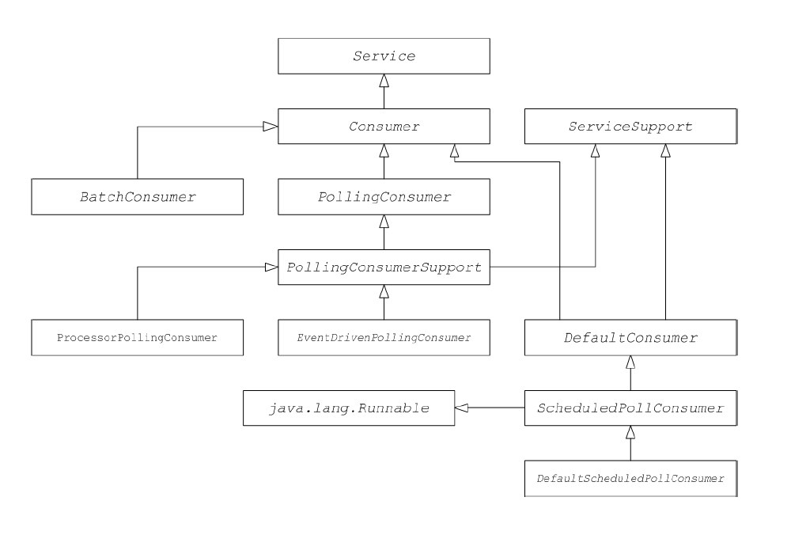

# CHAPTER 50. 消费者接口
*karezflow 产品组
整理：孙勇
版本：0.1*

## 50.1. 消费者端点
**org.apache.camel.Consumer** 类型的实例表示路由中的源端点。有几种实现消费者的不同方式，并且这种灵活性反映在继承层次结构中，其中包括用于实现消费者的几个不同的基类。



### Consumer parameter injection
消费者参数注入遵循调度轮询模式，Apache Camel提供将参数注入消费者实例的支持。例如，考虑如下的自定义前缀标识的组件：

```
custom:destination?consumer.myConsumerParam
```

Apache Camel提供自动注入查询选项的支持。例如，consumer.myConsumerParam 参数。这需要在消费者实现类中定义相应的`setter`和`getter `方法。如下：

```java
public class CustomConsumer extends ScheduledPollConsumer {
  ...
  String getMyConsumerParam() { ... }
  void setMyConsumerParam(String s) { ... }
  ...
}
```

除了在消费者实现中定义bean方法以外，还必须在 **Endpoint.createConsumer()** 方法内调用  **configureConsumer()** 方法 。下例显示一个文件组件端点类： 

```java
...
public class FileEndpoint extends ScheduledPollEndpoint {
  ...
  public Consumer createConsumer(Processor processor) throws   Exception {
    Consumer result = new FileConsumer(this, processor);
    configureConsumer(result);
    return result;
  }
  ...
}
```

在运行时，消费者参数注入工作如下：
1. 当创建端点时，默认实现 **DefaultComponent.createEndpoint(String uri)** 解析URI提取消费者参数，并通过调用 **ScheduledPollEndpoint.configureProperties()** 存储到端点实例中。
2. 当调用 **createConsumer()** 时，方法调用 **configureConsumer()** 注入消费者参数。
3. **configureConsumer()** 方法使用Java反射来调用`setter`方法，名字与选项相符。

### 调度轮询参数
遵循调度轮询模式的消费者自动支持下列消费者参数：

名称|默认|默认
----|----|----
initialDelay|1000|第一次轮询延迟时间（以毫秒为单位）。
delay|500|取决于 **useFixedDelay** 标志的值（以毫秒为单位）。
useFixedDelay|false|如果为false，则延迟参数为轮询间隔。轮询会在initialDelay，initialDelay+delay，initialDelay+2*delay发起。如果为true，则延迟则为上一次和下一次执行之间的间隔。轮询会在initialDelay, initialDelay+[ProcessingTime]+delay发起。 **ProcessingTime** 是处理当前线程中交换对象所花费的时间。 

### 在事件驱动和轮询消费者之间转换
Apache Camel提供两种特殊消费者实现，用于在事件驱动的消费者和轮询消费者之间来回转换。
- **org.apache.camel.impl.EventDrivenPollingConsumer** —— 将事件驱动消费者转换为轮询消费者实例。
- **org.apache.camel.impl.DefaultScheduledPollConsumer** —— 将轮询消费者转换为事件驱动消费者实例。

实际上，这些类用于简化实现端点类型的任务。端点接口定义了以下两种创建消费者实例的方法：

```java
package org.apache.camel;

public interface Endpoint {
  ...
  Consumer createConsumer(Processor processor) throws Exception;
    PollingConsumer createPollingConsumer() throws Exception;
}
```

**createConsumer()** 返回一个事件驱动消费者， createPollingConsumer() 返回一个轮询消费者。只能实现这些方法。然后，在转换类的帮助下，Apache Camel能够提供更实用的默认实现。

例如，如果要根据事件驱动的模式来实现消费者，则通过扩展DefaultEndpoint并实现createConsumer()方法实现端点。 createPollingConsumer() 的实现从DefaultEndpoint继承，其定义如下：

```java
public PollingConsumer<E> createPollingConsumer() throws Exception {
  return new EventDrivenPollingConsumer<E>(this);
}
```

**EventDrivenPollingConsumer** 构造函数引用了事件驱动消费者，这样做可有效地将其包装并转换为轮询消费者。实施转换时，**EventDrivenPollingConsumer** 实例缓存传入事件并使其能通过receive(), receive(long timeout), 和 receiveNoWait()方法。 

类似地，如果根据轮询模式实现消费者，则可以通过扩展DefaultPollingEndpoint实现端点并实现
**createPollingConsumer()** 方法。在这种情况下，执行从 **DefaultPollingEndpoint** 继承的 **createConsumer()**方法，默认返回一个 **DefaultScheduledPollConsumer** 实例（它转换轮询消费者成为事件驱动消费者）。

### ShutdownPrepared 接口
消费者类可以选择性地实现 **org.apache.camel.spi.ShutdownPrepare**d 接口，使接口能够接收关机通知。

```java
package org.apache.camel.spi;

public interface ShutdownPrepared {
  void prepareShutdown(boolean forced);
}
```

接收通知以在一个或两个阶段关闭消费者端点，如下：
1. 正常关机 —— 强制参数的值为false。尝试优雅地清理资源。
2. 强制关机 —— 强制参数的值为true。这意味着关机已超时，因此必须积极地清理资源。这是在进程退出之前清理资源的最后机会。
 
### ShutdownAware 接口
消费者类可以选择性地实现 **org.apache.camel.spi.ShutdownAware** 接口，它与优雅的关机机制进行交互，使消费者能够要求额外的时间关闭。这对于诸如SEDA的组件通常是需要的，其可以具有存储在内部队列中的挂起交换。通常，在关闭SEDA消费者之前，需要处理队列中的所有交换。

```java
package org.apache.camel.spi;

import org.apache.camel.ShutdownRunningTask;

public interface ShutdownAware extends ShutdownPrepared {
  boolean deferShutdown(ShutdownRunningTask shutdownRunningTask);
  int getPendingExchangesSize();
}
```

ShutdownAware接口定义了以下方法：

**deferShutdown**
从这个方法返回true，如果你想延迟关机的消费者。该shutdownRunningTask参数是一个可以采取以下任一操作的枚举值：
- ShutdownRunningTask.CompleteCurrentTaskOnly —— 完成处理消费者线程池当前处理的交换，但不要尝试处理任何更多的交换。
- ShutdownRunningTask.CompleteAllTask​​s —— 处理所有待处理的交换。例如，在SEDA组件的情况下，消费者将从其进入队列处理所有交换。

**getPendingExchangesSize**
指示消费者需要处理多少交易。零值表示处理完成后消费者可以关闭。

## 50.2. 实现消费者接口
可以通过以下方式之一实现消费者：
- 实现事件驱动消费者
- 实现调度轮询消费者
- 轮询消费者
- 实现自定义线程

### 实现事件驱动消费者
在事件驱动消费者中，处理由外部事件显式驱动。事件通过事件侦听器接口接收，其中侦听器接口是特定于特定事件源。

下列显示了**JMXConsumer**类的实现，该类来自Apache Camel JMX组件实现。 **JMXConsumer**类是事件驱动消费者的一个例子，它通过继承 **org.apache.camma.impl.DefaultConsumer** 类来实现。事件由 **NotificationListener.handleNotification()** 方法上的调用表示，该方法是接收JMX事件的标准方式。为了接收这些JMX事件，需要实现 **NotificationListener** 接口并重写 **handleNotification()** 方法。

```java
package org.apache.camel.component.jmx;

import javax.management.Notification;
import javax.management.NotificationListener;
import org.apache.camel.Processor;
import org.apache.camel.impl.DefaultConsumer;

public class JMXConsumer extends DefaultConsumer implements NotificationListener{
  JMXEndpoint jmxEndpoint;

  public JMXConsumer(JMXEndpoint endpoint, Processor processor) {
    super(endpoint, processor);
    this.jmxEndpoint = endpoint;
  }

  public void handleNotification(Notification notification, Object handback) {
    try {
      getProcessor().process(jmxEndpoint.createExchange(notification));
    } catch (Throwable e) {
      handleException(e);
    }
  }
}
```

1. **JMXConsumer** 通过扩展 **DefaultConsumer** 类遵循事件驱动消费者模式。另外，因为这个消费者被设计为从JMX接收事件（由JMX通知表示），所以必须实现 **NotificationListener** 接口。
2. 必须至少实现一个构造函数，该构造函数引用父端点，端点和引用链中处理器中的下一个处理器作为参数。
3. 当JMX通知到达时，**handleNotification()** 方法（在NotificationListener中定义）由JMX自动调用。此方法的正文应包含执行消费者事件处理的代码。因为 **handleNotification()** 调用源于JMX层，消费者的线程模型由JMX层隐含地控制，而不是JMXConsumer类。
>**注意**
handleNotification()方法特定于JMX示例。在实现自己的事件驱动的消费者时，必须识别一个类似的事件监听器方法来实现您的自定义消费者。
4. 这一行代码结合了两个步骤。首先，将JMX通知对象转换为交换对象，这是Apache Camel中事件的通用表示形式。然后新创建的交换对象被传递到路由中的下一个处理器被调用(同步）。
5. handleException() 方法由 DefaultConsumer 基类实现。默认情况下，它使用该方法来处理异常**org.apache.camel.impl.LoggingExceptionHandler**类。

### 实现调度轮询消费者

```java
import java.util.concurrent.ScheduledExecutorService;
import org.apache.camel.Consumer;
import org.apache.camel.Endpoint;
import org.apache.camel.Exchange;
import org.apache.camel.Message;
import org.apache.camel.PollingConsumer;
import org.apache.camel.Processor;
import org.apache.camel.impl.ScheduledPollConsumer;

public class CustomConsumer extends ScheduledPollConsumer {
  private final CustomEndpoint endpoint;

  public CustomConsumer(CustomEndpoint endpoint, Processor processor){
    super(endpoint, processor);
    this.endpoint = endpoint;
  }

  protected void poll() throws Exception {
    Exchange exchange = /* Receive exchange object ... */;
    // Example of a synchronous processor.
    getProcessor().process(exchange);
  }

  @Override
  protected void doStart() throws Exception {
    // Pre-Start:
    // Place code here to execute just before start of processing.
    super.doStart();
    // Post-Start:
    // Place code here to execute just after start of processing.
  }

  @Override
  protected void doStop() throws Exception {
    // Pre-Stop:
    // Place code here to execute just before processing stops.
    super.doStop();
    // Post-Stop:
    // Place code here to execute just after processing stops.
  }
}
```
1. 通过扩展 **org.apache.camel.impl.ScheduledPollConsumer** 类来实现一个自定义调度轮询消费者。
2. 必须至少实现一个构造函数，该构造函数引用父端点，端点和引用链中处理器中的下一个处理器作为参数。
3. 重写 **poll()** 方法以接收预定的轮询事件。在这里应该放置检索和处理传入事件（由交换对象表示）的代码。
4. 在这个例子中，事件被同步处理。如果你想处理事件异步地，你应该使用异步处理器的引用，而不是调用getAsyncProcessor()。
5. （可选）如果您希望在消费者启动时执行一些代码，重写 doStart() 方法。
6. （可选）如果您希望在消费者停止时执行一些代码，重写 doStop() 方法。

### 实现轮询消费者
下列概述了如何实现遵循轮询模式的消费者，该消费者通过扩展 PollingConsumerSupport 类实现。

```java
import org.apache.camel.Exchange;
import org.apache.camel.RuntimeCamelException;
import org.apache.camel.impl.PollingConsumerSupport;

public class CustomConsumer extends PollingConsumerSupport {
  private final CustomEndpoint endpoint;

  public CustomConsumer(CustomEndpoint endpoint) {
    super(endpoint);
    this.endpoint = endpoint;
  }

  public Exchange receiveNoWait() {
    Exchange exchange = /* Obtain an exchange object. */;
    // Further processing ...
    return exchange;
  }

  public Exchange receive() {
    // Blocking poll ...
  }

  public Exchange receive(long timeout) {
    // Poll with timeout ...
  }

  protected void doStart() throws Exception {
    // Code to execute whilst starting up.
  }

  protected void doStop() throws Exception {
  // Code to execute whilst shutting down.
  }
}
```

1. 通过扩展** org.apache.camel.impl.PollingConsumerSupport** 类实现的轮询消费者类 CustomConsumer。
2. 至少实现一个构造函数，该构造函数引用父端点，端点作为参数。轮询消费者不需要对处理器实例的引用。
3. **receiveNoWait()** 方法应该实现一个非阻塞算法进行检索一个事件（交换对象）。如果没有事件可用，它应该返回null。
4.** receive()** 方法应该实现一个用于检索事件的阻塞算法。如果事件保持不可用，此方法可以无限期地阻止。
5. **receive(long timeout)**方法实现一个可以阻塞的算法，可以指定超时（通常以毫秒为单位指定）。
6. 如果要插入在消费者启动或关闭时执行的代码，分别实现 **doStart()**方法和 **doStop()** 方法。

### 实现自定义线程
如果标准消费者模式不适合您的消费者实现，您可以直接实现Consumer界面，并自己编写线程代码。然而，在编写线程代码时，重要的是遵守标准的Apache Camel线程模型。

例如，来自camel-core的SEDA组件实现了自己的消费者线程，这与Apache Camel线程模型是一致的。

```java
package org.apache.camel.component.seda;

import java.util.ArrayList;
import java.util.List;
import java.util.concurrent.BlockingQueue;
import java.util.concurrent.ExecutorService;
import java.util.concurrent.TimeUnit;
import org.apache.camel.Consumer;
import org.apache.camel.Endpoint;
import org.apache.camel.Exchange;
import org.apache.camel.Processor;
import org.apache.camel.ShutdownRunningTask;
import org.apache.camel.impl.LoggingExceptionHandler;
import org.apache.camel.impl.ServiceSupport;
import org.apache.camel.util.ServiceHelper;
...
import org.apache.commons.logging.Log;
import org.apache.commons.logging.LogFactory;

/**
* A Consumer for the SEDA component.
*
* @version $Revision: 922485 $
*/
public class SedaConsumer extends ServiceSupport implements Consumer,Runnable, ShutdownAware {

  private static final transient Log LOG =LogFactory.getLog(SedaConsumer.class);
  private SedaEndpoint endpoint;
  private Processor processor;
  private ExecutorService executor;
  ...
  public SedaConsumer(SedaEndpoint endpoint, Processor processor) {
    this.endpoint = endpoint;
    this.processor = processor;
  }
  ...
  public void run() {
    BlockingQueue<Exchange> queue = endpoint.getQueue();
    // Poll the queue and process exchanges
    ...
  }
  ...
  protected void doStart() throws Exception {
    int poolSize = endpoint.getConcurrentConsumers();
    executor =endpoint.getCamelContext()
        .getExecutorServiceStrategy()
        .newFixedThreadPool(this, endpoint.getEndpointUri(),poolSize);

    for (int i = 0; i < poolSize; i++) {
      executor.execute(this);
    }
    
    endpoint.onStarted(this);
  }

  protected void doStop() throws Exception {
    endpoint.onStopped(this);
    // must shutdown executor on stop to avoid overhead of having them running
    endpoint.getCamelContext().getExecutorServiceStrategy().shutdownNow(executor);
    executor = null;
  
    if (multicast != null) {
      ServiceHelper.stopServices(multicast);
    }
  }
  ...
  //----------
  // Implementation of ShutdownAware interface
  public boolean deferShutdown(ShutdownRunningTask shutdownRunningTask) {
  // deny stopping on shutdown as we want seda consumers to run in case some other queues
  // depend on this consumer to run, so it can complete its exchanges
    return true;
  }

  public int getPendingExchangesSize() {
    // number of pending messages on the queue 
    return endpoint.getQueue().size();
  }
}
```

1. SedaConsumer类通过扩展org.apache.camel.impl.ServiceSupport类、Runnable和ShutdownAware接口来实现消费者。
2. 实现 Runnable.run()方法以定义消费者在一个线程中运行时在做什么。消费者运行循环，轮询队列为新的交换，然后处理后面的队列中的交换。
3. doStart() 方法继承自ServiceSupport。重写这个方法定义消费者在启动时做什么。
4. 而不是直接创建线程，您应该使用该方法在CamelContext中注册的ExecutorServiceStrategy对象创建一个线程池。这是重要的是因为它使得Apache Camel能够实现集中管理线程和支持这样的功能，如正常关机。
5. 通过调用ExecutorService.execute() 方法poolSize来启动线程。
6. doStop() 方法从ServiceSupport继承。重写这个方法定义消费者在关闭时做什么。
7. 关闭由执行器实例表示的线程池。