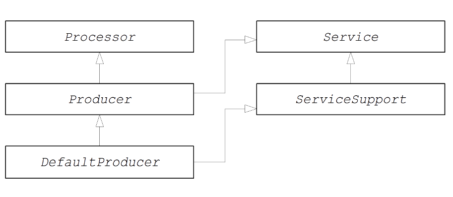

# CHAPTER 51. 生产者接口
*karezflow 产品组
整理：孙勇
版本：0.1*

## 生产者接口
**org.apache.camel.Producer** 类型的实例表示路由中的目标端点。生产者的作用是将请求（In 消息）发送到特定物理端点并接收响应的响应（Out或者Fault消息）。生产者对象本质上是一个特殊类型的处理器，出现在处理器链（相当于路由）的末端。下图是生产者继承层级关系结构：



### 生产者接口
下列显示 **org.apache.camel.Producer** 接口定义：

```java
package org.apache.camel;

public interface Producer extends Processor, Service, IsSingleton {
  Endpoint<E> getEndpoint();
  Exchange createExchange();
  Exchange createExchange(ExchangePattern pattern);
  Exchange createExchange(E exchange);
}
```
### 生产者方法
生产者接口定义了以下方法：
- **process()**（继承自Processor）—— 最重要的方法。生产者本质上是向端点发送请求的特殊类型处理器，而不是将交换对象转发到另一个处理器。通过重写 **process()** 方法，可以定义生产者如何向相关端点发送消息和接收消息。
- **getEndpoint()** —— 返回对父端点实例的引用。
- **createExchange()** —— 这些重载方法类似于相应的端点接口中定义的方法。通常，这些方法委托给在父端点实例上定义的相应方法（默认是 **DefaultEndpoint** 类）。有时候，可能需要重写这些方法。

### 异步处理
处理生产者中的交换对象（通产涉及向远程目的发送消息并等待回复）可能会阻塞相当长的时间。如果要避免阻塞当前线程，则可以选择将生产者实现为异步处理器。异步处理模式将前一个处理器与生产者分离，因此 **process()** 方法无延迟返回。

可以通过实现 **org.apache.camel.AsyncProcessor** 接口来支持异步处理模型。就其本身而言，这还不足以确保使用异步处理模型：处理链中的前一个处理器也需要调用异步版本的 **process()** 方法。AsyncProcessor 接口定义如下：

```java
package org.apache.camel;

public interface AsyncProcessor extends Processor {
  boolean process(Exchange exchange, AsyncCallback callback);
}
```

**process()** 方法的异步版本需要 **org.apache.camel.AsyncCallback** 类型的额外的参数以便回调。AsyncCallback 接口定义如下：

```java
package org.apache.camel;

public interface AsyncCallback {
  void done(boolean doneSynchronously);
}
```

**AsyncProcessor.process()** 的调用者必须提供一个 **AsyncCallback** 的实现接收处理完成的通知。**AsyncCallback.done()** 方法采用布尔参数，指示处理是同步执行还是异步执行。通常，标志为false表示异步执行。在某些情况下，生产者不会异步处理。例如，如果生产者直到交换的处理会快速完成，可以通过同步进行优化处理。在这种情况下，**doneSynchronously** 标志应设置为true。

### ExchangeHelper 类
在实现生产者时，**org.apache.camel.util.ExchangeHelper** 工具类中的某些方法会有所帮助。

## 实现生产者接口
### 如何实现同步生产者？
下列显示了如何实现同步生产者。在这种情况下，调用 **Producer.process()** 会阻塞直到收到回复。

```java
import org.apache.camel.Endpoint;
import org.apache.camel.Exchange;
import org.apache.camel.Producer;
import org.apache.camel.impl.DefaultProducer;

public class CustomProducer extends DefaultProducer {
  public CustomProducer(Endpoint endpoint) {
    super(endpoint);
    // Perform other initialization tasks...
  }

  public void process(Exchange exchange) throws Exception {
    // Process exchange synchronously.
    // ...
  }
}
```

1. 通过扩展 **org.apache.camel.impl.DefaultProducer** 类实现自定义同步生产者。
2. 实现一个引用父端点的构造函数。
3. **process()** 方法是实现生产者的核心代码。**process()** 方法的实现依赖于正在实现的组件类型。总而言之，**process()** 方法通常实现如下：
    - 如果交换包含In消息，并且与指定的交换模式一致，然后将In消息发送的指定的端点。
    - 如果交换模式预期接收到Out消息，则等待直到接收到Out消息。这通常会导致**process()** 方法阻塞很长时间。
4. 收到回复时，调用 **exchange.setOut()** 附加回复到交换对象。如果回复包含故障消息，使用  
**Message.setFault(true)** 设置故障标志。

### 如何实现异步生产者？
下列显示如何实现异步生产者。在这种情况下，必须同时实现同步和异步（需要一个额外的 **AsyncCallback** 参数）的 **process()** 方法。

```java
import org.apache.camel.AsyncCallback;
import org.apache.camel.AsyncProcessor;
import org.apache.camel.Endpoint;
import org.apache.camel.Exchange;
import org.apache.camel.Producer;
import org.apache.camel.impl.DefaultProducer;

public class CustomProducer extends DefaultProducer implements AsyncProcessor {
  public CustomProducer(Endpoint endpoint) {
    super(endpoint);
    // ...
  }

  public void process(Exchange exchange) throws Exception {
    // Process exchange synchronously.
    // ...
  }

  public boolean process(Exchange exchange, AsyncCallback callback) {
    // Process exchange asynchronously.
    CustomProducerTask task = new CustomProducerTask(exchange,callback);
    // Process 'task' in a separate thread...
    // ...
    return false;
  }
}

public class CustomProducerTask implements Runnable {
  private Exchange exchange;
  private AsyncCallback callback;

  public CustomProducerTask(Exchange exchange, AsyncCallback callback) {
    this.exchange = exchange;
    this.callback = callback;
  }

  public void run() {
    // Process exchange.
    // ...
    callback.done(false);
  }
}
```

1. 通过扩展 **org.apache.camel.impl.DefaultProducer** 类并实现 **AsyncProcessor** 接口来实现自定义异步生产者。
2. 实现一个引用父端点的构造函数。
3. 实现同步 **process()** 方法。
4. 实现异步 **process()** 方法。可以实现异步的方法有几种。这里显示的方法是创建一个 **java.lang.Runnable** 实例，task表示在子线程中运行的代码。然后使用Java线程API在子线程中运行任务。
5. 通常，从异步 **process()** 方法返回false，以指示交换异步处理。
6. **CustomProducerTask** 类中封装了在子线程中运行的处理代码。此类必须使用私有变量存储交换对象的副本和AsyncCallback回调对象。
7. **run()** 方法包含将In消息发送到生产者端点的代码并等待接收回复，收到回复后（Out或Fault消息）将其插入到交换对象中。必须调用 **callback.done()** 方法通知调用者处理完成。