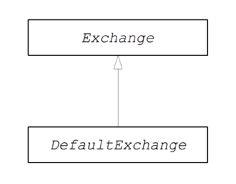

# CHAPTER 52. 交换接口
*karezflow 产品组
整理：孙勇
版本：0.1*

## 交换接口
**org.apache.camel.Exchange** 类型实例封装了通过路由传递的当前消息、附加的元数据被编码为交换属性。下图显示交换类型的继承层次结构，始终使用默认实现 **DefaultExchange**。



### 交换接口
下列显示 **org.apache.camel.Exchange** 接口定义：

```java
package org.apache.camel;

import java.util.Map;
import org.apache.camel.spi.Synchronization;
import org.apache.camel.spi.UnitOfWork;

public interface Exchange {
  // Exchange property names (string constants)
  // (Not shown here)
  ...
  ExchangePattern getPattern();
  void setPattern(ExchangePattern pattern);

  Object getProperty(String name);
  Object getProperty(String name, Object defaultValue);
  <T> T getProperty(String name, Class<T> type);
  <T> T getProperty(String name, Object defaultValue, Class<T> type);
  void setProperty(String name, Object value);
  Object removeProperty(String name);
  Map<String, Object> getProperties();
  boolean hasProperties();

  Message getIn();
  <T> T getIn(Class<T> type);
  void setIn(Message in);

  Message getOut();
  <T> T getOut(Class<T> type);
  void setOut(Message out);
  boolean hasOut();

  Throwable getException();
  <T> T getException(Class<T> type);
  void setException(Throwable e);

  boolean isFailed();
  boolean isTransacted();
  boolean isRollbackOnly();

  CamelContext getContext();
  
  Exchange copy();

  Endpoint getFromEndpoint();
  void setFromEndpoint(Endpoint fromEndpoint);
  String getFromRouteId();
  void setFromRouteId(String fromRouteId);

  UnitOfWork getUnitOfWork();
  void setUnitOfWork(UnitOfWork unitOfWork);

  String getExchangeId();
  void setExchangeId(String id);

  void addOnCompletion(Synchronization onCompletion);
  void handoverCompletions(Exchange target);
}
```

### 交换方法
Exchange 接口定义了下列方法：
- **getPattern(), setPattern()** ——设置交换模式。交换模式可以是：
  - InOnly
  - RobustInOnly
  - InOut
  - InOptionalOut
  - OutOnly
  - RobustOutOnly
  - OutIn
  - OutOptionalIn
- **setProperty(), getProperty(), getProperties(), removeProperty(),
hasProperties()** —— 使用属性setter和getter方法来关联命名属性与交换实例。属性由可能的杂项元数据组成需要组件实现。
- **setIn(), getIn()** —— In消息的Setter和getter方法。

  **DefaultExchange** 类提供的 **getIn()** 实现了懒惰创建语义：如果调用 **getIn()** 时的In消息为`null`，**DefaultExchange** 类则创建一个默认的In消息。

- **setOut(), getOut(), hasOut()** —— Out消息的Setter和getter方法。

**getOut()** 方法隐含地支持延迟创建Out消息。也就是说，如果当前输出消息为空，将自动创建新的消息实例。

- **setException(), getException()** —— 用于异常对象的Getter和setter方法。
- **isFailed()** —— 如果由于异常或由于故障而导致交换失败，则返回true。
- **isTransacted()** —— 如果交换被处理，则返回true。
- **isRollback()** —— 如果交换标记为回滚，则返回true。
- **getContext()** —— 返回对相关CamelContext实例的引用。
- **copy()** ——　创建当前自定义交换对象新的，相同的（除了交换ID）副本。交换对象In消息的主体和头部，Out消息（如果有）和此操作也会复制故障信息（如果有）。
- **setFromEndpoint(), getFromEndpoint()**　——　消费者的Getter和setter方法。
- **setFromRouteId(), getFromRouteId()**　——　起始的路由ID的Getters和setter方法。
- **setUnitOfWork(), getUnitOfWork()**　——　org.apache.camel.spi.UnitOfWork　的Getters和setter方法。
- **setExchangeId(), getExchangeId()**　——　交换ID的Getter和setter方法。
- **addOnCompletion()**　——　添加一个**org.apache.camel.spi.Synchronization**回调
对象，当交换的处理完成时被调用。
- **handoverCompletions()**　—— 将所有OnCompletion回调对象交给指定交换对象。