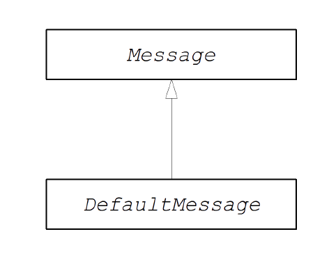

# CHAPTER 53. MESSAGE INTERFACE
*karezflow 产品组
整理：孙勇
版本：0.1*

## 消息接口
**org.apache.camel.Message** 类型的实例可以表示任何类型的消息。下图显示消息继承层次结构。并不总是需要实现自定义消息。在许多情况下，默认实现 **DefaultMessage** 是足够的。



### 消息接口
下例显示 **org.apache.camel.Message** 接口定义：

```java
package org.apache.camel;

import java.util.Map;
import java.util.Set;
import javax.activation.DataHandler;

public interface Message {
  String getMessageId();
  void setMessageId(String messageId);
  Exchange getExchange();
  
  boolean isFault();
  void setFault(boolean fault);

  Object getHeader(String name);
  Object getHeader(String name, Object defaultValue);
  <T> T getHeader(String name, Class<T> type);
  <T> T getHeader(String name, Object defaultValue, Class<T> type);
  Map<String, Object> getHeaders();
  void setHeader(String name, Object value);
  void setHeaders(Map<String, Object> headers);
  Object removeHeader(String name);
  boolean removeHeaders(String pattern);
  boolean hasHeaders();

  Object getBody();
  Object getMandatoryBody() throws InvalidPayloadException;
  <T> T getBody(Class<T> type);
  <T> T getMandatoryBody(Class<T> type) throws
  InvalidPayloadException;
  void setBody(Object body);
  <T> void setBody(Object body, Class<T> type);
  
  DataHandler getAttachment(String id);
  Map<String, DataHandler> getAttachments();
  Set<String> getAttachmentNames();
  void removeAttachment(String id);
  void addAttachment(String id, DataHandler content);
  void setAttachments(Map<String, DataHandler> attachments);
  boolean hasAttachments();

  Message copy();
  void copyFrom(Message message);
  String createExchangeId();
}
```
### 消息方法
**Message** 接口定义一下方法：
- **setMessageId(), getMessageId()** —— 消息ID的Getter和setter方法。在自定义组件是否需要使用消息ID是一个实现细节。
- **getExchange()** ——  返回对父交换对象的引用。
- **isFault(), setFault()** —— 用于故障标志的Getter和setter方法，指示此消息是否为故障消息。
- **getHeader(), getHeaders(), setHeader(), setHeaders(), removeHeader(),hasHeaders()** —— 消息头的Getter和setter方法。通常，这些消息头可以用于存储实际的头部数据，或用于存储杂项元数据。
- **getBody(), getMandatoryBody(), setBody()** ——消息体的Getter和setter方法。 **getMandatoryBody()**　访问器保证返回的消息正文不为空，否则抛出**InvalidPayloadException**　异常。
- **getAttachment(), getAttachments(), getAttachmentNames(),removeAttachment(),addAttachment(), setAttachments(), hasAttachments()**　——　获取，设置，添加和删除附件的方法。
- **copy()**　——　创建当前自定义消息对象的新的，相同的（包括消息ID）副本。
- **copyFrom()**　——将指定的通用消息对象（message）的完整内容（包括消息ID）复制到当前消息实例中。因为此方法必须能够从任何消息类型复制，它将复制通用消息属性，而不是自定义属性。
- **createExchangeId()** —— 返回此交换的唯一ID，如果消息实现能够提供ID;否则返回null。

## 消息实现
### 怎样实现自定义消息
下例显示通过扩展 **DefaultMessage** 类实现自定义消息：

```java
import org.apache.camel.Exchange;
import org.apache.camel.impl.DefaultMessage;

public class CustomMessage extends DefaultMessage {
  public CustomMessage() {
    // Create message with default properties...
  }

  @Override
  public String toString() {
    // Return a stringified message...
  }

  @Override
  public CustomMessage newInstance() {
    return new CustomMessage( ... );
  }

  @Override
  protected Object createBody() {
    // Return message body (lazy creation).
  }

  @Override
  protected void populateInitialHeaders(Map<String, Object> map) {
    // Initialize headers from underlying message (lazy creation).
  }

  @Override
  protected void populateInitialAttachments(Map<String, DataHandler>map) {
    // Initialize attachments from underlying message (lazy creation).
  }
}
```

1. 通常，您需要一个默认构造函数来创建具有默认属性的消息。
2. 重写 **toString()** 方法来自定义消息字符串。
3. 从 **MessageSupport.copy()** 中调用 **newInstance()** 方法，**newInstance()** 方法的定制应该集中在将当前消息实例的所有自定义属性复制到新的消息实例中。 **MessageSupport.copy()** 方法通过调用 **copyFrom()** 来复制通用消息属性。
4. **createBody()** 方法与 **MessageSupport.getBody()** 方法一起工作，以实现对消息体的延迟访问。默认情况下，消息正文为null。只有当应用程序代码尝试访问正文（通过调用**getBody()**）时，应该创建正文。 **MessageSupport.getBody() **会首次访问消息体时自动调用**createBody()**。
5. **populateInitialHeaders()** 方法与头getter和setter方法协同工作，实现对消息头的延迟访问。此方法解析消息以提取任何消息头并将其插入散列映射。当用户第一次尝试访问头（通过调用**getHeader()**，**getHeaders()**，**setHeader()**或**setHeaders()**）时，**populateInitialHeaders()** 方法将自动调用。
6. populateInitialAttachments() 方法是附件getter和setter方法，实现对附件的懒惰访问。这个方法提取消息附件并将其插入散列。该**populateInitialAttachments()** 方法在用户尝试时自动调用通过调用 **getAttachment()** 来首次访问附件，**getAttachments()**，**getAttachmentNames()**或**addAttachment()**。