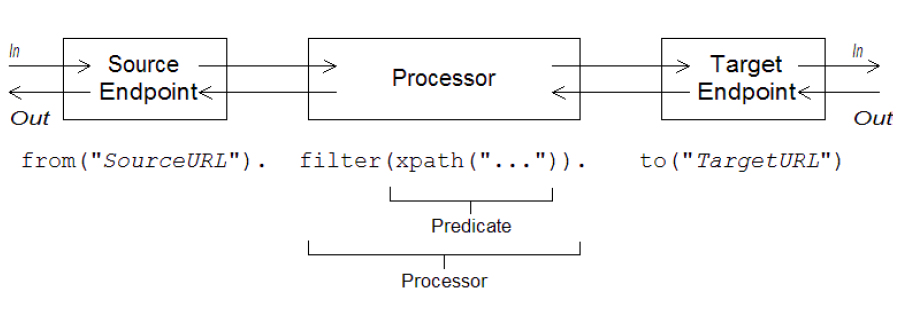

# CHAPTER 1. 路由定义构建块
*DataBridge 产品组
编写：孙勇
版本：1.0*

## 1.1.实现一个路由构建器类
### 概述
使用*领域专用语言(DSL)*，扩展 **RouteBuilder** 类并重写 **configure()** 方法（在路由规则定义处）。

如需要，可以定义多个`RouteBuilder`类。每个类实例化一次并注册至`CamelContext`对象。通常，由部署路由的容器自动管理每个`RouteBuilder`对象的生命周期。

### RouteBuilder 类
作为一个路由开发者，核心任务是实现一个或多个`RouteBuilder`类。可以从两个`RouteBuilder`类中继承实现：

- `org.apache.camel.builder.RouteBuilder`——通用的`RouteBuilder`基类，适用于部署到任何容器类型。
- `org.apache.camel.spring.SpringRouteBuilder`——Spring 容器特定基类。它支持以下Spring特性：
  - 在Spring 注册中查找Bean（使用`beanRef()` Java DSL 命令）
  - 事务

`RouteBuilder`类定义的方法用于发起路由规则。例如，`from()`,`intercept()`和`exception())`。

### 实现一个路由构建器
下列示例表示一个最小`RouteBuilder`实现。`configure()`方法体包含一个路由规则；每个路由都是单个Java声明。

```java
import org.apache.camel.builder.RouteBuilder;

public class MyRouteBuilder extends RouteBuilder {
  public void configure() {
    // 在这里定义路由规则:
    from("file:src/data?noop=true").to("file:target/messages");

    // 如果愿意，可以包含更多路由.
    // ...
  }
}
```
## 1.2.基础Java DSL语法
### 什么是DSL？
一个领域专用语言（DSL）是一个为特定目标定义的最小语言。DSL无需逻辑完备但必须有能力描述所选择域的问题。典型情况下，DSL不需要一个特定解析器，解释器或者编译器。DSL可以在已存在的面向对象的主语言基础上，DSL在主语言API中提供DSL构造映射。

### 路由规则语法
Apache Camel为定义路由规则定义了路由DSL。可以在`RouteBuilder.configure()`实现中使用DSL定义规则。



一个特定路由总是开始于 **from("EndpointURL")** 方法，用于指定消息来源（*消费者端点*）。可以添加任意处理器至路由（例如，**filter()**）。通常使用 **to("EndpointURL")** 方法结束路由，用于指定消息目的（*生产者端点*）。然而，不总是需要使用 **to("EndpointURL")** 方法结束路由，指定消息目的有多种可供选择的方法。

>可以定义一个全局路由规则，使用指定的处理器类型（例如，`intercept()`, `exception()`, 或者 `errorHandler()`）启动该路由。

### 消费者和生产者
一个特定路由总是从一个消费者端点定义（`from("EndpointURL")`）开始，通常（但不总是）至一个生产者端点定义（`to("EndpointURL")`）结束。端点URLs可以在部署时配置使用任意组件。例如，可以通过 **file:MyMessageDirectory** 使用文件端点。

### 交换
一个`exchange`对象由一个消息和元数据扩展组成。交换是Apache Camel核心，这是因为交换是消息通过路由传递的标准形式。交换的组成包括：

- **In消息**——交换封装的当前消息。当交换通过一个路由，这个消息可以修改。所以，路由开始处的In消息与路由结束时的In消息不一样。`org.apache.camel.Message`类型提供一个消息通用模型，包含以下部分：
  - 消息体
  - 消息头
  - 附件

最重要的是，这是消息通用模型的实现。Apache Camel支持大量各种各样的协议和端点类型。因此，无法规范消息体和消息头格式。

- **Out消息**——是回复消息或者转换消息的临时保存区。某些处理节点（如，**to()** 命令）可以修改当前消息将In消息作为请求处理，发送给一个生产者端点并从这个端点接收一个回复。回复消息插入到交换Out消息位置中。

通常，如果当前节点已经设置Out消息，Apache Camel在将其传递到下一个路由节点前修改这个交换：原有的In消息被丢弃，Out消息移动到In消息位置。所有，回复就成了新的当前消息。

然而，有着一种特殊情况Out消息需要不同的处理。如果路由起始的消费者端点等待一个回复消息，在路由最后的Out消息被认为是消费者端点的回复消息（在这种情况下，最终节点必须创建Out消息或者消费者端点挂起）

- **消息交换模式（MEP）**——影响路由上交换和端点之间的交互。
  - 消费者端点——消费者端点创建原始交换设置MEP初始值。初始值表示消费者端点是否需要接收回复（例如，*InOut* MEP）或者不需要（例如，*InOnly* MEP）
  - 生产者端点——会影响交换沿着路由遇到的生产者端点（例如，当交换通过一个 **to()** 节点）。例如，如果当前MEP为*InOnly*，则  **to()** 节点不会从端点收到回复消息。有时为了自定义交换与生产者端点的交互需要更改当前MEP。
- 交换属性——包含当前消息元数据的命名属性列表。

### 消息交换模式
使用交换对象可以方便的为不同消息交换模式进行消息处理。例如，异步协议可能定义一个包含从消费者端点到生产者端点的单一消息的MEP（*InOnly* MEP）。另一方面，RPC 协议定义一个包含请求消息和回复消息的MEP（*InOut* MEP）。Apache Camel 支持以下交换模式：
- InOnly
- RobustInOnly
- InOut
- InOptionalOut
- OutOnly
- RobustOutOnly
- OutIn
- OutOptionalIn

消息交换模式由 **org.apache.camel.ExchangePattern** 枚举类型常量表示。

### Grouped exchanges
有时，封装多个交换实例的单个交换是有用的。为此，可以使用分组交换。分组交换本质上是交换实例包含一个 **java.util.List** 的交换对象并保存至 **Exchange.GROUPED_EXCHANGE** 交换属性。
 
### 处理器
*处理器*是路由中的一个节点，可以通过路由访问和修改交换流。处理器可以用`表达式`或`判断`参数来修改行为。

### 表达式和判断
表达式（计算字符串或其他数据类型）和判断（计算结果为true或false）时常用在内置处理器类型的参数。

```java
from("seda:a").filter(header("foo").isEqualTo("bar")).to("seda:b");
```

## 1.3.ROUTER SCHEMA IN A SPRING XML FILE
### 命名空间
XML 架构命名空间：
```
http://camel.apache.org/schema/spring
```

### 指定架构位置
路由架构位置通常指定为** http://camel.apache.org/schema/spring/camel-spring.xsd**，它引用了Apache网站上最新版本的架构。
```xml
<beans xmlns="http://www.springframework.org/schema/beans" 
    xmlns:camel="http://camel.apache.org/schema/spring"
    xmlns:xsi="http://www.w3.org/2001/XMLSchema-instance"
    xsi:schemaLocation="
      http://www.springframework.org/schema/beans
      http://www.springframework.org/schema/beans/spring-beans-2.0.xsd
      http://camel.apache.org/schema/spring
      http://camel.apache.org/schema/spring/camel-spring.xsd">

  <camelContext id="camel" xmlns="http://camel.apache.org/schema/spring">
    <!-- Define your routing rules here -->
  </camelContext>
</beans>
```

### 运行时架构位置
在运行时，Apache Camel 不会从指定的位置下载路由架构。相反，Apache Camel自动从 **camel-spring** JAR文件根目录中选取一架构副本。者确保了用于解析的版本总是匹配当前的运行时版本。这很重要，因为Apache 网站上发布的最新版本的架构可能与正在使用的运行时版本不一致。

### 使用XML编辑器
通常，建议使用全功能XML编辑器进行编辑。为了确保编辑正在使用正确的架构版本，最好选择一个的定版本的 **camel-spring.xsd** 文件。

## 1.4.端点
### 概述
Apache Camel 端点是路由中消息的源头和汇聚点。端点是一个非常通用的构造块：它必须满足的唯一要求是它充当来源消息的发送器（作为消费者端点）或作为消息的接收器（作为生产者端点）。因此，Apache Camel 支持多种不同的端点类型，范围从协议支持端点（例如，HTTP）到简单定时端点（例如，Quartz）。Apache Camel一个主要特性是相对容易的添加实现一个新端点类型的自定义组件。

### 端点 URIs
端点由端点URIs标识，通用形式为：
```
scheme:contextPath[?queryOptions]
```

URL *scheme* 标识一个协议。例如，HTTP。*contextPath*提供由协议解释的URI详细信息。此外，大多数方案允许定义查询选项 *queryOptions*，如以下格式指定：
```
?option01=value01&option02=value02&...
```

并非每个方案都代表协议。有时一个方案只是提供一个有用的程序。例如，定时器。下面这个例子，Timer端点每秒生产一次交换。可以使用Timer在路由中计划活动。
```
timer://tickTock?period=1000
```

### 使用长端点URIs
有时端点URI可能会因为所有配置而变得相当长。可以采取两种方法使得长URIs更易管理。

#### 分别配置端点
可以分别配置端点并从路由中通过简短的IDs引用。
```xml
<camelContext ...>
  <endpoint id="foo" uri="ftp://foo@myserver">
    <property name="password" value="secret"/>
    <property name="recursive" value="true"/> 
    <property name="ftpClient.dataTimeout" value="30000"/>
    <property name="ftpClient.serverLanguageCode" value="fr"/>
  </endpoint>
  <route>
    <from uri="ref:foo"/>
    ...
    </route>
</camelContext>
```


可以在URI配置一些选项，然后使用属性指定其他选项（或从URI覆盖选项）。
```xml
<endpoint id="foo" uri="ftp://foo@myserver?recursive=true">
  <property name="password" value="secret"/>
  <property name="ftpClient.dataTimeout" value="30000"/>
  <property name="ftpClient.serverLanguageCode" value="fr"/>
</endpoint>
```

#### 分行分割端点配置
可以使用新行分割端点URI属性。
```xml
<route>
  <from uri="ftp://foo@myserver?password=secret&amp;
            recursive=true&amp;ftpClient.dataTimeout=30000&amp;
            ftpClientConfig.serverLanguageCode=fr"/>
  <to uri="bean:doSomething"/>
</route>
```

>**注意：** 在每行指定一个或者多个选项使用 **\&amp;** 作为分割符。

### 在URI中指定时间段

```
[NHour(h|hour)][NMin(m|minute)][NSec(s|second)]
```

```java
from("timer:foo?period=45m")
.to("log:foo");
```

```java
from("timer:foo?period=1h15m")
.to("log:foo");
from("timer:bar?period=2h30s")
.to("log:bar");
from("timer:bar?period=3h45m58s")
.to("log:bar");
```

### Specifying row values in URI options
### Case-insensitive enum options
### Specifying URI Resources
### Apache Camel 组件
每个URI映射到一个Apache Camel组件，Apache Camel组件本质上是端点工厂。换句话说，要使用特定类型的端点必须在运行时容器部署相应的组件。

如果使用Maven构建应用程序，只需要添加相关组件的依赖关系即可。例如，要包括HTTP组件：
```xml
<!-- Maven POM File -->
  <properties>
    <camel-version>2.17.0.redhat-630187</camel-version>
    ...
  </properties>

  <dependencies>
    ...
    <dependency>
      <groupId>org.apache.camel</groupId>
      <artifactId>camel-http</artifactId>
      <version>${camel-version}</version>
    </dependency>
    ...
  </dependencies>
```

下列组件是Camel核心内置组件，所以它们总是可用：
* Bean
* Browse
* Dataset
* Direct
* File
* Log
* Mock
* Properties
* Ref
* SEDA
* Timer
* VM

### 消费者端点
*消费者端点*是一个路由的起始端点（**from()** DSL命令）。换句话说，消费者端点在路由中是开始处理的原因：它创建一个交换实例（典型的，基于收到或者获取的消息）并为其余的路由提供一个线程处理交换。

下列示例中，JMS消费者端点从**payments**队列中拉取消息并处理。

Java DSL：
```java
from("jms:queue:payments")
  .process(SomeProcessor)
  .to("TargetURI");
```

XML DSL:
```xml
<camelContext id="CamelContextID" xmlns="http://camel.apache.org/schema/spring">
  <route>
    <from uri="jms:queue:payments"/>
    <process ref="someProcessorId"/>
    <to uri="TargetURI"/>
  </route>
</camelContext>
```

一些组件只是消费者——也就是说，它们只能被用作定义消费者端点。例如，Quartz组件。在下面这个例子，Quartz端点每一秒生成事件：

```java
from("quartz://secondTimer?trigger.repeatInterval=1000")
  .process(SomeProcessor)
  .to("TargetURI");
```

### 生产者端点
*生产者端点*是一个路由的中间或者结束端点（**to()** DSL命令）。换句话说，生产者端点接收一个已存在的交换对象并发送交换内容到指定端点。

在下面示例中，JMS 生产者端点推送当前交换内容至指定的JMS队列：
```java
from("SourceURI")
  .process(SomeProcessor)
  .to("jms:queue:orderForms");
```

XML DSL:
```xml
<camelContext id="CamelContextID" xmlns="http://camel.apache.org/schema/spring">
  <route>
    <from uri="SourceURI"/>
    <process ref="someProcessorId"/>
    <to uri="jms:queue:orderForms"/>
  </route>
</camelContext>
```

某些组件只是生产者——也就是说，它们只能用于定义生产者端点。例如，HTTP端点。
```java
from("SourceURI")
  .process(SomeProcessor)
  .to("http://www.google.com/search?hl=en&q=camel+router");
```

## 1.5. 处理器
为了让路由做一些比简单连接一个消费者端点至生产者端点更有意思的事，可以添加*处理器*至路由。一个处理器是一个命令，可以插入到一个路由规则执行任意的消息处理。Apache Camel提供多种多样的处理器，如下表：

#### Apache Camel 处理器清单
Java DSL|XML DSL|描述
--------|-------|----
aggregate()|aggregate|聚合模式：创建聚合器合并多个输入交换至单个交换。
bean(),beanRef()|bean|调用Java对象方法处理当前交换
choice()|choice|基于内容路由模式：根据交换内容选择子路由
convertBodyTo()|convertBodyTo|转换输入消息体至指定类型
delay()|delay|
doTry()|doTry|
end()|N/A|
enrich(),enrichRef()|enrich|
filter()|filter|
inheritErrorHandler()|@inheritErrorHandler
inOnly()|inOnly|
inOut()|inOut|
loadBalance()|loadBalance|
log()|log|
loop()|loop|
markRollbackOnly()|@markRollbackOnly|
markRollbackOnlyLast()|@markRollbackOnlyLast|
marshal()|marshal|
multicast()|multicast|
onCompletion()|onCompletion|
onException()|onException|
pipeline()|pipeline|
policy()|policy|
pollEnrich(),pollEnrichRef()|pollEnrich|
process(),processRef|process|
recipientList()|recipientList|
removeHeader()|removeHeader|
removeHeaders()|removeHeaders|
removeProperty()|removeProperty|
removeProperties()|removeProperties|
resequence()|resequence|
rollback()|rollback|
routingSlip()|routingSlip|
sample()|sample|
setBody()|setBody|
setExchangePattern()|setExchangePattern|
setHeader()|setHeader|
setOutHeader()|setOutHeader|
setProperty()|setProperty()|
sort()|sort|
split()|split|
stop()|stop|
threads()|threads|
throttle()|throttle|
throwException()|throwException|
to()|to|
toF()|N/A|
transacted()|transacted|
transform()|transform|
unmarshal()|unmarshal|
validate()|validate|
wireTap()|wireTap|

### 处理器示例
#### Choice
**choice()** 处理器是一个条件语句，用于将输入消息路由至选择的生产者端点。每个供选择的生产者端点以 **when()** 方法开始，提供一个判断条件。如果判断结果为真，下一步目标已选择。否则，在路由中继续下一个 **when()** 方法。

```java
from("SourceURL")
  .choice()
    .when(Predicate1).to("Target1")
    .when(Predicate2).to("Target2")
  .otherwise().to("Target3");
```

Spring XML:
```xml
<camelContext id="buildSimpleRouteWithChoice" xmlns="http://camel.apache.org/schema/spring">
  <route>
    <from uri="SourceURL"/>
    <choice>
      <when>
        <!-- First predicate -->
        <simple>header.foo = 'bar'</simple>
        <to uri="Target1"/>
      </when>
      <when>
        <!-- Second predicate -->
        <simple>header.foo = 'manchu'</simple>
        <to uri="Target2"/>
      </when>
      <otherwise>
        <to uri="Target3"/>
      </otherwise>
    </choice>
  </route>
</camelContext>
```

#### Filter
**filter()** 可以用于阻止无用的消息到达生产者端点。它提供单个判断参数：如果结果为true，消息交换允许传递给生产者；如果为false，消息交换被阻塞。

```java
from("SourceURL").filter(header("foo").isEqualTo("bar")).to("TargetURL");
```

Spring XML:
```xml
<camelContext id="filterRoute" xmlns="http://camel.apache.org/schema/spring">
  <route>
    <from uri="SourceURL"/>
    <filter>
      <simple>header.foo = 'bar'</simple>
      <to uri="TargetURL"/>
    </filter>
  </route>
</camelContext>
```

#### Throttler
**throttle()** 处理器确保生产者端点不会过载。 throttle 限定每秒通过的消息数量。流入消息超出指定量，throttle 将超出消息缓存到缓存区并更慢些传递至生产者端点。例如，限制每秒通过100条消息可以如下定义规则:

```java
from("SourceURL").throttle(100).to("TargetURL");
```

Spring XML:
```xml
<camelContext id="throttleRoute" xmlns="http://camel.apache.org/schema/spring">
  <route>
    <from uri="SourceURL"/>
    <throttle maximumRequestsPerPeriod="100" timePeriodMillis="1000">
      <to uri="TargetURL"/>
    </throttle>
  </route>
</camelContext>
``` 

### 自定义处理器
如果标准处理器不能提供所需功能则可以自定义处理器。自定义处理器，继承 **org.apache.camel.Processor** 接口并重写 **process()** 方法。

```java
public class MyProcessor implements org.apache.camel.Processor {

public void process(org.apache.camel.Exchange exchange) {
  inMessage = exchange.getIn();

  if (inMessage != null) {
    inMessage.removeHeader("foo");
  }
}
};
```

调用`process()`方法将自定义处理器插入到路由规则，该方法提供一个通用机制将处理器插入到规则中。

```java
org.apache.camel.Processor myProc = new MyProcessor();
from("SourceURL").process(myProc).to("TargetURL");
```

