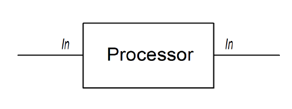
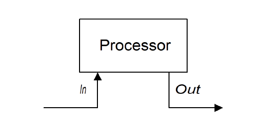
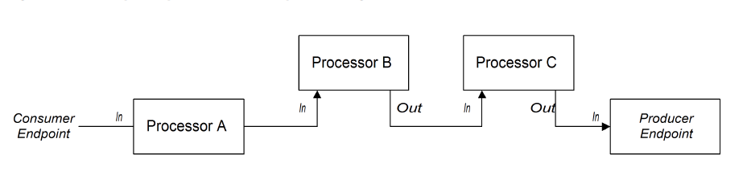
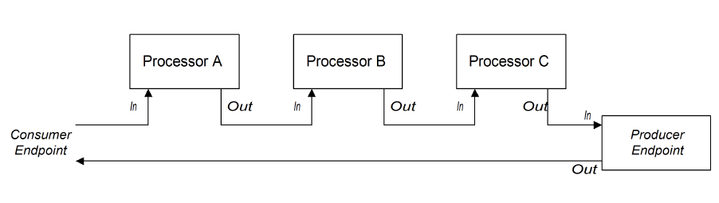
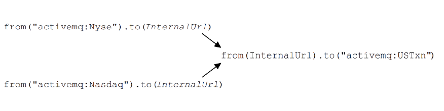

# CHAPTER 2. 路由构建基本原则
*DataBridge 产品组
编写：孙勇
版本：1.2*

Apache Camel 提供数个处理器和组件，可以在路由中彼此相连。

## 2.1. PIPELINE PROCESSING
在Apache Camel，管道是在路由定义节点连接显式的范式。路由是将一个处理器的输出消息复制到下一个处理器输入消息。

### 处理器节点
除了起始端点外，路由上每个节点都是一个处理器，继承`org.apache.camel.Processor`接口。换句话说，处理器是组成DSL路由的基础构造块。例如，`filter()`, `delayer()`,`setBody()`, `setHeader()`和 `to()`。当考虑处理器怎样连接彼此来构建一个路由时，区分为两种不同的方法。

第一种方法是在处理器简单修改交换的输入消息。


下列路由通过`setHeader()`命令修改当前输入消息：
```java
from("activemq:orderQueue")
  .setHeader("BillingSystem", xpath("/order/billingSystem"))
  .to("activemq:billingQueue");
```

第二种方法是在处理器创建一个输出消息代表处理结果。


下列路由使用`transform()`命令在创建输出消息时在消息体内包含字符串`DummyBody`：
```java
from("activemq:orderQueue")
  .transform(constant("DummyBody"))
  .to("activemq:billingQueue");
```
### InOnly 交换管道


Apache Camel 默认使用管道模式，所以不用在路由中创建管道。下例中，路由从`userdataQueue`队列中拉取消息，消息通过Velocity模板生成结果并发生至`envelopeAddresses`队列。
```java
from("activemq:userdataQueue")
    .to(ExchangePattern.InOut, "velocity:file:AdressTemplate.vm")
    .to("activemq:envelopeAddresses");
```
### InOut 交换管道


## 2.2. 多路输入
标准路由使用`from(EndpointURL)`DSL语法从单个端点接收输入。如果需要在路由定义多个输入？Apache Camel 允许提供数个输入给路由。

### 多路独立输入
定义多路输入最简单的方法是使用多参数`from()`DSL命令。

```java
from("URI1", "URI2", "URI3").to("DestinationUri");
```

或者
```java
from("URI1").from("URI2").from("URI3").to("DestinationUri");
```

在以上例子，交换在单独的线程处理`UR1`，`UR2`和`UR3`输入端点。实际上，前述的流程相当于下列三个独立的路由：
```java
from("URI1").to("DestinationUri");
from("URI2").to("DestinationUri");
from("URI3").to("DestinationUri");
```

### 分段路由


路由初始阶段从外部队列**activemq:Nyse**和**activemq:Nasdaq**获得输入并发送这个输入交换至内部端点**InternalUrl**。第二个路由阶段从内部端点获得输入交换并合并后发送给最终队列**activemq:USTxn**。*InternalUrl*端点只在路由应用内部使用。下列类型端点支持内部使用：
* Direct 端点
* SEDA 端点
* VM 端点

这些端点的主要目的是将路由不同分段连接起来。它们提供有效的方法将多路输入整合在一个路由中。

#### Direct 组件
direct 组件提供简单机制将路由连接在一起。direct组件的事件模型是*同步*的，所以随后的路由分段与首个分段运行在同一个线程中。direct URL的通用格式是`direct:EndpointID`。其中，`EndpointID`是端点实例的唯一标识（字符串）。

```java
from("activemq:Nyse").to("direct:mergeTxns");
from("activemq:Nasdaq").to("direct:mergeTxns");
from("direct:mergeTxns").to("activemq:USTxn");
```

*direct端点*的执行流程：每当一个交换达到一个生产者端点（例如，**to("direct:mergeTxns")**），*direct端点*将交换直接发送至相同端点ID的的所有消费者端点（例如，**from("direct:mergeTxns")**）。*direct端点*只能在同一**JVM**实例的同一个**CamelContext**中的路由间通讯。

#### SEDA 端点
*SEDA组件*提供一个替代机制将路由连接在一起。可以像*direct组件*一样使用，但是它具有不同的事件和线程模型，如下：
* SEDA端点的处理不是同步的。换句话说，当发送交换到SEDA生产者端点，在路由处理器之前立即返回。
* SEDA端点包含一个队列缓存（**java.util.concurrent.BlockingQueue**类型），它保存在下一个路由分段之前待处理的输入交换。
* 每个SEDA消费者端点创建一个线程池（默认大小是5）从阻塞队列里处理交换对象。
* SEDA组件支持*竞争消费者*模式，确保每个输入交换只处理一次，即使一个特殊端点具有多个消费者。

使用SEDA端点的优势是路由能够更多响应，这是因为內建的消费者线程池。
```java
from("activemq:Nyse").to("seda:mergeTxns");
from("activemq:Nasdaq").to("seda:mergeTxns");

from("seda:mergeTxns").to("activemq:USTxn");
```

#### VM 端点
VM组件是与SEDA端点很相似。唯一的差别是，SEDA组件只限于将在同一**CamelContext**上的路由连接在一起，VM组件可以从不同的Apache Camel应用将路由连接在一起，只要它们运行在同一个Java虚拟机上。

```java
from("activemq:Nyse").to("vm:mergeTxns");
from("activemq:Nasdaq").to("vm:mergeTxns");
```

如果另一个分段路由应用运行在同一个Java虚拟机上，可以定义第二个分段路由：
```java
from("vm:mergeTxns").to("activemq:USTxn");
```

### 内容丰富器模式
内容丰富器模式定义一个不同的方法处理一个路由的多路输入。当一个交换进入丰富器处理器，丰富器通过外部资源获取信息并添加到原始消息中。在这个模式中，外部资源实际就是消息的第二个输入。

假设写一个贷款申请处理应用。在处理贷款申请前需要获得客户信用等级，等级数据文件保存在**src/data/ratings**路径下。使用`pollEnrich()`模式和`GroupedExchangeAggregationStrategy`聚合策略将输入的贷款申请和等级合并在一起，如下：

```java
from("jms:queue:creditRequests")
    .pollEnrich("file:src/data/ratings?noop=true", new
GroupedExchangeAggregationStrategy())
    .bean(new MergeCreditRequestAndRatings(), "merge")
    .to("jms:queue:reformattedRequests");
```

```java
public class MergeCreditRequestAndRatings {
  public void merge(Exchange ex) {

    // Obtain the grouped exchange
    List<Exchange> list = ex.getProperty(Exchange.GROUPED_EXCHANGE,List.class);

    // Get the exchanges from the grouped exchange
    Exchange originalEx = list.get(0);
    Exchange ratingsEx = list.get(1);

    // Merge the exchanges
    ...
  }
}
```

## 2.3. 异常处理
Apache Camel提供多个不同机制在不同粒度等级上处理错误：在路由中可以使用`doTry`, `doCatch`和`doFinally`；可以使用`onException`指定处理每个错误类型的动作并应用规则到一个`RouteBuilder`中所有的路由上；可以使用`errorHandler`指定处理所有错误类型的动作并应用规则到一个`RouteBuilder`中所有的路由上。

### 2.3.1. onException 子句
onException 子句是捕获发生在一个和多个路由错误的强有力的机制：可以给不同错误类型定义不同的动作；允许使用路由定义相同的语法定义动作，提供灵活的方式处理错误。这是建立在捕获模型上。单个`onException`子句可以处理任何路由任何简单上发生的错误。

#### 使用onException捕获错误
`onException`子句是一个捕获机制，而不是捕获异常。也就是说，定义一次`onException`子句可以捕获路由中所有发生的错误。与Java try/catch机制相比，当错误发生时只能在捕获`try`程序块中特殊的错误。

实际上，当定义`onException`子句时，Apache Camel 运行时将每个路由节点放入到一个try块中，这样就可以捕获路由中每个节点的错误。这是自动完成的，不用在路由中显式定义。

#### Java DSL 示例
```java
// Java
public class MyRouteBuilder extends RouteBuilder {
  public void configure() {
    onException(ValidationException.class)
      .to("activemq:validationFailed");

    from("seda:inputA")
      .to("validation:foo/bar.xsd", "activemq:someQueue");

    from("seda:inputB").to("direct:foo")
      .to("rnc:mySchema.rnc", "activemq:anotherQueue");
  }
}
```

#### XML DSL 示例
```xml
<beans xmlns="http://www.springframework.org/schema/beans"
  xmlns:camel="http://camel.apache.org/schema/spring"
  xmlns:xsi="http://www.w3.org/2001/XMLSchema-instance"
  xsi:schemaLocation="
  http://www.springframework.org/schema/beans
  http://www.springframework.org/schema/beans/spring-beans-2.0.xsd
  http://camel.apache.org/schema/spring
  http://camel.apache.org/schema/spring/camel-spring.xsd">

  <camelContext xmlns="http://camel.apache.org/schema/spring">
    <onException>
      <exception>com.mycompany.ValidationException</exception>
      <to uri="activemq:validationFailed"/>
    </onException>
    <route>
      <from uri="seda:inputA"/>
      <to uri="validation:foo/bar.xsd"/>
      <to uri="activemq:someQueue"/>
    </route>
    <route>
      <from uri="seda:inputB"/>
      <to uri="rnc:mySchema.rnc"/>
      <to uri="activemq:anotherQueue"/>
    </route>
  </camelContext>
</beans>
```

#### 捕获多种错误
可以定义多个`onException`子句在`RouteBuilder`范围内捕获错误，对不同错误提供不同的响应动作。

Java DSL:
```java
onException(ValidationException.class).to("activemq:validationFailed");
onException(java.io.IOException.class).to("activemq:ioExceptions");
onException(Exception.class).to("activemq:exceptions");
```

XML DSL:
```xml
<onException>
  <exception>com.mycompany.ValidationException</exception>
  <to uri="activemq:validationFailed"/>
</onException>
<onException>
  <exception>java.io.IOException</exception>
  <to uri="activemq:ioExceptions"/>
</onException>
<onException>
  <exception>java.lang.Exception</exception>
  <to uri="activemq:exceptions"/>
</onException>
```

也可以将多种错误进行分组并使用同一个`onException`子句进行错误捕获。如下：
Java DSL:
```java
onException(ValidationException.class, BuesinessException.class)
  .to("activemq:validationFailed");
```

XML DSL:
```xml
<onException>
  <exception>com.mycompany.ValidationException</exception>
  <exception>com.mycompany.BuesinessException</exception>
  <to uri="activemq:validationFailed"/>
</onException>
```

当捕获多种错误时，`onException`子句的顺序非常重要。Apache Camel先用第一个子句匹配抛出的错误。如果第一个子句不匹配，再匹配第二个子句直到匹配。每次匹配取决于以下规则：

#### Deadletter通道
到目前为止，`onException`使用的基本示例都利用了`deadletter`通道模式。 也就是说，当一个`onException`子句捕获异常时，当前的交换被路由到一个特殊的目的地（deadletter通道）。 死信通道用作未处理的失败消息的保留区域。 管理员可以稍后检查消息，并确定需要采取哪些措施。

#### 使用原始消息
在路由中间出现异常时，交换中的消息可能会被修改的面目全非。 如果在通讯队列中可见的消息是在路由开始时收到的原始消息，则管理员更容易决定采取哪些纠正措施。

在Java DSL中，您可以使用`useOriginalMessage()`DSL命令通过原始消息替换交换中的消息，如下所示：

Java DSL:
```java
onException(ValidationException.class)
  .useOriginalMessage()
  .to("activemq:validationFailed");
```

XML DSL:
```xml
<onException useOriginalMessage="true">
  <exception>com.mycompany.ValidationException</exception>
  <to uri="activemq:validationFailed"/>
</onException>
```

### 2.3.2. Error Handler
### 2.3.3. doTry, doCatch, and doFinally
### 2.3.4. Propagating SOAP Exceptions

## 2.4. BEAN 集成
### 概述
Bean集成提供了使用任意Java对象处理消息的通用机制。通过将bean引用插入到路由中，您可以调用Java对象上的任意方法，然后可以访问和修改传入的交换。将交换机的内容映射到bean方法的参数和返回值的机制称为参数绑定。参数绑定可以使用以下方法的任意组合来初始化方法的参数：

- 常规方法签名 —— 如果方法签名符合某些约定，参数绑定可以使用Java反射来确定要传递的参数。

- 注释和依赖注入 —— 对于更灵活的绑定机制，使用Java注释来指定要注入到方法参数中的内容。这种依赖注入机制依赖于Spring 2.5组件扫描。通常，如果您将Apache Camel应用程序部署到Spring容器中，则依赖注入机制将会自动工作。

- 明确指定的参数 —— 您可以在调用bean的位置显式指定参数（作为常量或使用简单语言）。

### Bean 注册
Bean可以通过bean注册表访问，Bean注册表是一种使您可以使用类名或bean ID作为关键字查找bean的服务。 在bean注册表中创建条目的方式取决于底层框架，例如纯Java，Spring，Guice或Blueprint。 注册表项通常是隐式创建的（例如，当您在Spring XML文件中实例化一个Spring bean时）。

### 注册表插件策略
Apache Camel实现了bean注册表的插件策略，定义了一个用于访问Bean的集成层，使底层注册表实现变得透明。 因此，可以将Apache Camel应用程序与各种不同的bean注册表集成，如表2.2“注册表插件”所示。

### Accessing a bean created in Java
### Accessing overloaded bean methods
### Specify parameters explicitly
### Basic method signatures
### Method signature for processing message bodies
### Method signature for processing exchanges
### Accessing a Spring bean from Spring XML
### Accessing a Spring bean from Java
### Bean shutdown order in Spring XML
### Parameter binding annotations
### Basic annotations
### Expression language annotations
### Inherited annotations
### Interface implementations
### Invoking static methods
### Invoking an OSGi service
 
## 2.5. 新建交换实例
当使用Java代码处理消息，它经常需要新建一个交换实例。如果需要创建**Exchange**对象，简单的方法是调用**ExchangeBuilder**类的方法。

### ExchangeBuilder 类
**ExchangeBuilder**类的名称：
```java
org.apache.camel.builder.ExchangeBuilder
```

**ExchangeBuilder**暴露**anExchange**静态方法，可以使用它新建一个交换对象。

### 示例
```java
import org.apache.camel.Exchange;
import org.apache.camel.builder.ExchangeBuilder;
...
Exchange exch = ExchangeBuilder.anExchange(camelCtx)
                    .withBody("Hello World!")
                    .withHeader("username", "jdoe")
                    .withHeader("password", "pass")
                    .build();
```

### ExchangeBuilder 方法
方法|描述
----|----
ExchangeBuilder anExchange(CamelContext context)|（静态方法）初始构建一个交换对象
Exchange build()|构建一个交换
ExchangeBuilder withBody(Object body)|设置交换消息体
ExchangeBuilder withHeader(String key, Object value)|设置交换消息头
ExchangeBuilder withPattern(ExchangePattern pattern)|设置交换模式
ExchangeBuilder withProperty(String key, Object value)|设置交换属性

## 2.6. 转换消息内容
Apache Camel支持多种方法来转换消息内容。除了提供简单的API修改消息内容外，Apache Camel支持

### 2.6.1. Simple Message Transformations
### 2.6.2. Marshalling and Unmarshalling
### 2.6.3. Endpoint Bindings

## 2.7. 属性占位符
属性占位符特性用于替换字符串至多种内容，占位符设置保存在Java属性文件中。这个特性非常有用，如果想在不同的Apache Camel应用之间共享设置或者集中配置设置。

在下面示例中，路由发送请求给一个Web服务器，主机地址和端口使用占位符 **{{remote.host}}** 和 **{{remote.port}}**：

```java
from("direct:start").to("http://{{remote.host}}:{{remote.port}}");
```

占位符值在Java属性文件中定义，如下：
```java
# Java properties file
remote.host=myserver.com
remote.port=8080
```
### Property files
### Resolving properties
### Specifying locations using system properties and environment variables
### Configuring the properties component
### Placeholder syntax
### Substitution in endpoint URIs
### Substitution in Spring XML files
### Substitution of XML DSL attribute values
### Substitution of Java DSL EIP options
### Substitution in Simple language expressions
### Using Property Placeholders in the XML DSL
### Integration with OSGi blueprint property placeholders
### Implicit blueprint integration
### Explicit blueprint integration
### Integration with Spring property placeholders

## 2.8. THREADING MODEL
### Java thread pool API
### Apache Camel thread pool API
### Component threading model
### Processor threading model
### threads DSL options
### Creating a default thread pool
### Default thread pool profile settings
### Changing the default thread pool profile
### Customizing a processor's thread pool
### Creating a custom thread pool
### Creating a custom thread pool profile
### Sharing a thread pool between components
### Customizing thread names

## 2.9. 控制路由的启动和关闭
### 概述
默认情况下，当Apache Camel应用程序（由**CamelContext**实例表示）启动时，路由将自动启动，当您的Apache Camel应用程序关闭时，路由将自动关闭。 对于非关键部署，关闭序列的细节通常不是很重要。 但是在生产环境中，现在的任务在停机期间应该运行到完成状态往往至关重要，以避免数据丢失。 您通常还要控制路由关闭的顺序，以便不会违反相关性（这将阻止现有任务运行到完成）。

因此，Apache Camel提供了一系列功能来支持正常关闭应用程序。 正常关机可以完全控制路由的停止和启动，从而可以控制路由的关机顺序，并使当前任务运行到完成。

### 设置路由 ID
为每个路由分配路由ID是一个好习惯。 除了使日志消息和管理功能更加翔实，使用路由标识可以更好地控制路由的停止和启动。

例如，在Java DSL中，可以通过调用`routeId()`命令将路由ID **myCustomerRouteId** 分配给路由，如下所示：

```java
from("SourceURI").routeId("myCustomRouteId").process(...).to(TargetURI);
```

在XML DSL中，设置路由元素的id属性，如下所示：

```xml
<camelContext id="CamelContextID"
xmlns="http://camel.apache.org/schema/spring">
  <route id="myCustomRouteId" >
    <from uri="SourceURI"/>
    <process ref="someProcessorId"/>
    <to uri="TargetURI"/>
  </route>
</camelContext>
```

### 禁用自动启动路由
默认情况下，CamelContext在开始时所知道的所有路由将自动启动。 但是，如果要手动控制特定路由的启动，您可能会喜欢禁用该路由的自动启动。

要控制Java DSL路由是否自动启动，请使用布尔参数（true或false）或String参数（true或false）调用autoStartup命令。 例如，您可以禁用Java DSL中的路由自动启动，如下所示：

```java
from("SourceURI")
.routeId("nonAuto")
.autoStartup(false)
.to(TargetURI);
```

您可以通过将路由元素上的autoStartup属性设置为false来禁用XML DSL中路由的自动启动，如下所示：

```xml
<camelContext id="CamelContextID"
xmlns="http://camel.apache.org/schema/spring">
  <route id="nonAuto" autoStartup="false">
    <from uri="SourceURI"/>
    <to uri="TargetURI"/>
  </route>
</camelContext>
```
### 手动启动和停止路由
您可以通过调用CamelContext实例上的`startRoute()`和`stopRoute()`方法，在Java中随时手动启动或停止路由。 例如，要启动具有路由ID的路由，`nonAuto`，在`CamelContext`实例上下文中调用`startRoute()`方法，如下所示：

```java
context.startRoute("nonAuto");
```

要停止具有路由ID的路由，`nonAuto`，在`CamelContext`实例上下文中调用`stopRoute()`方法，如下所示：
```java
context.stopRoute("nonAuto");
```

### 路由启动顺序
默认情况下，Apache Camel以非确定性顺序启动路由。 然而，在某些应用中，控制启动顺序很重要。 要控制Java DSL中的启动顺序，请使用`startupOrder()`命令，该命令采用正整数值作为其参数。具有最小整数值的路由首先启动，然后是具有连续更高启动顺序值的路由。

例如，以下示例中的前两个路由通过seda：buffer endpoint链接在一起。 您可以通过分配启动订单（分别为2和1）来确保第一个路由段在第二个路由段之后启动，如下所示：

```java
from("jetty:http://fooserver:8080")
  .routeId("first")
  .startupOrder(2)
  .to("seda:buffer");

from("seda:buffer")
  .routeId("second")
  .startupOrder(1)
  .to("mock:result");

// 此路由启动顺序未指定
from("jms:queue:foo")
  .to("jms:queue:bar");
```

或者在Spring XML中，您可以通过设置route元素的startupOrder属性来实现相同的效果，如下所示：
```xml
<route id="first" startupOrder="2">
  <from uri="jetty:http://fooserver:8080"/>
  <to uri="seda:buffer"/>
</route>

<route id="second" startupOrder="1">
  <from uri="seda:buffer"/>
  <to uri="mock:result"/>
</route>

<!-- 此路由启动顺序未指定 -->
<route>
  <from uri="jms:queue:foo"/>
  <to uri="jms:queue:bar"/>
</route>
```

必须为每个路由分配唯一的启动顺序值。 您可以选择小于1000的任何正整数值。对于Apache Camel，保留为1000及以上的值，它们将自动将这些值分配给没有显式启动值的路由。 例如，上述示例中的最后一条路由将自动分配启动值1000（因此在前两条路由之后启动）。

### 关机顺序
当`CamelContext`实例关闭时，Apache Camel使用可插拔关闭策略控制关机序列。 默认关机策略实现以下关机顺序：

1. 路由关闭顺序与启动顺序相反。
2. 通常情况下，关机策略等待直到当前有效的交换进行了处理。 然而，运行任务的处理是可配置的。
3. 总的来说，关机顺序被超时（默认，300秒）绑定。 如果关机顺序超过此超时，即使某些任务仍在运行，关闭策略将强制关闭。

### 路由关机顺序
路由关闭顺序与启动顺序相反。也就是说，当使用`startupOrder()`命令（在Java DSL中）或`startupOrder`属性（在XML DSL中）定义启动顺序时，关闭的第一个路由是启动顺序分配的最大整数值，最后一个关闭路由是由启动顺序分配的最小整数值的路由。

例如，在例2.5中的“Java DSL启动顺序”中，要关闭的第一个路由段是具有ID，第一和第二路由段被关闭的路由是具有ID，秒的路由。此示例说明了一般规则，您应该在关闭路由时观察到：暴露外部可访问的使用者端点的路由应首先关闭，因为这有助于通过路由图的其余部分来限制消息流。

>**注意**
>Apache Camel还提供了shutdownRoute（Defer）选项，它使您能够指定路由必须在最后关闭的路由之间（覆盖启动顺序值）。但是你很少需要这个选项。主要需要此选项作为早期版本的Apache Camel（2.3之前版本）的解决方法，对于哪些路由将以与启动顺序相同​​的顺序关闭。

### 关闭路由中的运行任务
如果路由在关闭启动时仍处理消息，则在关闭路由之前，关闭策略通常会等待直到当前活动交换完成处理。此行为可以使用`shutdownRunningTask`选项在每个路由上进行配置，其中可以采取以下任一值：

- **ShutdownRunningTask.CompleteCurrentTaskOnly**
（默认）通常，路由一次只对单个消息进行操作，因此您可以在当前任务完成后安全地关闭路由。

- **ShutdownRunningTask.CompleteAllTask​​s**
指定此选项以便正常关闭批量消费者。一些消费者端点（例如，文件，FTP，邮件，iBATIS和JPA）一次操作一批消息。对于这些端点，等待当前批处理中的所有消息都已完成是更合适的。

例如，要正常关闭文件使用者端点，您应该指定CompleteAllTask​​s选项，如以下Java DSL片段所示：
```java
public void configure() throws Exception {
  from("file:target/pending")
    .routeId("first").startupOrder(2)
    .shutdownRunningTask(ShutdownRunningTask.CompleteAllTasks)
    .delay(1000).to("seda:foo");

  from("seda:foo")
    .routeId("second").startupOrder(1)
  .to("mock:bar");
}
```

可以在XML DSL中定义相同的路由，如下所示：
```xml
<camelContext id="camel" xmlns="http://camel.apache.org/schema/spring">
<!-- let this route complete all its pending messages when asked to shut down -->
  <route id="first"
    startupOrder="2"
    shutdownRunningTask="CompleteAllTasks">
    <from uri="file:target/pending"/>
    <delay><constant>1000</constant></delay>
    <to uri="seda:foo"/>
  </route>

  <route id="second" startupOrder="1">
    <from uri="seda:foo"/>
    <to uri="mock:bar"/>
  </route>
</camelContext>
```

### 关机超时
关机超时的默认值为300秒。 您可以通过关闭shutdown策略调用`setTimeout()`方法来更改超时值。 例如，您可以将超时值更改为600秒，如下所示：

```java
context.getShutdownStrategy().setTimeout(600);
```

### 与自定义组件集成
如果您正在实现一个自定义的Apache Camel组件（它也从`org.apache.camel.Service`接口继承），那么您可以通过实现`org.apache.camel.spi.ShutdownPrepared`接口来确保自定义代码接收到关闭通知。 这使组件有机会执行自定义代码以准备关闭。

## 2.10. 调度路由策略
### 2.10.1. 调度路由策略概述
调度路由策略可用于触发在运行时影响路由的事件。 特别地，当前可用的实现使您能够在策略指定的任何时间（或时间）启动，停止，挂起或恢复路由。

#### 调度任务
调度路由策略能够触发下列事件：

- 启动路由 - 在指定的时间（或时间）启动路由。 如果路由当前处于停止状态，等待激活，此事件才有效果。

- 停止路由 _在指定的时间（或时间）停止路由 。 此事件只有当路由当前处于活动状态时才有效果。

- 暂停路由 - 在路由开始时临时停用消费者端点（如 在from()中指定）。 路由的其余部分仍然有效，但客户端将无法向路由发送新消息。

- 恢复路由 - 在路由开始时重新激活消费者端点，将路由返回到完全活动状态。

#### Quartz组件
Quartz组件是基于Terracotta的Quartz的定时器组件，它是作业调度程序的开源实现。 Quartz组件为简单的调度路由策略和cron调度路由策略提供了底层实现。

### 2.10.2. 简单调度路由策略
简单的调度路由策略是一种路由策略，使您能够启动，停止，挂起和恢复路由，通过提供初始事件的时间和日期（可选）通过指定一个数字来定义这些事件的时间的后续裁决。 要定义简单的计划路由策略，请创建以下类的实例：

```java
org.apache.camel.routepolicy.quartz.SimpleScheduledRoutePolicy
```

### 2.10.3. Cron Scheduled Route Policy
### 2.10.4. Route Policy Factory

## 2.11. ONCOMPLETION
*OnCompletion* DSL用于定义当**单元工作**完成后的动作。**单元工作**是Apache Camel包含全部交换的概念。*OnCompletion*具有以下特性：

* *OnCompletion*命令可以全局或者每路由范围定义。一个路由范围覆盖全局范围。
* *OnCompletion*可以配置在失败时触发。
*  **onWhen**判断用于在某种情况下触发 *OnCompletion*。
*  可以定义是否使用线程池。默认情况下不启用线程池。

### 只限于onCompletion路由
当*OnCompletion* DSL在交换中指定，Apache Camel新增一个线程。

## 2.12. METRICS
## 2.13. JMX NAMING
## 2.14. PERFORMANCE AND OPTIMIZATION

