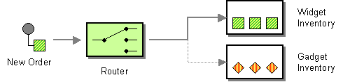
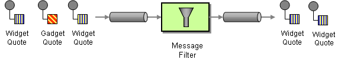

# CHAPTER 8. 消息路由
*KarezFlow 产品组
整理：孙勇
版本：0.1*

## 8.1. 基于内容的路由器
**问题：** 如果一个逻辑功能的实现需要跨越多个物理系统，这种情况如何应对？
**方案：** 使用基于内容的路由器，根据消息的内容把每条消息路由给正确的接收者。



基于内容的路由器首先检查消息的内容，并根据消息中包含的数据把消息路由到不同的通道上。可以根据许多标准来完成路由，如是否存在某些字段、是否有指定的字段值等。

### Java DSL 示例
```java
RouteBuilder builder = new RouteBuilder() {
  public void configure() {
    from("seda:a").choice()
      .when(header("foo").isEqualTo("bar")).to("seda:b")
      .when(header("foo").isEqualTo("cheese")).to("seda:c")
      .otherwise().to("seda:d");
  }
};
```

### XML DSL 示例
```xml
<camelContext id="buildSimpleRouteWithChoice"
  xmlns="http://camel.apache.org/schema/spring">
  <route>
    <from uri="seda:a"/>
      <choice>
        <when>
          <xpath>$foo = 'bar'</xpath>
          <to uri="seda:b"/>
        </when>
        <when>
          <xpath>$foo = 'cheese'</xpath>
          <to uri="seda:c"/>
        </when>
      <otherwise>
        <to uri="seda:d"/>
      </otherwise>
    </choice>
  </route>
</camelContext>
```

## 8.2. 消息过滤器
**问题：** 如何避免组件接收到与之无关的消息？
**方案：** 使用一种特殊的消息路由器——消息过滤器，可以根据一组规则把不需要的消息从通道中剔除。



消息过滤器是一种只有一个输出通道的消息路由器。如果输入消息的内容与消息过滤器指定的规则匹配，该消息将路由到输出通道。如果消息的内容与规则不匹配，这个消息则被丢掉。

### Java DSL 示例
```java
RouteBuilder builder = new RouteBuilder() {
  public void configure() {
  from("seda:a").filter(header("foo").isEqualTo("bar")).to("seda:b");
}
};
```

要评估更复杂的过滤器谓词，可以调用支持的脚本语言之一，例如XPath，XQuery或SQL。

```java
from("direct:start").
  filter().xpath("/person[@name='James']").to("mock:result");
```

### XML DSL 示例
```xml
<camelContext id="simpleFilterRoute"
  xmlns="http://camel.apache.org/schema/spring">
  <route>
    <from uri="seda:a"/>
    <filter>
      <xpath>$foo = 'bar'</xpath>
      <to uri="seda:b"/>
    </filter>
  </route>
</camelContext>
```

### 使用bean过滤
```java
from("direct:start")
  .filter().method(MyBean.class,"isGoldCustomer").to("mock:result").end()
  .to("mock:end");

public static class MyBean {
  public boolean isGoldCustomer(@Header("level") String level) {
    return level.equals("gold");
  }
}
```

### 使用 stop()
Stop是一种特殊类型的过滤器，用于过滤所有消息。 Stop 在基于内容的路由器中使用时，需要在其中一个谓词中停止进一步处理。

在以下示例中，我们不希望邮件正文中带有Bye字样的邮件在路由中进一步传播。 我们使用.stop() 在when() 谓词中阻止这种情况。

```java
from("direct:start")
  .choice()
    .when(bodyAs(String.class).contains("Hello")).to("mock:hello")
    .when(bodyAs(String.class).contains("Bye")).to("mock:bye").stop()
    .otherwise().to("mock:other")
  .end()
.to("mock:result");
```

### 了解Exchange是否被过滤
消息过滤器EIP将在Exchange上添加一个属性，该属性指示是否被过滤。

该属性具有键值 **Exchannge.FILTER_MATCHED**，其值为 **CamelFilterMatched**。 它的值是一个布尔值，表示true或false。 如果值为true，则Exchange将在过滤器块中路由。

## 8.3. 接收者列表
**问题：** 如果接收者列表会动态变化，如何把消息路由给这样一组接收者？
**方案：** 为每个接收者定义一个通道。如何使用接收者列表模式检查输入消息，确定需要消息的接收者列表，并把消息转发给与列表中接收者关联的所有通道。


### 具有固定目的地的收件人列表
最简单的接收者列表是固定的，提前知道的，交换模式是InOnly。 在这种情况下，可以将目的地列表连线到`to()`Java DSL命令。

>**注意**
这里给出的具有固定目的地的收件人列表的示例仅适用于 **InOnly** 交换模式（类似于流水线）。 如果要使用Out消息创建交换模式的收件人列表，请改用 **multicast** 多播模式。

#### Java DSL 示例
```java
from("seda:a").to("seda:b", "seda:c", "seda:d");
```

#### XML DSL 示例
```xml
<camelContext id="buildStaticRecipientList"
  xmlns="http://camel.apache.org/schema/spring">
  <route>
    <from uri="seda:a"/>
    <to uri="seda:b"/>
    <to uri="seda:c"/>
    <to uri="seda:d"/>
  </route>
</camelContext>
```

### 动态的接收者列表
在大多数情况下，当使用接收者列表模式时，应在运行时计算接收者列表。 为此，请使用`recipientList()` 处理器，它将目的地列表作为其唯一参数。 因为Apache Camel将类型转换器应用于列表参数，所以应该可以使用大多数标准的Java列表类型（例如，集合，列表或数组）。 

接收者收到相同的交换实例的副本，Apache Camel 依次执行它们。

#### Java DSL 示例
```java
from("direct:a").recipientList(header("recipientListHeader").tokenize(","));
```

#### XML DSL 示例
```xml
<camelContext id="buildDynamicRecipientList"
  xmlns="http://camel.apache.org/schema/spring">
  <route>
    <from uri="seda:a"/>
    <recipientList delimiter=",">
      <header>recipientListHeader</header>
    </recipientList>
  </route>
</camelContext>
```

## 8.4. 分解器
**问题：** 如果消息中包含多个元素，每个元素要采用不同的方式处理，这种消息如何处理？
**方案：** 使用分解器把组合的消息分解为一系列单独的消息，每条消息只包含与每个项目相关的数据。


分解器是一种将输入消息分成一系列传出消息的路由器。每个传出的消息都包含一段原始消息。 在Apache Camel中，分解器模式由`split()`Java DSL命令实现。

Apache Camel分离器实际上支持两种模式，如下所示：
- 简单的分解器 - 自己实现分解器模式。
- 分解器/聚合器 - 将分解器模式与聚合器模式组合，使得消息的片段在它们被处理之后被重新组合。

### Java DSL 示例
```java
RouteBuilder builder = new RouteBuilder() {
  public void configure() {
    from("seda:a")
    .split(bodyAs(String.class).tokenize("\n"))
    .to("seda:b");
  }
};
```

### XML DSL 示例
```xml
<camelContext id="buildSplitter"
  xmlns="http://camel.apache.org/schema/spring">
  <route>
    <from uri="seda:a"/>
    <split>
      <xpath>//foo/bar</xpath>
      <to uri="seda:b"/>
    </split>
  </route>
</camelContext>
```

## 8.5. 聚合器
**问题：** 怎样把独立但相关的结果消息组合起来，从而使它们能作为一个完整的消息来处理？
**方案：** 使用有状态的过滤器，即聚合器，把单独的消息收集并存储起来，直到接收到所有相关的完整的消息集合，然后聚合器从各个单独消息中提取消息，组合成一个消息后发布。


聚合器是一种特殊的过滤器，它接收一个消息流并识别出相关的消息。一旦接收到完整的消息集合，聚合器就从每个相关的消息中收集信息，并把它们组合为一个聚合消息发布到输出通道上，以便进一步的处理。

### Java DSL 示例
```java
```

### XML DSL 示例
```xml
```

## 8.6. 重排器
**问题：** 如何把相关但是乱序的消息重新恢复成正确的顺序？
**方案：** 使用一个有状态的过滤器：重排器，收集并重排消息，使消息能够按指定的顺序发布到输出通道上。


重排器可以接收未按顺序到达的消息流。它把乱序的消息存储在一个内部缓冲区中，直到获得完整的消息序列，然后按正确的顺序把消息发布到输出通道上。关键是输出通道必须保证消息的顺序，只有这样才能保证消息按顺序达到下一组件。和其他大多数路由器一样，重排器一般不会修改消息的内容。

重排器模式能够根据排序表达式重新排列消息。 为排序表达式生成低值的消息将移动到批处理的前端，生成高值的消息将被移动到后面。

Apache Camel支持两种重新排序算法：
- 批量重排 - 将消息收集到批中，对消息进行排序并将其发送到其输出。
- 流重排 - 根据检测到消息之间的差距重新排序（连续）消息流。

默认情况下，重新排序器不支持重复的消息，只有在消息到达时使用相同的消息表达式才能保留最后一条消息。 但是，在批处理模式下，您可以启用重新同步器以允许重复。

### 批量重排

```java
from("direct:start").resequence(header("TimeStamp")).to("mock:result");
```

```java
import org.apache.camel.model.config.BatchResequencerConfig;

RouteBuilder builder = new RouteBuilder() {
  public void configure() {
    from("direct:start").resequence(header("TimeStamp")).batch(new
    BatchResequencerConfig(300,4000L)).to("mock:result");
  }
};
```

```xml
<camelContext id="resequencerBatch"
  xmlns="http://camel.apache.org/schema/spring">
  <route>
    <from uri="direct:start" />
      <resequence>
      <!--
      batch-config can be omitted for default (batch) resequencer
      settings
      -->
      <batch-config batchSize="300" batchTimeout="4000" />
      <simple>header.TimeStamp</simple>
      <to uri="mock:result" />
    </resequence>
  </route>
</camelContext>
```

#### 批量参数

### 流重排

```java
from("direct:start").resequence(header("seqnum")).stream().to("mock:result");
```
```java
import org.apache.camel.model.config.StreamResequencerConfig;
RouteBuilder builder = new RouteBuilder() {
  public void configure() {
    from("direct:start").resequence(header("seqnum")).
    stream(new StreamResequencerConfig(5000, 4000L)).
    to("mock:result");
  }
};
```

```xml
<camelContext id="resequencerStream"
  xmlns="http://camel.apache.org/schema/spring">
  <route>
    <from uri="direct:start"/>
    <resequence>
      <stream-config capacity="5000" timeout="4000"/>
      <simple>header.seqnum</simple>
      <to uri="mock:result" />
    </resequence>
  </route>
</camelContext>
```

### Ignore invalid exchanges
### Reject old messages

## 8.7. ROUTING SLIP
**问题：** 
**方案：** 


### Java DSL 示例
```java
```

### XML DSL 示例
```xml
```

## 8.8. THROTTLER
**问题：** 
**方案：** 


### Java DSL 示例
```java
```

### XML DSL 示例
```xml
```

## 8.9. DELAYER
**问题：** 
**方案：** 


### Java DSL 示例
```java
```

### XML DSL 示例
```xml
```

## 8.10. LOAD BALANCER
**问题：** 
**方案：** 


### Java DSL 示例
```java
```

### XML DSL 示例
```xml
```

## 8.11. MULTICAST
**问题：** 
**方案：** 


### Java DSL 示例
```java
```

### XML DSL 示例
```xml
```

## 8.12. COMPOSED MESSAGE PROCESSOR
**问题：** 
**方案：** 


### Java DSL 示例
```java
```

### XML DSL 示例
```xml
```

## 8.13. SCATTER-GATHER
**问题：** 
**方案：** 


### Java DSL 示例
```java
```

### XML DSL 示例
```xml
```

## 8.14. LOOP
**问题：** 
**方案：** 


### Java DSL 示例
```java
```

### XML DSL 示例
```xml
```

## 8.15. SAMPLING
**问题：** 
**方案：** 


### Java DSL 示例
```java
```

### XML DSL 示例
```xml
```

## 8.16. DYNAMIC ROUTER
**问题：** 
**方案：** 


### Java DSL 示例
```java
```

### XML DSL 示例
```xml
```