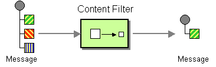
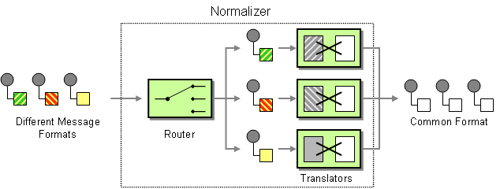

# CHAPTER 9. 消息转换
*KarezFlow 产品组
编写：孙勇
版本：1.0*

消息转换模式描述如何基于不同目的编辑消息内容。

## 9.1. 内容丰富器
内容丰富器描述这样一个场景：消息接收者需要的数据超出发送者提供的原始消息内容。在此案例中，使用内容丰富器从外部资源获取额外的数据。


### 内容丰富器模型
Apache Camel 支持两种类型的内容丰富器：
- **enrich()**——通过发送当前交换拷贝至生产者端点获得附加数据并从回复结果中使用数据（丰富器创建的交换总是`InOut`）。
- **pollEnrich()**——从轮询消费者获得附加数据。

### 使用 enrich()
```java
AggregationStrategy aggregationStrategy = ...

from("direct:start")
.enrich("direct:resource", aggregationStrategy)
.to("direct:result");

from("direct:resource")
...
```

### Spring XML 示例
```xml
<camelContext id="camel" xmlns="http://camel.apache.org/schema/spring">
  <route>
    <from uri="direct:start"/>
    <enrich strategyRef="aggregationStrategy">
      <constant>direct:resource</constant>
    <to uri="direct:result"/>
  </route>
  <route>
    <from uri="direct:resource"/>
    ...
  </route>
</camelContext>
<bean id="aggregationStrategy" class="..." />
```

### 默认聚合策略
聚合策略是可选的。如果没有提供，Apache Camel 将默认从消息体获得资源。
```java
from("direct:start")
  .enrich("direct:resource")
  .to("direct:result");
```

## 9.2. 内容过滤器
内容过滤器描述场景：在发送消息给接受者前需要过滤内容。


通常使用支持的脚本语言（例如，XSLT, XQuery or JoSQL）在DSL中使用公式来过滤消息。

### 实现内容过滤器
一个内容过滤器从本质上来看就是为实现特定目的采用消息处理技术的应用。实现内容过滤器，可以使用下列消息处理技术：
- 消息转换
- 处理器
- Bean 集成

### XML 配置示例
```xml
<camelContext xmlns="http://camel.apache.org/schema/spring">
  <route>
    <from uri="activemq:My.Queue"/>
    <to uri="xslt:classpath:com/acme/content_filter.xsl"/>
    <to uri="activemq:Another.Queue"/>
  </route>
</camelContext>
```

### 使用XPath过滤器
```xml
<route>
  <from uri="activemq:Input"/>
  <setBody><xpath resultType="org.w3c.dom.Document">//foo:bar</xpath>
  </setBody>
  <to uri="activemq:Output"/>
</route>
```

## 9.3. 规范器
规范器用于处理语义相等但格式不同的消息。规范器将输入消息转换为一个通用格式。

在Apache Camel，可以通过组合基于内容的路由实现规范器模式。一些依据消息翻译器集合发现输入消息格式，一些转换不同输入格式到通用格式。



### Java DSL 示例
#### 使用 Fluent 构建器
```java
// we need to normalize two types of incoming messages
from("direct:start")
  .choice()
    .when().xpath("/employee").to("bean:normalizer?method=employeeToPerson")
    .when().xpath("/customer").to("bean:normalizer?method=customerToPerson")
  .end()
  .to("mock:result");
```

在这个示例中使用Java bean实现规则器。类看上去如下：
```java
public class MyNormalizer {
  public void employeeToPerson(Exchange exchange,
    @XPath("/employee/name/text()") String name) {
    exchange.getOut().setBody(createPerson(name));
  }

  public void customerToPerson(Exchange exchange,
    @XPath("/customer/@name") String name) {
    exchange.getOut().setBody(createPerson(name));
  }

  private String createPerson(String name) {
    return "&lt;person name=\"" + name + "\"/>";
  }
}
```

### XML 配置示例
```xml
<camelContext xmlns="http://camel.apache.org/schema/spring">
  <route>
    <from uri="direct:start"/>
    <choice>
      <when>
        <xpath>/employee</xpath>
        <to uri="bean:normalizer?method=employeeToPerson"/>
      </when>
      <when>
        <xpath>/customer</xpath>
        <to uri="bean:normalizer?method=customerToPerson"/>
      </when>
    </choice>
    <to uri="mock:result"/>
  </route>
</camelContext>

<bean id="normalizer" class="org.apache.camel.processor.MyNormalizer"/>
```

## 9.4. 提取证
*提取证*模式允许使用提取证（唯一键）替换消息内容，可以稍后再检索消息内容。消息内容临时存储在持久储存（例如，数据库或者文件系统）。该模式非常适用消息内容非常大和所有组件不需要全部信息。


### Java DSL示例
```java
from("direct:start").to("bean:checkLuggage", "mock:testCheckpoint",
"bean:dataEnricher", "mock:result");
```

### XML DSL示例
```xml
<route>
  <from uri="direct:start"/>
  <pipeline>
    <to uri="bean:checkLuggage"/>
    <to uri="mock:testCheckpoint"/>
    <to uri="bean:dataEnricher"/>
    <to uri="mock:result"/>
  </pipeline>
</route>
```

### checkLuggage bean
```java
public static final class CheckLuggageBean {
  public void checkLuggage(Exchange exchange, @Body String body,@XPath("/order/@custId") String custId) {
    // store the message body into the data store, using the custId as the claim check
    dataStore.put(custId, body);

    // add the claim check as a header
    exchange.getIn().setHeader("claimCheck", custId);

    // remove the body from the message
    exchange.getIn().setBody(null);
  }
}
```

### testCheckpoint endpoint
`mock:testCheckpoint`端点

### dataEnricher bean
```java
public static final class DataEnricherBean {
  public void addDataBackIn(Exchange exchange, @Header("claimCheck"),
String claimCheck) {

  // query the data store using the claim check as the key and add the data
  // back into the message body
  exchange.getIn().setBody(dataStore.get(claimCheck));

  // remove the message data from the data store
  dataStore.remove(claimCheck);

  // remove the claim check header
  exchange.getIn().removeHeader("claimCheck");
  }
}
```

## 9.5. SORT 排序
*排序*模式被用来对消息体内容进行排序，假定消息体包含可排序的项目列表。

默认情况下，排序使用默认比较器处理数字或字符串值。可以通过自定比较器和表达式返回已排序列表（表达式必须可以将排序结果转换至`java.util.List`）。

### Java DSL 示例
```java
from("file://inbox").sort(body().tokenize("\n")).to("bean:MyServiceBean.p
rocessLine");
```

```java
from("file://inbox").sort(body().tokenize("\n"), new
MyReverseComparator()).to("bean:MyServiceBean.processLine");
```

### XML 配置示例
```xml
<route>
  <from uri="file://inbox"/>
  <sort>
    <simple>body</simple>
  </sort>
  <beanRef ref="myServiceBean" method="processLine"/>
</route>
```

```xml
<route>
  <from uri="file://inbox"/>
  <sort comparatorRef="myReverseComparator">
    <simple>body</simple>
  </sort>
  <beanRef ref="MyServiceBean" method="processLine"/>
</route>

<bean id="myReverseComparator" class="com.mycompany.MyReverseComparator"/>
```

### 选项
`sort` DSL命令支持下列选项：

名称|默认值|描述
----|------|----
comparatorRef||引用自定义`java.util.Comparator`


## 9.6. VALIDATE 校验
*校验*模式提供一个实用的语法完成消息内容的校验。`validate`DSL命令是一个判断表达式：如果值为`true`，路由则继续正常处理；如果值为`false`则抛出`PredicateValidationException`异常。

### Java DSL 示例
使用正则表达式校验消息体：
```java
from("jms:queue:incoming")
  .validate(body(String.class).regex("^\\w{10}\\,\\d{2}\\,\\w{24}$"))
  .to("bean:MyServiceBean.processLine");
```

可以校验消息头：
```java
from("jms:queue:incoming")
  .validate(header("bar").isGreaterThan(100))
  .to("bean:MyServiceBean.processLine");
```

也可以使用`simple`表达式语言：
```java
from("jms:queue:incoming")
  .validate(simple("${in.header.bar} == 100"))
  .to("bean:MyServiceBean.processLine");
```

### XML 配置示例
使用`simple`表达语言:
```xml
<route>
  <from uri="jms:queue:incoming"/>
  <validate>
    <simple>${body} regex ^\\w{10}\\,\\d{2}\\,\\w{24}$</simple>
  </validate>
  <beanRef ref="myServiceBean" method="processLine"/>
</route>

<bean id="myServiceBean" class="com.mycompany.MyServiceBean"/>
```

也可以校验消息头：
```xml
<route>
  <from uri="jms:queue:incoming"/>
  <validate>
    <simple>${in.header.bar} == 100</simple>
  </validate>
  <beanRef ref="myServiceBean" method="processLine"/>
</route>

<bean id="myServiceBean" class="com.mycompany.MyServiceBean"/>
```