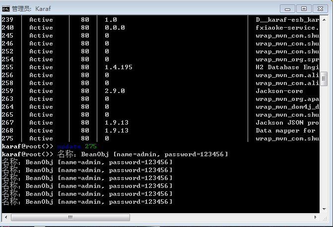

# Bean组件

*版权：数帝网络*
*整理：方辉*
*时间：2017-10-30*
*相关连接:[http://camel.apache.org/bean.html](http://camel.apache.org/bean.html)*

## 概述
camel-core-bean组件将bean绑定到camel消息交换。让我们在使用apache camel框架时更灵活的调用bean实例，来实现复杂的集成服务。(与[class组件](http://camel.apache.org/class.html)功能类似)

## URI
```
bean:beanID[?options]
```

>注：beanID是在注册表中查询出对应的bean

### 补充：Camel的bean注册表
Camel注册表是调用者和真实注册表之间的一个抽象。当一个请求需要查找一个bean，就会使用Camel的注册表，接着Camel注册表会到真实注册表中查找这个bean，最后bean返回响应。这种结构是一个松耦合、可插拔的结构，可以与多个注册表集成。请求者只需知道如何与Camel注册表交互。在Camel中，Camel注册表只是一个服务提供接口：`org.apache.camel.spi.Registry`

## URI参数

名称|类型|默认|描述
----|-----|----|-----
method|String|null|设置方法调用bean的名称
cache|boolean|false|如果启用，Camel将缓存第一个注册表查找的结果。（注册表中的bean被定义为一个单例范围，才可以启用缓存）
multiParameterArray|boolean|false|如何处理从消息体传递的参数。如果为true，则消息正文中的参数为一个数组（注意:这个选项被骆驼在内部使用,并不是供最终用户使用）
bean.xxx|Map|null|用于配置bean上的附加属性

## 使用
用于使用消息的对象实例必须在注册表中显式注册。注册方法：

1. spring的配置文件中定义bean。
2. JNDI中注册bean。

**格式:**`{snippet:id=register|lang=java|url=camel/trunk/camel-core/src/test/java/org/apache/camel/component/pojo/PojoRouteTest.java}`

## 示例

camel bean组件运行步骤:

1. 在注册表中查找bean
2. 选择所调用bean的方法
3. 绑定参数到选中的方法上(例如，使用输入消息的body作为一个参数)
4. 调用方法
5. 处理调用过程中的错误(从bean中抛出的任何异常都会设置到Camel的exchange中，以备进一步处理)
6. 设置方法的响应结果(如果有的话)到输出消息的body中

camel bean组件方法选择算法:

1. 如果方法显示指定，Camel将使用它
2. 如果所调用的bean可以转换为Processor类型(使用Camel的类型转换机制)，转换后的Processor用来处理消息。Camel允许把任何bean转换为消息驱动bean
3. 如果路由中提供了方法名，但是bean中没有对应的方法名，则抛出异常：MethodNotFoundException。
4. 如果只有一个方法使用@Handler注解标记，则选中它。
5. 如果只有一个方法使用了Camel的参数绑定注解(例如：@body，@header等等)，则选中它。
6. 如果在bean所有的方法中，只有一个方法的参数个数为1，则选中这个方法。单个参数的方法被优先选中，原因是，他们直接映射到了Camel中exchange的负载。
7. 存在有多个候选方法，Camel必须确定是否有一个方法是最适合的。策略是过滤掉候选方法中不适合的方法。Camel通过匹配候选方法的第一个参数;如果不是同一类型的参数,而且不能进行强制类型转换,该方法过滤掉。最后,如果只剩下一个方法,该方法被选中。
8. 如果最后没有选中方法，抛出AmbigiousMethodCallException异常，异常信息中包含模糊方法的列表。

参数绑定：

- 单个参数时，Camel将输入消息体绑定到参数
- 多个参数绑定的原则：
1. Camel built-in types(Camel内建类型)---Camel提供了一系列特殊绑定的概念。(包括Exchange、Message、CamelContext、TypeConverter等... )
2. Exchange---这是Camel的Exchange，它允许绑定到输入消息，比如它的body(消息体)和headers(消息头部)。
3. Camel annotations---在处理多个参数时,可以使用注解来区分它们。

### BeanProcessor类
用于向交换中添加正文数据

```java
package com.shudi.databridge.test;
import org.apache.camel.Exchange;
import org.apache.camel.Processor;

   public class BeanProcessor implements Processor {
	     @Override
	       public void process(Exchange exchange) throws Exception {
		          BeanObj beanObj = new BeanObj("admin", "123456");
		          exchange.getIn().setBody(beanObj, BeanObj.class);
	       }
    }
```

>注:此处省略BeanObj实体类...

### BeanTest类
测试bean实例

```java
package com.shudi.databridge.test;

    public class BeanTest {
	       public void test(BeanObj beanObj) {
                 System.out.println("用户："+beanObj);
	       }
    }
```

### Blueprint DSL 配置

```xml
<blueprint xmlns="http://www.osgi.org/xmlns/blueprint/v1.0.0"
           xmlns:xsi="http://www.w3.org/2001/XMLSchema-instance"
           xmlns:cm="http://aries.apache.org/blueprint/xmlns/blueprint-cm/v1.0.0"
           xsi:schemaLocation="
           http://www.osgi.org/xmlns/blueprint/v1.0.0 http://www.osgi.org/xmlns/blueprint/v1.0.0/blueprint.xsd">

	   <camelContext xmlns="http://camel.apache.org/schema/blueprint" id="测试">	
             <route id="bean测试">
                   <from uri="quartz://inventory?cron=0/20 * * * * ?"/>
                   <process ref="beanProcessor"/> 
                   <to uri="bean:beanTest?method=test"/>
                   <log message="fang.${body}"/>
             </route>           
	   </camelContext>
	   <bean id="beanTest" class="com.shudi.databridge.test.BeanTest"/> 
	   <bean id="beanProcessor" class="com.shudi.databridge.test.BeanProcessor/>		
</blueprint>

```

>注：这里采用的是DSL语言去实现bean组件在路由中的运用。当然，我们还可以运用camel注解去实现这些功能。相比较DSL语言更适合复杂的集成场景。camel注解相关连接：[http://camel.apache.org/bean-integration.html](http://camel.apache.org/bean-integration.html)

### 示例运行
