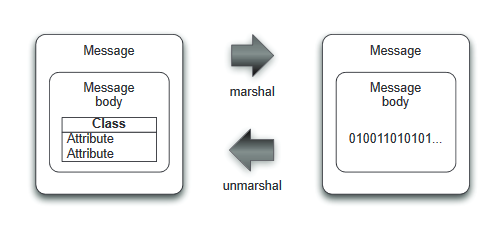

# DataFormat组件

*版权：数帝网络*
*整理：方辉*
*时间：2017-11-01*
*相关连接:[http://camel.apache.org/dataformat-component.html](http://camel.apache.org/dataformat-component.html)*

## 概述
DataFormat组件用于**数据格式**的转换，达到我们预想的格式要求，从而解决集成中数据格式的问题。
注：这里的数据格式并不是java语言中数据类型，详情可查看[数据格式](http://camel.apache.org/data-format.html)链接

## URI

```
dataformat:name:(marshal|unmarshal)[?options]
```

其中name是数据格式的名称。然后再后跟必须是marshal送或unmarshal的操作,
这些选项用于配置正在使用的数据格式。
**marshal：**把消息打包成另一种形式,比如java objects to XML,CSV,EDI,HL7或者其他著名的数据模型
**unmarshal：**反向操作，将上面的数据模型转换为消息



## 示例

### 样例一:使用camel的CSV数据格式

#### Blueprint DSL 配置

```xml
<camelContext xmlns="http://camel.apache.org/schema/blueprint" id="测试">
    <route>
        <from uri="file://rider/csvfiles"/>
        <unmarshal><csv/></unmarshal>
        <split>
            <simple>body</simple>
            <to uri="activemq:queue.csv.record"/>
        </split>
    </route> 
</camelContext>  
```

#### 样例一分析：

将文件传送到JMS队列中,我们要做的是就是对CSV文件进行整理，逐行读取文件，将消息体中的所有行都存储为一个java.util.list的类型。然后你用分解器把身体分成两部分(每一行表示为包含字段的另一个列表)，并将每一行发送到JMS队列。这样就通过数据格式转化实现上面的功能。

### 样例二：使用camel的JSON数据格式

#### Blueprint DSL 配置 

```xml
<bean id="orderService" class="camelinaction.OrderServiceBean"/>
<camelContext id="camel" xmlns="http://camel.apache.org/schema/spring">
    <!--设置JSON数据格式-->
    <dataFormats>
        <json id="json" library="Jackson"/>          
    </dataFormats>
    <route>
        <from uri="jetty://http://0.0.0.0:8080/order"/> 
        <!--调用Bean组件，检索数据的回复-->              
        <bean ref="orderService" method="lookup"/>    
        <marshal ref="json"/>
    </route> 
</camelContext>
```
#### 样例二分析：

首先我们要设置JSON数据格式，然后定义一个暴露路径的HTTP服务（jetty端点）。
每当客户端访问order服务时，就会调用bean实例中lookup方法。
数据通过JSON格式化后返回给客户端。

