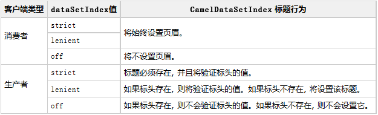
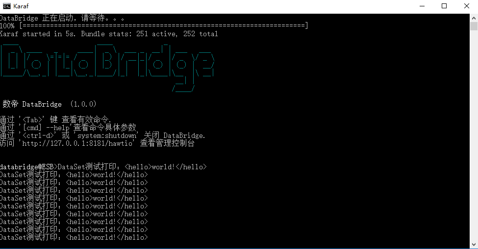

# DataSet组件

*版权：数帝网络*
*整理：方辉*
*时间：2017-11-02*
*相关连接:[http://camel.apache.org/dataset.html](http://camel.apache.org/dataset.html)*

## 概述
DataSet组件提供了一种机制，可以轻松地执行系统的负载和测试。它的工作原理是允许您创建数据集实例作为消息源, 并作为断言数据集被接收的一种方法。
当发送数据集时, 骆驼将使用[吞吐量记录器](http://camel.apache.org/log.html)。

## URI

```
dataset:name[?options]
```

其中, name用于在注册表中查找[数据集实例](http://camel.apache.org/maven/current/camel-core/apidocs/org/apache/camel/component/dataset/DataSet.html)
骆驼支持实现 `org.apache.camel.component.dataset.DataSet, org.apache.camel.component.dataset.DataSetSupport`类,用作实现您自己的基础DataSet。
骆驼还附带一些可用于测试的实现:
- `org.apache.camel.component.dataset.SimpleDataSet`
- `org.apache.camel.component.dataset.ListDataSet` 
- `org.apache.camel.component.dataset.FileDataSet`
这些实现扩展`DataSetSupport`类。

## URI参数

选项|默认|描述
----|----|----
produceDelay|3|允许指定毫秒的延迟, 这会导致生产者暂停以模拟缓慢的生产者。至少使用 3ms 延迟。设置为 -1 可强制所有延迟。
consumeDelay|0|允许指定毫秒的延迟,这会导致消费者暂停以模拟缓慢的消费者。
preloadSize|0|设置路由在完成初始化时预加载的消息数。
initialDelay|1000|开始发送邮件之前等待的时间 (以毫秒为单位)。
minRate|0|等待的数据集至少包含此数目的消息
dataSetIndex|lenient|控制 CamelDataSetIndex标头的行为(详情见下图)



## 示例

### 示例分析
我们将DataSet组件设置为路由的消费者，执行路由时dataset在注册表寻找数据集的bean，并将数据集加载到消息交换中，所以说这里处理器打印出10条数据。
由此可见DataSet组件可以作为数据源有效的解决集成中负载和测试的问题。

### Blueprint DSL 配置

```xml
<blueprint xmlns="http://www.osgi.org/xmlns/blueprint/v1.0.0"
           xmlns:xsi="http://www.w3.org/2001/XMLSchema-instance"
           xmlns:cm="http://aries.apache.org/blueprint/xmlns/blueprint-cm/v1.0.0"
           xsi:schemaLocation="
           http://www.osgi.org/xmlns/blueprint/v1.0.0 http://www.osgi.org/xmlns/blueprint/v1.0.0/blueprint.xsd">

      <!--配置数据集(这里引用的的是Camel DataSet组件中的测试类SimpleDataSet) -->
	  <bean id="simpleDataSet" class="org.apache.camel.component.dataset.SimpleDataSet">
            <property name="size" value="10"/>
      </bean>
      <!--自定义处理器（打印结果集）-->
	  <bean id="dataSetProcessor" class="com.shudi.databridge.test.DataSetProcessor"/>
	  <!--DataSet测试组件测试dsl-->
	  <camelContext xmlns="http://camel.apache.org/schema/blueprint" id="测试">	
              <route id="DataSet测试">
                   <from uri="dataset:simpleDataSet"/>
				   <process ref="dataSetProcessor"/>
				   <log message="fang.${body}"/>
              </route>           
	   </camelContext>	  
</blueprint>
```

### 示例运行

