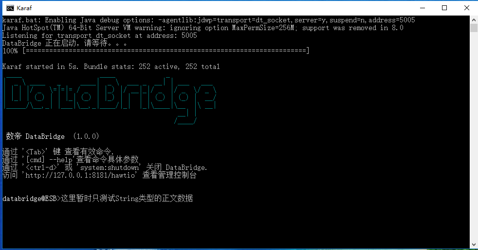

# File组件

*版权：数帝网络*
*整理：方辉*
*时间：2017-11-02*
*相关连接:[http://camel.apache.org/file2.html](http://camel.apache.org/file2.html)*

## 概述

文件组件提供对文件系统的访问，允许任何其他骆驼组件或来自其他组件的消息被保存到磁盘上。

## URI

```
file:directoryName[?options] OR file://directoryName[?options] 
```

其中 directoryName 表示基础文件目录。

### 补充：

- 骆驼只支持配置有起始目录的端点。因此，directoryName必须是一个目录。
- 如果您只想使用一个文件，您可以使用文件名选项。则可以通过设置fileName=thefilename。
- 此外，起始目录不能包含带有${}占位符的动态表达式。再次使用文件名选项来指定文件名的动态部分。

## URI参数

### 通用

名称|默认值|描述
----|----|----
autoCreate|true|在文件的路径名中自动创建丢失的目录。
bufferSize|128kb|写入缓冲区大小 (以字节为单位)。
fileName|null|动态设置文件名。
flatten|false|如果将此设置为true , 则会运用CamelFileName标头中接收的任何文件名称作为前导路径。
charset|null|该选项用于指定文件的编码。
copyAndDeleteOnRenameFail|true|当文件名重复时是否回退并执行复制和删除文件。(此选项对于FTP组件不可用)
renameUsingCopy|false|使用复制和删除策略执行重命名操作。

### 消费者

名称|默认值|描述
----|----|----
initialDelay|1000|在轮询文件/目录开始之前的延迟(毫秒为单位)
delay|500|文件/目录的下一次轮询之前的毫秒数。
useFixedDelay|true|控制是否使用固定延迟或固定速率。有关详细信息, 请参见 JDK 中的[ScheduledExecutorService](https://docs.oracle.com/javase/1.5.0/docs/api/java/util/concurrent/ScheduledExecutorService.html) 。
runLoggingLevel|TRACE|用户在进行轮询时，会记录一个起始/完整的日志线。该选项允许您为该选项配置日志级别。
recursive|false|如果只有一个目录，也会在所有子目录中查找文件。
delete|false|如果是true，该文件在成功处理后将被删除。
noop|false|如果为 true, 则不会以任何方式移动或删除该文件。此选项适合于只读数据, 或用于[ETL](http://camel.apache.org/etl.html)类型要求。如果 noop=true, 则骆驼也将设置idempotent=true , 以避免重复使用相同的文件。
preMove|null|[表达式](http://camel.apache.org/expression.html)(如[文件语言](http://camel.apache.org/file-language.html)), 用于在移动之前处理时动态设置文件名。例如, 将正在进行中的文件移动到order目录中, 将此值设置为order。
move|.camel|表达式(如文件语言), 用于在移动后处理时动态设置文件名。若要将文件移动到 .done子目录只输入 .done。
moveFailed|null|表达式(如文件语言), 用于在移动文件时动态设置不同的目标目录。(注意: 当将文件移动"失败"时, 骆驼将处理该错误, 并且不会再次拾取该文件)
include|null|如果文件名与正则表达式模式匹配，则用于包含文件。
exclude|null|如果文件名与正则表达式模式匹配，则用于排除文件。
antInclude|null|Ant风格的过滤器包含，例如antInclude=/.txt。多个夹杂物可以用逗号分隔的格式指定。有关ant路径过滤器的更多细节，请参见下面的内容
antExclude|null|Ant风格过滤排除。如果使用antInclude和ant排他，antInclude优先于antInclude。可以用逗号分隔的格式指定多个排除。有关ant路径过滤器的更多细节，请参见下面。
antFilterCaseSensitive|true|区分大小写的 Ant 类型筛选器。
idempotent|false|选项可以使用[Idempotent Consumer](http://camel.apache.org/idempotent-consumer.html)的使用者模式来让骆驼跳过已处理的文件。默认情况下, 将使用基于内存的 LRUCache, 它包含1000条目。如果 noop=true , 则也将启用Idempotent等, 以避免重复使用相同的文件。
idempotentKey|Expression|使用自定义idempotent key。默认情况下, 将使用文件的绝对路径。可以使用文件语言, 例如使用文件名和文件大小, 可以执行以下操作:idempotentKey = $ {文件: 名称}-$ {文件: 大小}
idempotentRepository|null|可插入的存储库 [org.apache.camel.spi.IdempotentRepository](http://camel.apache.org/maven/current/camel-core/apidocs/org/apache/camel/spi/IdempotentRepository.html), 默认情况下使用 MemoryMessageIdRepository (如果没有指定) 并且idempotent是true。
inProgressRepository|memory|可插入的正在进行的存储库 org.apache.camel.spi.IdempotentRepository 。正在进行的存储库用于计算正在使用的当前正在进行的文件。默认情况下, 使用基于内存的存储库。
filter|null|可插入过滤器org.apache.camel.component.file.GenericFileFilter类。如果过滤器在accept()方法中返回false，将跳过文件。
filterDirectory|null|根据简单的[语言](http://camel.apache.org/simple.html)过滤目录。例如，对当前日期进行筛选，您可以使用一个简单的日期模式，例如${date: now:yyyMMdd}。
filterFile|null|基于简单语言筛选文件。例如, 若要按文件大小进行筛选, 可以使用 ${file}:size > 5000 。
shuffle|false|无序排列文件列表 (按随机顺序排序)。
sorter|null|可插拔的分类器java.util.Comparator< org.apache.camel.component.file.GenericFile > class
sortBy|null|使用[文件语言](http://camel.apache.org/file-language.html)的内置排序。支持嵌套排序, 因此您可以按文件名排序, 并作为第二组按修改日期排序。
readLock|none|由使用者使用，只有在文件中有独占的读锁时才对其进行轮询。
readLockTimeout|10000|readLock可选的超时（以毫秒为间隔）
readLockCheckInterval|1000|读锁定的时间间隔 (以毫秒为单位) (如果读锁定支持)。此间隔用于在获取读取锁定的尝试之间进行休眠。
readLockMinLength|1|此选项仅适用于 readLock=changed的。此选项允许您配置最小文件长度。默认情况下, 骆驼希望文件包含数据, 因此默认值为1。可以将此选项设置为零, 以允许使用零长度文件。
readLockMinAge|0|此选项仅适用于 readLock=change。此选项允许您在尝试获取读锁定之前指定文件的最小年龄。
readLockLoggingLevel|WARN|无法获取读锁定时使用的日志记录级别。默认情况下, 将记录WARN 。您可以更改此级别, 例如关闭以不进行任何日志记录。
readLockMarkerFile|true|是否将标记文件与changed、rename或exclusive读锁定类型一起使用。
readLockRemoveOnRollback|true|此选项仅适用于 readLock=idempotent等。此选项允许指定在处理文件失败并发生回滚时是否从idempotent存储库中删除文件名项。
readLockRemoveOnCommit|false|此选项仅适用于 readLock=idempotent等。此选项允许指定在处理文件成功并发生提交时是否从idempotent存储库中删除文件名项。
readLockDeleteOrphanLockFiles|true|启动时是否应使用标记文件读取锁定。如果骆驼未正确关闭 (如 JVM 崩溃), 则删除任何孤立的读锁定文件 (可能已留在文件系统上)。
directoryMustExist|false|类似于startingDirectoryMustExist但这期间适用于轮询递归子目录
doneFileName|null|如果提供了doneFileName，骆驼只会在有文件存在的情况下使用文件。
exclusiveReadLockStrategy|null|可插入org.apache.camel.component.file.GenericFileExclusiveReadLockStrategy实现读锁
maxMessagesPerPoll|0|一个整数, 用于定义每个轮询收集的最大消息数。默认情况下不设置最大值。可用于设置例如 1000 的限制, 以避免启动服务器时出现数以千计的文件。设置 0 或负数的值以禁用它。
eagerMaxMessagesPerPoll|true|如false将扫描所有文件, 然后执行排序。如果将此选项设置为false , 则允许首先对所有文件进行排序, 然后限制轮询。
minDepth|0|在递归处理目录时开始处理的最小深度。使用 minDepth=1 表示基目录。使用 minDepth=2 表示第一个子目录。
maxDepth|Integer.MAX_VALUE|递归处理目录时要遍历的最大深度。
processStrategy|null|一个可插入org.apache.camel.component.file.GenericFileProcessStrategy允许您实现自己的readLock选项或类似。
startingDirectoryMustExist|false|起始目录是否必须存在。
pollStrategy|null|一个可插入的org.apache.camel.spi.PollingConsumerPollStrategy, 允许您提供自定义实现来控制在轮询操作过程中可能发生的错误处理, 但之前Exchange已由骆驼创建和路由。
sendEmptyMessageWhenIdle|false|如果轮询使用者没有轮询任何文件, 则可以启用此选项以发送空消息 (无正文)。
consumer.bridgeErrorHandler|false|允许将使用者连接到骆驼路由[错误处理程序](http://camel.apache.org/error-handler.html), 这意味着在尝试拾取文件时发生的任何异常 (或类似的情况) 现在将作为消息处理并由路由错误处理程序处理。
scheduledExecutorService|null|允许配置用于使用者的自定义/共享线程池。默认情况下, 每个使用者都有自己的单线程线程池。此选项允许您在多个文件使用者之间共享一个线程池。
scheduler|null|使用自定义计划程序来触发用户运行。
backoffMultiplier|0|如果有一系列后续的错误，就让计划的轮询使用者后退。
backoffIdleThreshold|0|应在backoffMultipler之前发生的空闲轮询数。
backoffErrorThreshold|0|backoffMultipler之前应发生的后续错误轮询 (由于某些错误而失败) 的数量。
onCompletionExceptionHandler|暂无|使用自定义 org.apache.camel.spi.ExceptionHandler 来处理在使用者完成提交或回滚的过程中引发的异常。
probeContentType|false|是否允许对内容类型进行判断。
extendedAttributes|null|使用文件通过 java.nio.file.attribute 类来收集扩展文件属性。

### 生产者

名称|默认值|描述
----|----|----
fileExist|Override|如果已存在同名文件, 该如何处理。可以指定以下值:Override-替换现有文件。Append--将内容添加到现有文件中;Fail--将引发 GenericFileOperationException,指示已存在文件;Ignore--会悄悄忽略该问题;Move--要求同时配置选项moveExisting，eagerDeleteTargetFile可用于控制在移动文件时要执行的操作, 并且已存在一个文件, 否则将导致移动作业失败。在写入目标文件之前, Move选项将移动任何现有文件;TryRename--仅在 tempFileName 选项正在使用时才适用。这允许尝试将该文件从临时名称重命名为实际名称, 而不进行任何存在的检查。
tempPrefix|null|此选项用于使用临时名称写入文件, 然后在写入完成后将其重命名为实际名称。
tempFileName|null|与tempPrefix选项相同, 但在使用文件语言时对临时文件名的命名提供更精细的粒度控制。
moveExisting|null|表达式(如文件语言), 用于计算在配置fileExist=Move时要使用的文件名。将文件移动到backup子目录中。
keepLastModified|false|将保留上次修改的时间戳与源文件 (如果有)。
eagerDeleteTargetFile|true|是否急切地删除任何现有的目标文件。
doneFileName|null|如果提供了，那么当原始文件被写入时，骆驼将会写第二个文件(称为已完成的文件)
allowNullBody|false|用于指定在文件写入期间是否允许空正文。如果设置为 true, 则将创建一个空文件, 如果设置为 false, 并尝试将 null 正文发送到文件组件, 则将引发 GenericFileWriteException 消息 "无法将空正文写入文件"。(如果 fileExist=Override文件将被截断。如果 fileExist=append , 则该文件将保持不变。)
forceWrites|true|是否强制同步写入文件系统。如果您不希望此级别的保证, 例如写入日志/审核日志等, 您可以将其关闭。这将产生更好的性能。
chmod|null|指定由生产者发送的文件权限，chmod值必须在000和777之间。
chmodDirectory|null|指定当生产者创建丢失目录时所使用的目录权限，chmod值必须在000和777之间。

## 示例

### 样例一：文件移动

#### Blueprint DSL 配置

```xml
<camelContext xmlns="http://camel.apache.org/schema/blueprint" id="测试">	
	    <route id="File组件测试">
			    <!--文件移动-->
			    <from uri="file:H:/fxk?delay=30000"/>
			    <to uri="file:H:/k3"/>
		</route> 	
</camelContext>
```

#### 样例一分析:
样例中我们将H:/fxk文件夹下的所有文件移动到H:/k3，delay=30000为每次轮询的时间间隔。路由开启后fxk文件移动到k3中，而fxk文件夹中会自动备份移动的文件（存在于.camel文件夹中）。

### 样例二：将交换中的消息写入文件

#### FileProcessor类
用于向交换中添加数据

```java
package com.shudi.databridge.test;

import org.apache.camel.Exchange;
import org.apache.camel.Processor;

public class FileProcessor implements Processor {

	   @Override
	   public void process(Exchange exchange) throws Exception {
		       exchange.getOut().setBody("这里暂时只测试String类型的正文数据");  
		        System.out.println("FileProcessor处理器运行。。。。。。");
	   }
}
```

#### Blueprint DSL 配置

```xml
   <bean id="fileProcessor" class="com.shudi.databridge.test.FileProcessor"/>

   <!--file组件测试-->
   <camelContext xmlns="http://camel.apache.org/schema/blueprint" id="测试">	
	        <route id="File组件测试">
			      <!--文件写入-->
			      <from uri="timer://order?period=20s"/>
                  <process ref="fileProcessor"/> 
			      <to uri="file:H:/Data"/>
			</route> 	
   </camelContext>
```

#### 示例运行


#### 样例二分析:
通过处理器将正文数据添加到交换中，然后连接file组件端点。从图中可以看出，这里出现三个文件，而且每个文件名都不同。
样例中的路由是由定时器开启得，所以路由会定时运行。
file组件中可以fileName属性去自定义文件名。fileName=null时,骆驼会默认将交换ID作为文件名，所以样例中的文件名都不同。


### 样例三：文件读取

### 修改FileProcessor类
读取文件并打印

```java 
package com.shudi.databridge.test;

import org.apache.camel.Exchange;
import org.apache.camel.Processor;

public class FileProcessor implements Processor {

	   @Override
	   public void process(Exchange exchange) throws Exception {
		      InputStream body = exchange.getIn().getBody(InputStream.class);  
		      BufferedReader br = new BufferedReader(new InputStreamReader(body, "UTF-8"));  
              StringBuilder sb = new StringBuilder("");  
              String str;  
              while((str = br.readLine()) != null) {  
                   sb.append(str + " ");  
              }  
              System.out.println(sb);
	   }
}
```

#### Blueprint DSL 配置

```xml
<bean id="fileProcessor" class="com.shudi.databridge.test.FileProcessor"/>
       
<!--file组件测试-->
<camelContext xmlns="http://camel.apache.org/schema/blueprint" id="测试">	
	     <route id="File组件测试">
			   <!--文件读取-->
			   <from uri="file:H:/Data?noop=true"/>
			   <process ref="fileProcessor"/>
		 </route> 	
</camelContext>
```
#### 示例运行


#### 样例三分析：
上述路由将从H:/Data目录中读取文件，将文件内容打印到karaf容器中。路由中的noop=true选项告诉Camel：保留原始文件(不删除原文件)；如果去掉noop选项，将会使用Camel的默认行为：把成功消费的原始文件移到.camel目录中,这个目录名可以通过move配置选项来设置。如果想删除源文件，可以使用delete配置选项。 

