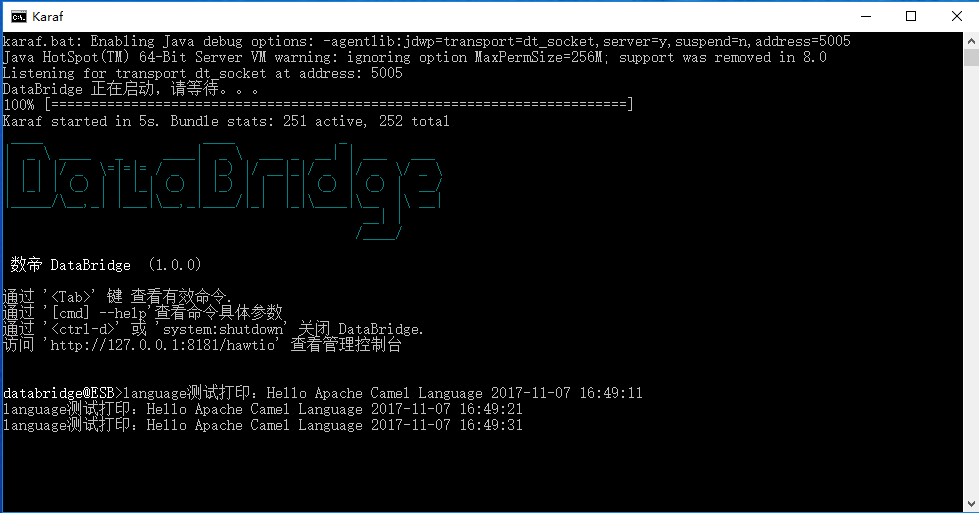

# Language组件

*版权：数帝网络*
*整理：方辉*
*时间：2017-11-03*
*相关连接:[http://camel.apache.org/language.html](http://camel.apache.org/language.html)*

## 概述
Language组件允许您将交换发送到一个端点，该端点可以通过任何支持的[语言](http://camel.apache.org/languages.html)来执行脚本。

## URI

```
language://languageName[:script][?options]

```
**从骆驼2.11 开始, 您可以使用与其他语言在骆驼中所支持的相同的表示法来引用脚本的外部资源**
```
language://languageName:resource:scheme:location][?options]
```

## URI参数

名称|默认值|类型|描述
----|----|----|----
languageName|null|string|要使用的语言的名称, 如simple、 groovy、 javascript等。此选项是必需的。
script|null|string|要执行的脚本。
transform|true|boolean|是否应将脚本的结果用作新的消息正文。通过设置为false , 将执行脚本, 但会丢弃脚本的结果。
contentCache|true|boolean|是否在从资源加载时缓存脚本。
cacheScript|false|boolean|是否缓存已编译的脚本。打开此选项可以获得性能, 因为脚本只编译/创建一次, 并且在处理骆驼消息时重用。
binary|false|boolean|脚本是否为二进制内容。这将用于使用常量语言 (如加载二进制文件) 来加载资源。

## 示例

### 示例分析
- 这里的简单案例告诉了我们调用language组件，执行脚本语言，可以使正文数据发生相应的变化。
- 案例是直接在URI中编辑的脚本语言。此外，language组件还可以引用外部资源脚本，这样路由的组成结构看上去会更清晰。
- language组件实现的功能非常丰富，想要熟练的运用到开发环境，我们必须要去深入的了解[脚本语言](http://camel.apache.org/languages.html)。

### BeanProcessor类
向正文添加数据

```java
package com.shudi.databridge.test;
import org.apache.camel.Exchange;
import org.apache.camel.Processor;

public class BeanProcessor implements Processor {

	@Override
	public void process(Exchange exchange) throws Exception {
		   exchange.getIn().setBody("Apache Camel Language");
	}
}
```

### DataSetProcessor类
打印执行脚本语言后的正文数据

```java
package com.shudi.databridge.test;
import org.apache.camel.Exchange;
import org.apache.camel.Processor;

public class DataSetProcessor implements Processor{

	@Override
	public void process(Exchange exchange) throws Exception {
		   System.out.println("language测试打印："+exchange.getIn().getBody(String.class));
	}     
}
```

### Blueprint DSL 配置

```xml
<blueprint xmlns="http://www.osgi.org/xmlns/blueprint/v1.0.0"
           xmlns:xsi="http://www.w3.org/2001/XMLSchema-instance"
           xmlns:cm="http://aries.apache.org/blueprint/xmlns/blueprint-cm/v1.0.0"
           xsi:schemaLocation="
           http://www.osgi.org/xmlns/blueprint/v1.0.0 http://www.osgi.org/xmlns/blueprint/v1.0.0/blueprint.xsd">
	   	   
	   <bean id="beanProcessor" class="com.shudi.databridge.test.BeanProcessor"/>   
	   <bean id="dataSetProcessor" class="com.shudi.databridge.test.DataSetProcessor"/> 
	   <!--language组件测试dsl-->
	   <camelContext xmlns="http://camel.apache.org/schema/blueprint" id="language组件测试环境">		   
	          <route id="language组件测试">
			       <from uri="timer://foo?period=10s"/>
                   <process ref="beanProcessor"/>	
				   <!--调用language组件端点，执行simple脚本语言-->
                   <to uri="language:simple:Hello ${body} ${date:now:yyyy-MM-dd HH:mm:ss}"/>
				   <process ref="dataSetProcessor"/>	
			       <log message="fang.${body}"/>
              </route> 		  	  			  
	   </camelContext>	 	
</blueprint>
```
### 示例运行


