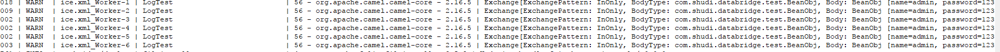

# Log组件

*版权：数帝网络*
*整理：方辉*
*时间：2017-10-30*
*相关连接:[http://camel.apache.org/log.html](http://camel.apache.org/log.html)*

## 概述
Log组件记录消息交换到底层的日志机制。

```
骆驼使用sfl4j，它允许您通过其他方式配置日志记录:
- Log4j
- Logback
- JDK Util Logging logging
```
## URI

```
log:loggingCategory[?options]
```

其中, loggingCategory 是要使用的日志记录类别的名称。


使用注册表中的记录器实例：
如果在注册表中找到 `org.slf4j.Logger` 的单个实例, 则 loggingCategory 不再用于创建记录器实例。改为使用注册的实例。

## URI参数

选项|默认|类型|描述
----|----|----|----
groupActiveOnly|true|boolean|如果是true，在没有收到新的消息时，将会隐藏统计信息。如果是false，显示统计信息，不管消息流量如何。
groupDelay|0|Integer|设置初始延迟的统计。
groupInterval|null|Integer|指定将在此时间间隔内分组消息统计。
groupSize|null|Integer|一个整数, 它指定吞吐量日志的组大小。
level|INFO|String|使用日志级别。可能的值: ERROR,WARN, INFO, DEBUG,TRACE, OFF
logger|暂无|Logger|可选引用org.slf4j.Logger，从注册表使用。
marker|null|String|要使用的可选[标记](https://www.slf4j.org/api/org/slf4j/Marker.html)名称。
注： groupDelay和groupActiveOnly 仅限于在使用groupInterval时才适用

### 日志格式

选项|默认|描述
----|----|----
maxChars|10000|限制每行记录的字符数。
multiline|false|如果是true，那么每条信息都将被记录在一条新的线上。
showAll|false|快速选项，让所有选项都打开。(如果要使用，maxChars必须手动设置)。
showBody|true|显示主体。
showBodyType|true|显示主体Java类型。
showCaughtException|false|如果exchange有捕获的异常,则显示异常消息(无堆栈跟踪)。
showException|false|如果exchange有异常,则显示异常消息(无堆栈跟踪)。
showExchangeId|false|显示唯一的 exchange ID。
showExchangePattern|false|显示消息交换模式(简称为MEP)。
showFiles|false|骆驼是否应该显示文件体,例如java.io.File。
showFuture|false|骆驼是否应显示 java.util.concurrent.Future 主体。
showHeaders|false|显示消息头信息。
showOut|false|如果 exchange 具有OUT消息, 则显示OUT消息。
showProperties|false|显示 exchange 属性。
showStackTrace|false|如果 exchange 有异常, 则显示堆栈跟踪。只有在启用 showAll、 showException 或 showCaughtException 中的一个时才有效。
showStreams|false|如果启用此选项, 则当此记录器已读取流时, 您以后可能无法访问消息正文。若要对此进行补救, 您必须使用[流缓存](http://camel.apache.org/stream-caching.html)。
skipBodyLineSeparator|true|在记录消息体时是否跳过行分隔符。

## 样例

### 示例分析

骆驼的Log组件实现了路由的日志记录功能。
按规则去配置Log端点来监控路由的运行状态和实时数据。

### Blueprint DSL 配置

```xml
<!--在交换中添加数据-->
<bean id="beanProcessor" class="com.shudi.databridge.test.BeanProcessor"/>
<!--Log组件测试-->
<camelContext xmlns="http://camel.apache.org/schema/blueprint" id="测试">	
	     <route id="Log组件测试">
			   <from uri="quartz://inventory?cron=0/20 * * * * ?"/>
			   <process ref="beanProcessor"/>
			   <to uri="log:LogTest?level=WARN"/>
		 </route> 	
</camelContext>
```

### 运行示例:
查看日志文件



