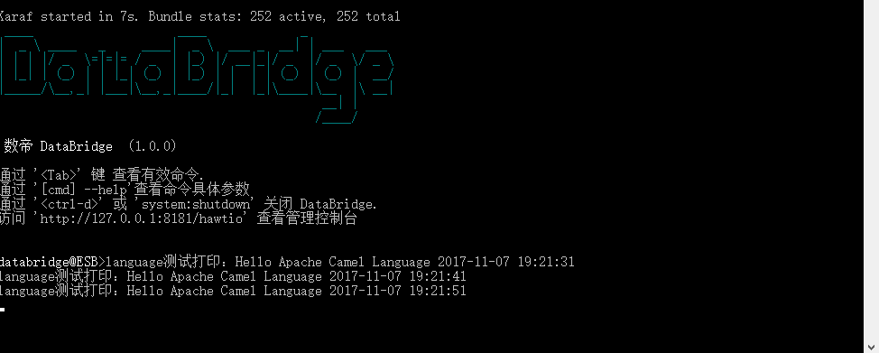

# Properties组件

*版权：数帝网络*
*整理：方辉*
*时间：2017-11-07*
*相关连接:[http://camel.apache.org/properties.html](http://camel.apache.org/properties.html)*

## 概述
Properties组件提供从外部获取参数的一种机制，可以熟练运用到集成开发中。

## URI

```
properties:key[?options]
```

其中, key 是要查的属性的键

## URI参数

选项|类型|默认|描述
----|----|----|----
cache|boolean|true|是否缓存加载的属性。
encoding|String|null|加载属性时要使用的字符集, 如 UTF-8。默认字符集为: ISO-8859-1 。
fallbackToUnaugmentedProperty|boolean|true|如果为true, 则在回退指定的纯属性名称之前, 首先尝试使用具有 propertyPrefix 和propertySuffix 的属性名称的解析。如果为 false, 则只搜索增强属性名称。
defaultFallbackEnabled|boolean|true|如果 false , 则该组件不会试图通过查看冒号分隔符来查找该键的默认值。
ignoreMissingLocation|boolean|false|是否要忽略无法确定的位置。（如未找到属性文件）
locations|String|null|要加载的一个或多个属性文件位置的逗号分隔列表。属性解析将独占使用给定的属性文件。任何默认位置都将被忽略。
prefixToken|String|{{|此标记用于标记属性占位符定义的开始。
propertyPrefix|String|null|一个可选的前缀, 它在解析之前前置到每个属性名前。 
propertySuffix|String|null|一个可选后缀, 在解析之前,追加到每个属性名称后。
suffixToken|String|}}|此标记用于标记属性占位符定义的末尾。
systemPropertiesMode|int|2|用于是否解析和使用系统属性的模式: 0 = 从不使用 JVM 系统属性。 1 = 后备 JVM 系统属性仅用作回退 (如果不存在具有该键的常规属性)。 2 = 重写-如果存在, 则使用 JVM 系统属性, 否则将使用常规属性。

```
从 Java 代码解析属性:
可以使用 CamelContext 上的方法 resolvePropertyPlaceholders 来解析任何 Java 代码中的属性。
```

## 示例

### 示例分析 
示例通过引用properties文件，并且在路由中使用占位符的方式来动态获取参数。
properties组件使我们集成开发更简单，使我们对于参数的运用更加的高效。

### one.properties文件
```
dateTime = 10s 
```

### Blueprint DSL 配置

```xml
<blueprint xmlns="http://www.osgi.org/xmlns/blueprint/v1.0.0"
           xmlns:xsi="http://www.w3.org/2001/XMLSchema-instance"
           xmlns:cm="http://aries.apache.org/blueprint/xmlns/blueprint-cm/v1.0.0"
           xsi:schemaLocation="
           http://www.osgi.org/xmlns/blueprint/v1.0.0 http://www.osgi.org/xmlns/blueprint/v1.0.0/blueprint.xsd">

	   <!--读取配置文件方法一-->
	   <bean id="properties" class="org.apache.camel.component.properties.PropertiesComponent">
             <property name="location" value="classpath:com/shudi/databridge/test/one.properties"/> 
	   </bean>
                      
	   <bean id="beanProcessor" class="com.shudi.databridge.test.BeanProcessor"/>   
	   <bean id="dataSetProcessor" class="com.shudi.databridge.test.DataSetProcessor"/> 
	   <!--properties组件测试dsl-->
	   <camelContext xmlns="http://camel.apache.org/schema/blueprint" id="properties组件测试环境">	
              <!--读取配置文件方法二
              <propertyPlaceholder id="properties" location="file:e:/tmp/one.properties" /> 
               -->	  

	          <route id="properties组件测试">
                   <!--引用配置文件属性使用格式：{{属性名}}-->
			       <from uri="timer://foo?period={{dateTime}}"/>
                   <process ref="beanProcessor"/>	
				   <!--调用language组件端点，执行simple脚本语言-->
                   <to uri="language:simple:Hello ${body} ${date:now:yyyy-MM-dd HH:mm:ss}"/>
				   <process ref="dataSetProcessor"/>	
			       <log message="fang.${body}"/>
              </route> 		  	  	  
	   </camelContext>	  	
</blueprint>
```

### 示例运行


