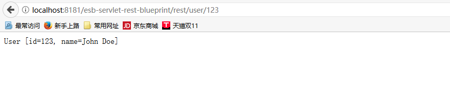

# Rest组件

*版权：数帝网络*
*整理：方辉*
*时间：2017-11-03*
*相关连接:[http://camel.apache.org/rest.html](http://camel.apache.org/rest.html)*

## 概述
Rest组件允许使用rest DSL将服务定义为rest端点进行数据传输。

## URI

```
rest://method:path[:uriTemplate]?[options]
```

## URI参数

名称|默认值|描述
----|----|----
method|无|HTTP 方法应为下列之一:get,post,put,patch,delete,head,trace,connect,options。
path|无|支持 REST 语法的基路径。
uriTemplate|无|支持 REST 语法的 URI 模板。
consumes|无|数据传播类型，如: text/xml 或application/json 此 REST 服务接受。默认情况下, 我们接受各种类型。
produces|无|数据传播类型, 如: text/xml 或application/json 此 REST 服务返回。

## 示例

### 利用rest组件发布服务

#### 示例分析
示例首先配置Service基本参数,然后通过rest组件发布了一个web服务站点。
rest组件可以使HttpService和Apache camel 集成在一起，解决通过外部访问路由的问题，使camel可以适用更多的集成环境。

#### RestProcess类
处理器

```java
package com.eds.esb.rest;
import org.apache.camel.Exchange;
import org.apache.camel.Processor;

public class RestProcess implements Processor {

	public void process(Exchange exchange) throws Exception {
		Object message = exchange.getIn().getHeader("id");
		UserService service = new UserService();
		User user = service.getUser(message.toString());
		if(user!=null){
		exchange.getOut().setBody(user);
		}else{
		exchange.getOut().setBody("NO DATA");
		}
	}
}
```

#### UserService类

```java
package com.eds.esb.rest;
import java.util.Collection;
import java.util.Map;
import java.util.TreeMap;

public class UserService {
    private final Map<String, User> users = new TreeMap<String, User>();

    public UserService() {
        users.put("123", new User(123, "John Doe"));
        users.put("456", new User(456, "Donald Duck"));
    }

    public User getUser(String id) {
        return users.get(id);
    }

    public Collection<User> listUsers() {
        return users.values();
    }

 
    public void updateUser(User user) {
        users.put("" + user.getId(), user);
    }
}
```

#### User类

```java
package com.eds.esb.rest;

public class User {
	private int id;
    private String name;
    //此处省略有参，无参，get,set,toString方法
}

```

#### 添加依赖

```xml
<dependencies>
		<dependency>
			<groupId>org.apache.camel</groupId>
			<artifactId>camel-core</artifactId>
			<version>2.16.5</version>
		</dependency>
		<dependency>
			<groupId>org.apache.camel</groupId>
			<artifactId>camel-blueprint</artifactId>
			<version>2.16.5</version>
		</dependency>
		<dependency>
			<groupId>org.apache.camel</groupId>
			<artifactId>camel-servlet</artifactId>
			<version>2.16.5</version>
		</dependency>
		<dependency>
			<groupId>org.apache.camel</groupId>
			<artifactId>camel-jackson</artifactId>
			<version>2.16.5</version>
		</dependency>
		<dependency>
			<groupId>org.osgi</groupId>
			<artifactId>org.osgi.service.http</artifactId>
			<version>1.2.1</version>
		</dependency>
		<dependency>
			<groupId>org.apache.camel</groupId>
			<artifactId>camel-restlet</artifactId>
			<version>2.16.5</version>
		</dependency>
</dependencies>
```

#### Blueprint DSL 配置

```xml
<blueprint xmlns="http://www.osgi.org/xmlns/blueprint/v1.0.0"
           xmlns:xsi="http://www.w3.org/2001/XMLSchema-instance"
           xmlns:cm="http://aries.apache.org/blueprint/xmlns/blueprint-cm/v1.0.0"
           xsi:schemaLocation="
           http://www.osgi.org/xmlns/blueprint/v1.0.0 http://www.osgi.org/xmlns/blueprint/v1.0.0/blueprint.xsd">
    <!--引用HttpService服务接口-->
	<reference id="httpService" interface="org.osgi.service.http.HttpService" />
	<!--注册camelServlet-->
	<bean id="camelServlet" class="org.apache.camel.component.servlet.CamelHttpTransportServlet" />
	
	<bean class="org.apache.camel.component.servlet.osgi.OsgiServletRegisterer"
		init-method="register" destroy-method="unregister">
		<property name="alias" value="/esb-servlet-rest-blueprint/rest" />
		<property name="httpService" ref="httpService" />
		<property name="servlet" ref="camelServlet" />
	</bean>
	<!--注册处理器-->
	<bean id="restProcess" class="com.eds.esb.rest.RestProcess" />
	
	<camelContext xmlns="http://camel.apache.org/schema/blueprint">
	    <!--配置服务站点参数-->
		<restConfiguration component="servlet" bindingMode="json"
			contextPath="/esb-servlet-rest-blueprint/rest" port="8181">
			<dataFormatProperty key="prettyPrint" value="true" />
		</restConfiguration>
		<!--rest组件测试路由一-->
		<route>
		     <from uri="rest:get:/user/{id}?consumes=application/json&amp;produces=application/json"/>
		     <to uri="direct:restProcess"/>
		</route>
		<!--rest组件测试路由二-->
		<route>
			<from uri="direct:restProcess" />
			<process ref="restProcess" />
		</route>
	</camelContext>

</blueprint>
```

**运行karaf容器，访问http://localhost:8181/esb-servlet-rest-blueprint/rest/user/123**

