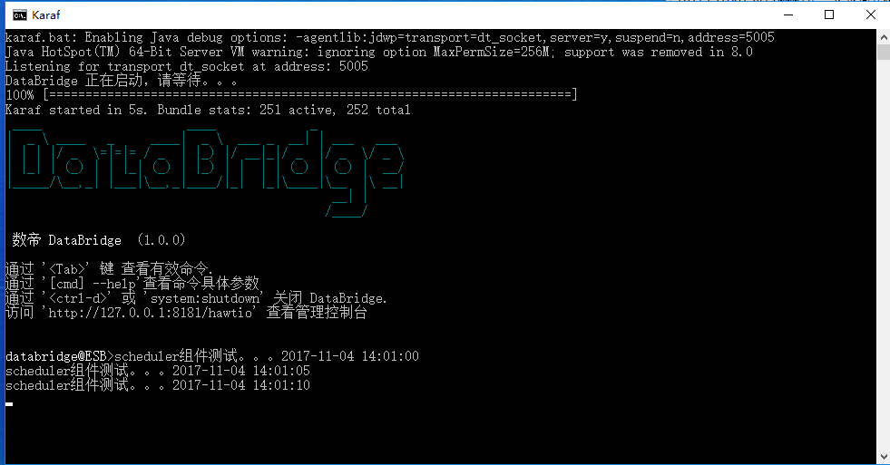

# Scheduler组件

*版权：数帝网络*
*整理：方辉*
*时间：2017-11-04*
*相关连接:[http://camel.apache.org/scheduler.html](http://camel.apache.org/scheduler.html)*

## 概述
当调度程序触发时，组件用于生成消息交换。这个组件类似于[定时器](http://camel.apache.org/timer.html)组件，但是它提供了更多的功能。
这个组件使用`JDK ScheduledExecutorService`。当定时器使用 `JDKTimer`时，您只能从这个端点消费事件。

## URI
```
scheduler:name[?options]
```
其中name是调度程序的名称，它是在端点之间创建和共享的。因此，如果您对所有的计时器端点使用相同的名称，只使用一个调度器线程池和线程，但是您可以配置线程池来允许更多的并发线程。

## URI参数

名称|默认值|描述
----|----|----
initialDelay|1000|第一次轮询开始前(初始延迟)的毫秒数。
delay|500|下一次轮询之前(延迟)的毫秒数。
timeUnit|MILLISECONDS|initialDelay和delay的时间单位。
useFixedDelay|true|是否使用固定的延迟或固定的速率控制。请参阅JDK中的[ScheduledExecutorService](https://docs.oracle.com/javase/1.5.0/docs/api/java/util/concurrent/ScheduledExecutorService.html)，了解详细信息。
pollStrategy|暂无|可插拔org.apache.camel.PollingConsumerPollingStrategy,允许您提供自定义实现来控制错误处理,通常发生在轮询前。
runLoggingLevel|TRACE|用户在进行轮询时，会记录一个起始/完整的日志线。该选项允许您为该选项配置日志级别。
sendEmptyMessageWhenIdle|false|如果轮询用户没有轮询任何文件，您可以启用该选项来发送空消息(没有主体)。
greedy|false|当greedy为true时，如果之前的运行对一个或多个消息进行了轮询，则 ScheduledPollConsumer 将立即再次运行。
scheduler|暂无|允许插件自定义org.apache.camel.spi.ScheduledPollConsumerScheduler在轮询使用者运行时用作触发的计划程序。
scheduler.xxx|暂无|在使用自定义调度器或任何一个基于Spring的调度程序时，可以配置额外的属性。
backoffMultiplier|0|如果有一系列后续的错误，则允许计划的轮询使用者退避。backoffMultiplier是在下次发生错误之前将跳过的轮询数。
backoffIdleThreshold|0|在backoffmulti开始之前应该进行的后续的空闲轮询的数量
backoffErrorThreshold|0|在backoffmulti开始之后发生的错误轮询数 。

### Exchange Properties

当触发计时器时, 它会将以下信息作为属性添加到Exchange:

名称|类型|描述
----|----|----
Exchange.TIMER_NAME|String|名称选项的值。
Exchange.TIMER_FIRED_TIME|Date|消费者被解雇的时间。

## 示例

### 示例分析
当开启路由时，scheduler组件会等待10S再触发整个流程，轮询的时间间隔为5S。
根据上述样例可以得出Scheduler组件和Timer组件做着类似得事情，但是前者会在功能上有更多的扩展。

**例如**
1.强制调度程序在完成时立即触发，可以将该选项设置为 "greedy = true"。
2.强制调度程序处于空闲状态，您需要将Exchange.SCHEDULER_POLLED_MESSAGES的属性值设置为 false 。这会使调度程序停止。

### Blueprint DSL 配置

```xml
<blueprint xmlns="http://www.osgi.org/xmlns/blueprint/v1.0.0"
           xmlns:xsi="http://www.w3.org/2001/XMLSchema-instance"
           xmlns:cm="http://aries.apache.org/blueprint/xmlns/blueprint-cm/v1.0.0"
           xsi:schemaLocation="
           http://www.osgi.org/xmlns/blueprint/v1.0.0 http://www.osgi.org/xmlns/blueprint/v1.0.0/blueprint.xsd">
		   
	   <!--scheduler组件测试dsl-->
	   <camelContext xmlns="http://camel.apache.org/schema/blueprint" id="测试">	
              <route id="bean测试">
                   <from uri="scheduler://foo?initialDelay=10000&amp;delay=5000"/>
                   <process ref="beanProcessor"/> 
				   <log message="fang.${body}"/>
              </route>           
	   </camelContext>

	   <bean id="beanProcessor" class="com.shudi.databridge.test.BeanProcessor"/> 
		
</blueprint>
```

### 示例运行



