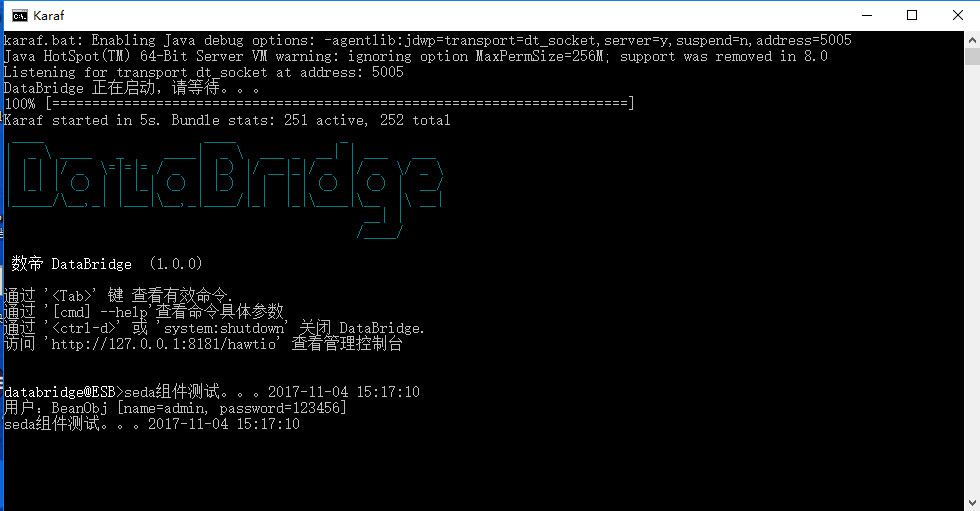

# Seda组件

*版权：数帝网络*
*整理：方辉*
*时间：2017-11-04*
*相关连接:[http://camel.apache.org/seda.html](http://camel.apache.org/seda.html)*

## 概述
Seda组件可以在相同的CamelContext中异步调用另一个端点。不支持任何的持久化和恢复机制，失败之后没有处理的消息不会再处理，如果需要持久化、消息可靠或者达到分布式，那么我们可以考虑用JMS（jvm消息服务）和MQ。

## URI

```
seda:someName[?options]
```

## URI参数

名称|默认|描述
----|----|----
size|暂无|seda队列的最大容量, 即它可以容纳的消息数。
concurrentConsumers|1|处理交换的并发线程数。
waitForTaskToComplete|IfReplyExpected|选项指定调用者是否应该等待异步任务完成，然后继续。支持以下选项:Always，Never，IfReplyExpected。
timeout|30000|在seda的生产者停止等待异步任务完成之前的超时(以毫秒为单位)
multipleConsumers|false|指定是否允许多个用户。如果启用，您可以使用SEDA进行发布-订阅消息传递。
limitConcurrentConsumers|true|是否将当前消费者的数量限制在500。
blockWhenFull|false|将消息发送到完全seda队列的线程是否会阻塞。
queueSize|暂无|seda队列的最大值(它可以容纳的消息的数量)。如果未指定size , 则使用此选项。
pollTimeout|1000|仅消费者：轮询时使用的超时。当超时发生时，使用者可以检查是否允许继续运行。设置较低的值可以让使用者在关机时更快地作出反应。
purgeWhenStopping|false|是否在停止消路由时清除任务队列。这会使队列中的任何消息都将被丢弃。
queue|null|定义seda端点将使用的队列实例。
queueFactory|null|定义可以为seda端点创建队列的 QueueFactory 。
failIfNoConsumers|false|当发送到一个没有活动消费者的seda队列时，生产者是否应该抛出异常。
discardIfNoConsumers|false|当发送到没有活动消费者的seda队列时，生产者是否应该丢弃消息(不将消息添加到队列)。

## 示例

### 示例分析

SEDA组件支持使用请求应答，其中调用者将等待异步路由完成.
在下面的路由中，我们在from端有一个定时器，当路由一运行时会将消息发送到seda组件的队列中。此时，当路由二seda端点发现队列中有消息，就会触发路由二的整个流程，打印输出交换中的数据。
所以SEDA组件让路由编排更丰富，同时也降低了耦合度。

### Blueprint DSL 配置

```xml
<blueprint xmlns="http://www.osgi.org/xmlns/blueprint/v1.0.0"
           xmlns:xsi="http://www.w3.org/2001/XMLSchema-instance"
           xmlns:cm="http://aries.apache.org/blueprint/xmlns/blueprint-cm/v1.0.0"
           xsi:schemaLocation="
           http://www.osgi.org/xmlns/blueprint/v1.0.0 http://www.osgi.org/xmlns/blueprint/v1.0.0/blueprint.xsd">
		   
	   <!--seda组件测试dsl-->
	   <camelContext xmlns="http://camel.apache.org/schema/blueprint" id="测试">	
	          <!--路由一将数据添加到交换正文中，连接seda端点-->
              <route id="seda测试1">
			       <!--任务调度,轮询间隔设置大一点，以便测试-->
                   <from uri="scheduler://foo?initialDelay=10000&amp;delay=5000000"/>
				   <!--向交换中添加数据-->
                   <process ref="beanProcessor"/> 
				   <!--异步调用端点seda-->
				   <to uri="seda:Test"/>
              </route>  
			  
              <!--路由二等待seda组件端点触发，打印数据-->
              <route id="seda测试2">
				   <!--连接seda端点-->
                   <from uri="seda:Test"/>
				   <!--调用bean组件，打印输出-->
                   <to uri="bean:beanTest?method=test"/>
              </route>     			  
	   </camelContext>

	   <bean id="beanProcessor" class="com.shudi.databridge.test.BeanProcessor"/> 
	   <bean id="beanTest" class="com.shudi.databridge.test.BeanTest"/> 
</blueprint>
```

### 示例运行




