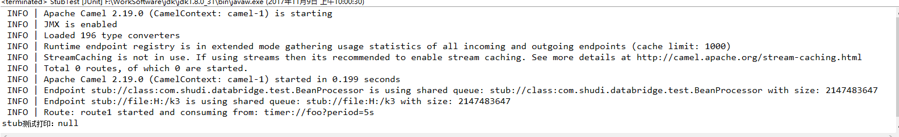

# Stub组件

*版权：数帝网络*
*整理：方辉*
*时间：2017-11-08*
*相关连接:[http://camel.apache.org/stub.html](http://camel.apache.org/stub.html)*

## 概述
Stub组件提供了一种简单的方法, 可以在开发或测试中将任何物理端点进行存根, 从而使您可以运行路由, 而无需实际连接到特定的SMTP或Http端点。只需在任何端点 URI 前面添加存根: , 就可以将端点进行存根。
Stub组件在内部创建VM端点。存根和vm之间的主要区别在于，vm将验证您给它的 uri 和参数，因此将 vm: 放在带有查询参数的典型 uri 前面通常会失败。存根不会，因为它基本上忽略了所有的查询参数，让您可以暂时将路由中的一个或多个端点短时间地终止。

## URI

```
stub:someUri
```

其中, someUri 可以是具有任何查询参数的任何 URI。

## 示例

### Stub组件单元测试

```java
package com.shudi.databridge.test;

import org.apache.camel.CamelContext;
import org.apache.camel.builder.RouteBuilder;
import org.apache.camel.impl.DefaultCamelContext;
import org.junit.Test;

public class StubTest{

	@Test
	public void Test() throws Exception {
			CamelContext context = new DefaultCamelContext(); 
			context.start();
			context.addRoutes(new RouteBuilder() {
				@Override
				public void configure() throws Exception {
					from("timer://foo?period=5s")
                     //调用class组件向交换中添加数据(此组件和bean组件作用相同)
					.to("stub:class:com.shudi.databridge.test.BeanProcessor")
                     //将交换中的数据写入k3文件夹中
					.to("stub:file:H:/k3")
                     //打印输出
					.process(new DataSetProcessor());
				}
			});
			Thread.sleep(8000000);
	}
}
```

### 示例分析

**当运行路由时，程序正常运行，运行结果如下：**



当我们把两个to端点的前缀stub:去掉，再次运行路由。程序会打印输出-stub测试打印：Apache Camel Stub，并且在k3文件夹下会有写入的文件。

通过上述样例可以得出结论：存根组件会把其他组件的URI保存到共享的队列中去，而不影响整个路由的运行。

存根组件在路由编排测试时也发挥着一定的作用。


