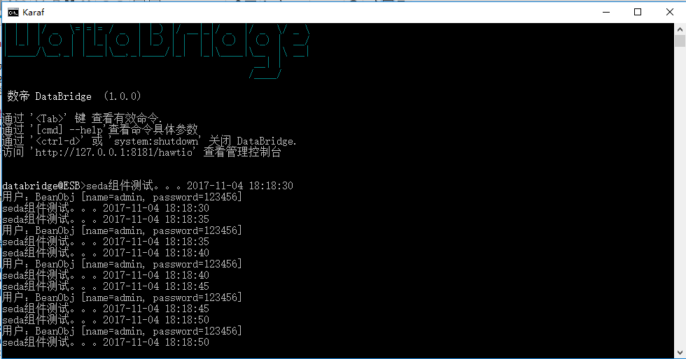

# Timer组件

*版权：数帝网络*
*整理：方辉*
*时间：2017-11-04*
*相关连接:[http://camel.apache.org/timer.html](http://camel.apache.org/timer.html)*

## 概述
Timer组件组件用于在定时器触发时生成消息交换，您只能使用该端点的事件

## URI
```
timer:name[?options]
```
其中name是Timer对象的名称, 它是在端点之间创建和共享的。因此, 如果对所有计时器端点使用相同的名称, 则只使用一个Timer对象和线程。

## URI参数

名称|默认值|描述
----|----|----
time|null|第一次调用的时间。如果使用这个URI，模式是:yyyy-MM-dd HH：mm：ss或yyyy-MM-dd'T'HH：mm：ss。
pattern|null|允许您指定一个自定义日期模式来使用URI语法来设置时间选项。
period|1000|每次调用的时间间隔。（毫秒为单位）
delay|1000|第一次调用之前等待的毫秒数。不应与time选项一起使用。还可以使用单位指定时间值, 例如 60s (60 秒)、5m30s (5 分钟和30秒) 和 1h (1 小时)。
fixedRate|false|事件是否按指定的时间间隔进行。
daemon|true|指定与定时器端点关联的线程是否作为后台程序运行。
repeatCount|0|指定调用的次数，0或负的值意味着永远的调用。

### Exchange Properties
当触发计时器时, 它会将以下信息作为属性添加到Exchange:

名称|类型|描述
-|-|-
Exchange.TIMER_NAME|String|name选项的值。
Exchange.TIMER_TIME|Date|time选项的值。
Exchange.TIMER_PERIOD|long|period选项的值。
Exchange.TIMER_FIRED_TIME|Date|消费者解雇的时间。
Exchange.TIMER_COUNTER|Long|当前的计数器，从1开始。

### Message Headers
当触发计时器时, 它会将以下信息作为标题添加到 "in" 消息。

名称|类型|描述
----|----|----
Exchange.TIMER_FIRED_TIME|Date|消费者解雇的时间

## 示例

### Blueprint DSL 配置
```xml
<blueprint xmlns="http://www.osgi.org/xmlns/blueprint/v1.0.0"
           xmlns:xsi="http://www.w3.org/2001/XMLSchema-instance"
           xmlns:cm="http://aries.apache.org/blueprint/xmlns/blueprint-cm/v1.0.0"
           xsi:schemaLocation="
           http://www.osgi.org/xmlns/blueprint/v1.0.0 http://www.osgi.org/xmlns/blueprint/v1.0.0/blueprint.xsd">
		   
	   <!--Timer组件测试dsl-->
	   <camelContext xmlns="http://camel.apache.org/schema/blueprint" id="测试">	
	 
              <route id="Timer组件测试">
                   <from uri="timer://foo?time=2017-11-04 18:18:30&amp;period=5s"/>
                   <process ref="beanProcessor"/>
	               <to uri="bean://beanTest?method=test"/>
              </route> 
                          			
	   </camelContext>

	   <bean id="beanProcessor" class="com.shudi.databridge.test.BeanProcessor"/> 
	   <bean id="beanTest" class="com.shudi.databridge.test.BeanTest"/>
</blueprint>
```
### 示例运行



### 样例分析
通过上述示例可以看到路由按照规定的时间触发运行，并且以5S为间隔轮询调度。
所以说Timer组件能更好的帮助我们实现路由任务调度问题。