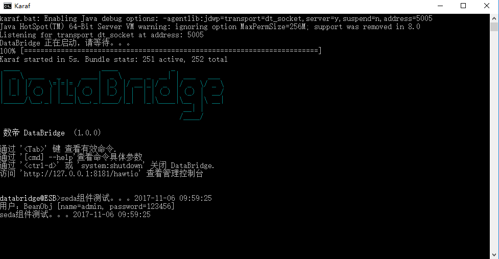

# VM组件

*版权：数帝网络*
*整理：方辉*
*时间：2017-11-06*
*相关连接:[http://camel.apache.org/vm.html](http://camel.apache.org/vm.html)*

## 概述
VM组件提供异步调用行为, 在[BlockingQueue](https://docs.oracle.com/javase/1.5.0/docs/api/java/util/concurrent/BlockingQueue.html)上交换消息, 并在单独的线程池中调用使用者。
该组件与[Seda](http://camel.apache.org/seda.html)组件不同, 因为 VM 支持跨 CamelContext 实例的通信, 因此您可以使用此机制跨 web 应用程序进行通信 (前提是 "camel-core.jar " 在system/boot类路径)。
VM 是Seda组件的扩展。

## URI

```
vm:queueName[?options]
```

## URI参数
引用seda组件Options

名称|默认|描述
----|----|----
size|暂无|seda队列的最大容量, 即它可以容纳的消息数。
concurrentConsumers|1|处理交换的并发线程数。
waitForTaskToComplete|IfReplyExpected|选项指定调用者是否应该等待异步任务完成，然后继续。支持以下选项:Always，Never，IfReplyExpected。
timeout|30000|在seda的生产者停止等待异步任务完成之前的超时(以毫秒为单位)
multipleConsumers|false|指定是否允许多个用户。如果启用，您可以使用SEDA进行发布-订阅消息传递。
limitConcurrentConsumers|true|是否将当前消费者的数量限制在500。
blockWhenFull|false|将消息发送到完全seda队列的线程是否会阻塞。
queueSize|暂无|seda队列的最大值(它可以容纳的消息的数量)。如果未指定size , 则使用此选项。
pollTimeout|1000|仅消费者：轮询时使用的超时。当超时发生时，使用者可以检查是否允许继续运行。设置较低的值可以让使用者在关机时更快地作出反应。
purgeWhenStopping|false|是否在停止消路由时清除任务队列。这会使队列中的任何消息都将被丢弃。
queue|null|定义seda端点将使用的队列实例。
queueFactory|null|定义可以为seda端点创建队列的 QueueFactory 。
failIfNoConsumers|false|当发送到一个没有活动消费者的seda队列时，生产者是否应该抛出异常。
discardIfNoConsumers|false|当发送到没有活动消费者的seda队列时，生产者是否应该丢弃消息(不将消息添加到队列)。

## 示例

### Blueprint DSL 配置

```xml
<blueprint xmlns="http://www.osgi.org/xmlns/blueprint/v1.0.0"
           xmlns:xsi="http://www.w3.org/2001/XMLSchema-instance"
           xmlns:cm="http://aries.apache.org/blueprint/xmlns/blueprint-cm/v1.0.0"
           xsi:schemaLocation="
           http://www.osgi.org/xmlns/blueprint/v1.0.0 http://www.osgi.org/xmlns/blueprint/v1.0.0/blueprint.xsd">
		   
	   <bean id="beanProcessor" class="com.shudi.databridge.test.BeanProcessor"/> 
	   <bean id="beanTest" class="com.shudi.databridge.test.BeanTest"/>
		   
	   <!--VM组件测试dsl-->
	   <camelContext xmlns="http://camel.apache.org/schema/blueprint" id="环境1">	   
	          <route id="VM组件测试1">
                   <from uri="scheduler://foo?delay=5000000"/>
	               <to uri="direct:in"/>
              </route> 
	    	 
              <route id="VM组件测试2">
                   <from uri="direct:in"/>
                   <process ref="beanProcessor"/>
	               <to uri="vm:test"/>
              </route>                           			
	   </camelContext>
	   
	   <camelContext xmlns="http://camel.apache.org/schema/blueprint" id="环境2">		 
              <route id="VM组件测试3">
                   <from uri="vm:test?concurrentConsumers=5"/>
	               <to uri="bean://beanTest?method=test"/>
              </route>                         			
	   </camelContext>
	   	
</blueprint>
```

### 示例运行



### 示例分析

Camel在核心包中提供了三个组件用于处理内存消息。对于同步消息的处理，可以使用Direct组件；对于异步消息的处理，可以使用SEDA和VM组件。SEDA和VM组件的区别在于：SEDA组件用于在CamelContext范围内进行消息传递，VM组件的范围更广一些，可以用于在JVM范围内进行消息传递。如果你的一个应用中加载了两个CamelContext，你可以使用VM组件在两个CamelContext直接发送消息。

注意以上的使用方式带有一个  concurrentConsumers=5 的参数，这个参数非常重要，建议使用这个组件的时候，都记得设置，这是应为vm的生成者和消费者并不是在同个线程内的，他们的通讯中间隔了一个BlockingQueue，也就是消费者是从这个blockingQueue中取消息消费的concurrentConsumers=5的意思是有5个线程准备着可以同时消费，如果不设置的话，当同时访问量高一点并且消费处理时间久，很容易出现错误。

