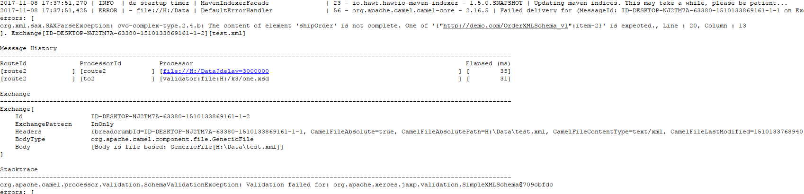

# Validation组件

*版权：数帝网络*
*整理：方辉*
*时间：2017-11-08*
*相关连接:[http://camel.apache.org/validation.html](http://camel.apache.org/validation.html)*

## 概述
Validation组件使用[XML模式](https://www.w3.org/XML/Schema)和JAXP验证验证消息的有效负载。

## URI
```
validator:someLocalOrRemoteResource
```

其中, someLocalOrRemoteResource是指向类路径上的本地资源的某个 url, 或者是文件系统上包含要验证的 XSD 的远程资源或资源的完整 url。例如：
- msv：org/foo/bar.xsd
- msv：file:../foo/bar.xsd
- msv：http://acme.com/cheese.xsd
- validator：com/mypackage/myschema.xsd

### 注：从骆驼2.9 起，Validation组件直接在骆驼核心中提供。2.9以下需导入camel-spring依赖。

## URI参数

选项|默认|描述
----|----|----
resourceResolverFactory|DefaultValidatorResourceResolverFactory|org.apache.camel.component.validator.ValidatorResourceResolverFactory 的引用, 它为每个端点创建资源解析器. 默认实现创建 org.apache.camel.component.validator 的实例org.apache.camel.component.validator.DefaultLSResourceResolver per endpoint 。
resourceResolver|null|对注册表中的org.w3c.dom.ls.LSResourceResolver的引用。
useDom|false|验证程序是否应使用DOMSource/DOMResult或SaxSource/SaxResult。
useSharedSchema|true|是否应共享Schema实例。
failOnNullBody|true|如果没有body，是否会失败。
headerName|null|对消息头部进行验证。
failOnNullHeader|true|如果在对消息头部进行验证时不存在, 则是否失败。

## 示例

### one.xsd
执行验证的xsd文件

```xml
<?xml version="1.0" encoding="UTF-8"?>
<!-- - Licensed Text -->
<xsd:schema xmlns:xsd="http://www.w3.org/2001/XMLSchema"
	elementFormDefault="qualified" targetNamespace="http://demo.com/OrderXMLSchema_v1"
	xmlns:tns="http://demo.com/OrderXMLSchema_v1">

	<xsd:element name="shipOrder" type="tns:shipOrder"></xsd:element>

	<xsd:complexType name="shipOrder">
		<xsd:sequence maxOccurs="1" minOccurs="1">
			<xsd:element name="orderperson" type="xsd:string"
				minOccurs="1" maxOccurs="1"></xsd:element>
			<xsd:element name="order-description" type="xsd:string"
				minOccurs="1" maxOccurs="1"></xsd:element>
			<xsd:element name="items" type="tns:items" maxOccurs="1"
				minOccurs="1"></xsd:element>
			<xsd:element name="item-2" type="tns:item-2" maxOccurs="unbounded"
				minOccurs="1"></xsd:element>
		</xsd:sequence>
	</xsd:complexType>

	<xsd:complexType name="items">
		<xsd:sequence maxOccurs="unbounded" minOccurs="1">
			<xsd:element name="item" minOccurs="1" maxOccurs="1">
				<xsd:complexType>
					<xsd:simpleContent>
						<xsd:extension base="xsd:string">
							<xsd:attribute name="index" type="xsd:unsignedLong" />
						</xsd:extension>
					</xsd:simpleContent>
				</xsd:complexType>
			</xsd:element>
		</xsd:sequence>
	</xsd:complexType>

	<xsd:complexType name="item-2">
		<xsd:sequence maxOccurs="1" minOccurs="1">
			<xsd:element name="title" type="xsd:string" />
			<xsd:element name="note" type="xsd:string" minOccurs="0" />
			<xsd:element name="quantity" type="xsd:positiveInteger" />
			<xsd:element name="price" type="xsd:decimal" />
		</xsd:sequence>
		<xsd:attribute name="index" type="xsd:unsignedLong" />
	</xsd:complexType>

</xsd:schema>
```

### test.xml
被测试的XML文件

```xml
<?xml version="1.0" encoding="UTF-8" standalone="no"?>
<!-- - Licensed Description. -->
<shipOrder xmlns="http://demo.com/OrderXMLSchema_v1"
	xmlns:server="http://demo.com/OrderXMLSchema_v1" xmlns:xsi="http://www.w3.org/2001/XMLSchema-instance">

	<orderperson>John Smith</orderperson>
	<order-description>This document is used for demo sxN#
	</order-description>

	<items>
		<item index="1">
			some potatoes
		</item>
		<item index="2">
			some tomatoes
		</item>
	</items>

	<item-2 index="1">
		<title>Hide your heart</title>
		<quantity>1</quantity>
		<price>9.90</price>
	</item-2>
	<item-2 index="2">
		<title>Hide your heart</title>
		<note>this is for testing note, it is not required</note>
		<quantity>1</quantity>
		<price>9.90</price>
	</item-2>

</shipOrder>
```

### Blueprint DSL 配置

```xml
<blueprint xmlns="http://www.osgi.org/xmlns/blueprint/v1.0.0"
           xmlns:xsi="http://www.w3.org/2001/XMLSchema-instance"
           xmlns:cm="http://aries.apache.org/blueprint/xmlns/blueprint-cm/v1.0.0"
           xsi:schemaLocation="
           http://www.osgi.org/xmlns/blueprint/v1.0.0 http://www.osgi.org/xmlns/blueprint/v1.0.0/blueprint.xsd">

	<bean id="fileProcessor" class="com.shudi.databridge.test.FileProcessor" />
	
    <camelContext xmlns="http://camel.apache.org/schema/blueprint">	
		<route>
		    <!--读取XML文件-->
			<from uri="file:H:/Data?delay=3000000" />
			<!--使用one.xsd文件进行验证-->
			<to uri="validator:file:H:/k3/one.xsd"/>
			<!--打印输出XML信息-->
			<process ref="fileProcessor" />	
		</route>	
	</camelContext>
	
</blueprint>
```

### 示例分析
使用karaf容器运行路由，验证成功后，会打印出XML的信息。

**若验证失败会抛出如下错误：**



这里只是使用了Validation组件验证XML，然而该组件还有更多的验证功能需要大家去了解。
Validation组件的存在，使我们的测试和对消息的校验更加方便。


