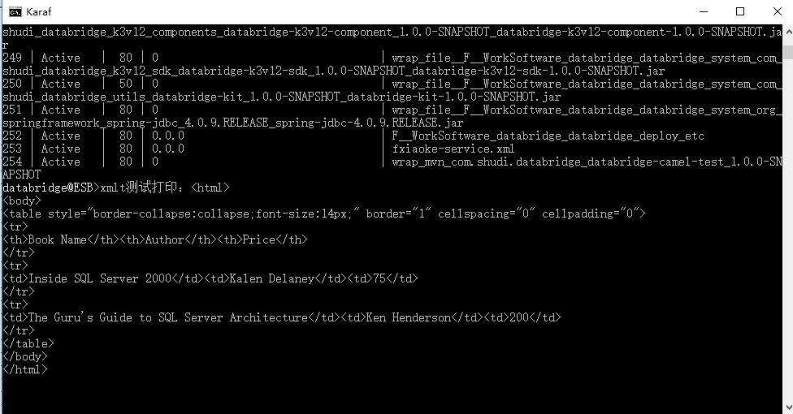

# XSLT组件

*版权：数帝网络*
*整理：方辉*
*时间：2017-11-06*
*相关连接:[http://camel.apache.org/xslt.html](http://camel.apache.org/xslt.html)*

## 概述
XSLT组件允许您使用XSLT模板处理消息。(适用于骆驼2.8以上版本)

## URI

```
xslt:templateName[?options]
```

其中, templateName是要调用的模板的类路径本地 URI;或远程模板的完整 URL。有关[URI 语法的详细信息](https://docs.spring.io/spring/docs/2.5.x/javadoc-api/org/springframework/core/io/DefaultResourceLoader.html), 请参阅 Spring 文档。

### uri示例

uri|描述
----|----
xslt:com/acme/mytransform.xsl|指向类路径上的文件 com/acme/mytransform. xsl
xslt:file :///foo/bar.xsl|引用文件/foo/bar. xsl
xslt:http ://acme.com/cheese/foo.xsl|引用远程 http 资源

## URI参数

名称|默认值|描述
----|----|----
converter|null|选项以替代默认的XmlConverter。将在注册表中查找转换器。所提供的转换必须为org.apache.camel.converter.jaxp.XmlConverter 类型。
transformerFactory|null|选项以替代默认的TransformerFactory。将在注册表中查找 transformerFactory。所提供的转换工厂必须是 javax.xml.transform.TransformerFactory 型的。
transformerFactoryClass|null|选项以替代默认的TransformerFactory。将创建一个 TransformerFactoryClass 实例并将其设置为转换器。
uriResolverFactory|DefaultXsltUriResolverFactory|引用 org.apache.camel.component.xslt. XsltUriResolverFactory每个端点创建一个 URI 解析器.默认实现返回org.apache.camel.component.xslt.的实例 DefaultXsltUriResolverFactory , 它创建默认的 URI 解析程序 org.apache.camel.builder.xml。
uriResolver|null|允许您使用自定义javax.xml.transformation.URIResolver。骆驼将默认使用它自己的实现org.apache.camel.builder.xml.XsltUriResolver , 它能够从类路径加载。
resultHandlerFactory|null|允许您使用一个定制的org.apache.camel.builder.xml。
failOnNullBody|true|如果输入正文为 null, 是否引发异常。
deleteOutputFile|false|如果您有output=file, 则此选项指示在处理Exchange时是否应删除输出文件。
output|string|选项指定要使用的输出类型。可能的值有:string, bytes, DOM, file。前三选项都是基于内存的, 其中file直接流到java.io.File。对于file ,必须在 "in" 标头中指定文件名, 并使用键Exchange.XSLT_FILE_NAME , 这也是CamelXsltFileName。还必须事先创建任何通向文件名的路径, 否则在运行时会引发异常。
contentCache|true|加载资源内容 (样式表文件) 的缓存。如果设置为false , 则将在每个消息处理中重新加载样式表文件。(注意: 从骆驼 2.9可以使用clearCachedStylesheet操作强制在运行时通过 JMX 重新加载缓存样式表。)
allowStAX|暂无|是否允许使用StAX作为javax.xml.transform.Source。
transformerCacheSize|0|缓存以供重用的javax.xml.transform.Transformer对象的数目, 以避免对Template.newTransformer()的调用。
saxon|false|是否要把Saxon作为转换。如果启用,那么类net.sf.saxon.TransformerFactoryImpl。你需要把Saxon添加到类路径中。
saxonExtensionFunctions|null|允许配置一个或多个自定义net.sf.saxon.lib.ExtensionFunctionDefinition。你需要把Saxon添加到类路径中。通过设置这个选项，saxon选项将被自动地显示出来。
errorListener|暂无|允许配置使用一个定制的javax.xml.transform.ErrorListener。在这样做时，请注意，默认的错误侦听器会捕获任何错误或致命错误，并将信息存储在交换器中，因为属性没有使用。所以只在特殊用例中使用这个选项。
entityResolver|暂无|使用自定义org.xml.sax.EntityResolver 与 javax.xml.transform.sax.SAXSource。

## 示例

### 通过XSLT组件将xml文件进行模板转换

#### 示例分析
示例通过XSLT组件将XML文件转换为HTML格式的文件。
XSLT组件提供了一种模板转换机制，可以将消息进行转换，以达到预期的效果。

#### hell.xsl
xslt模板

```xml
<?xml version="1.0" encoding="utf-8"?>
<xsl:stylesheet version="1.0" xmlns:xsl="http://www.w3.org/1999/XSL/Transform">
<xsl:output method="html" encoding="utf-8"/>
<xsl:template match="/">
    <html>
    <body>
      <table cellpadding="0" cellspacing="0" border="1" style="border-collapse:collapse;font-size:14px;">
        <tr>
          <th>Book Name</th>
          <th>Author</th>
          <th>Price</th>
        </tr>
        <xsl:for-each select="//ric/catalog/book">
          <tr>
            <td>
              <xsl:value-of select="name"></xsl:value-of>
            </td>
            <td>
              <xsl:value-of select="author"></xsl:value-of>
            </td>
            <td>
              <xsl:value-of select="@price"/>
            </td>
          </tr>
        </xsl:for-each>
      </table>
    </body>
    </html>
</xsl:template>
</xsl:stylesheet>
```

#### test.xml
供转换测试的xml

```xml
<?xml version="1.0" encoding="utf-8" ?>
<ric>
  <catalog>
    <book price="75">
      <author>Kalen Delaney</author>
      <name>Inside SQL Server 2000</name>
    </book>
    <book price="200">
      <author>Ken Henderson</author>
      <name>The Guru's Guide to SQL Server Architecture</name>
    </book>
  </catalog>
</ric>
```

#### Blueprint DSL 配置

```xml
<blueprint xmlns="http://www.osgi.org/xmlns/blueprint/v1.0.0"
           xmlns:xsi="http://www.w3.org/2001/XMLSchema-instance"
           xmlns:cm="http://aries.apache.org/blueprint/xmlns/blueprint-cm/v1.0.0"
           xsi:schemaLocation="
           http://www.osgi.org/xmlns/blueprint/v1.0.0 http://www.osgi.org/xmlns/blueprint/v1.0.0/blueprint.xsd">
		   
	   <bean id="dataSetProcessor" class="com.shudi.databridge.test.DataSetProcessor"/> 
	   <!--xslt组件测试dsl-->
	   <camelContext xmlns="http://camel.apache.org/schema/blueprint" id="xslt组件测试环境">	
	   
	          <route id="xslt组件测试">
			       <from uri="file:H:/fxk?delay=30000"/>
                   <!--通过模板转换xml-->
				   <to uri="xslt:com/shudi/databridge/test/hello.xsl"/>
                   <!--通过处理器打印转换出的内容-->
                   <process ref="dataSetProcessor"/>	
                   <to uri="file:H:/k3"/>				   
			       <log message="fang.${body}"/>
              </route> 
			  
	   </camelContext>
	   	
</blueprint>
```
#### 示例运行


#### 查看转换后的HTML文件


